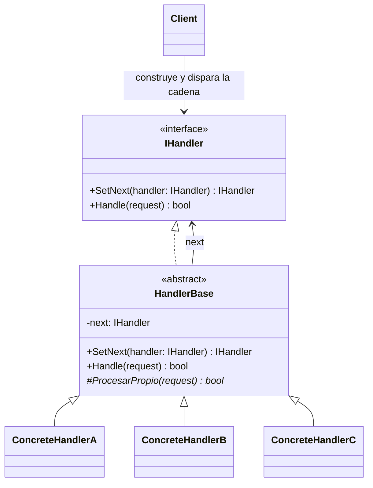
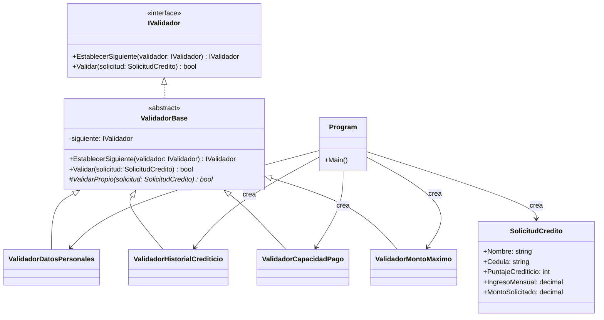
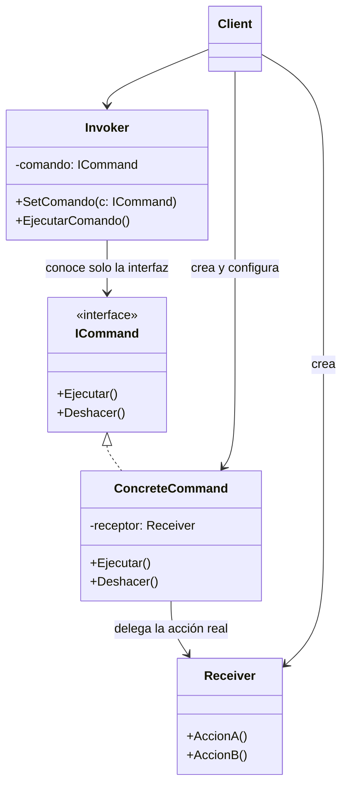
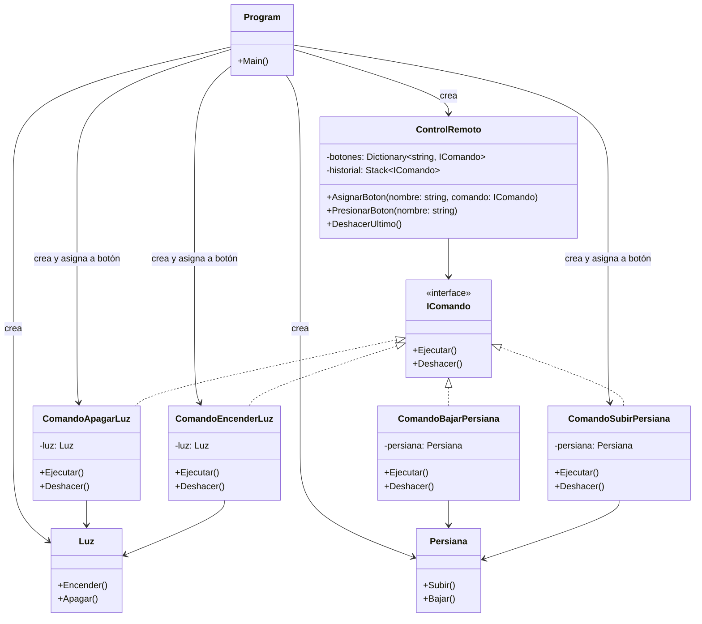

## 1. Patrón Cadena de Responsabilidad (Chain of Responsibility)

### Situación problema o contexto

Un banco tiene un sistema para aprobar **solicitudes de crédito**. Antes de aprobar una solicitud, esta debe pasar por varias validaciones independientes:

1. Que los datos personales del solicitante estén completos.
2. Que el historial crediticio sea aceptable.
3. Que la capacidad de pago (ingresos vs. monto solicitado) sea suficiente.
4. Que el monto solicitado no supere el límite que la sucursal puede autorizar.

Si se programan todas estas validaciones en un solo método (`if / else if` gigante), la clase termina con múltiples responsabilidades, es difícil de mantener y cada vez que el banco agrega una nueva regla de negocio hay que **modificar** código que ya funciona. Además, no todas las solicitudes necesitan pasar por las mismas validaciones ni en el mismo orden en todos los productos del banco (una tarjeta de crédito, un crédito hipotecario, etc.), por lo que se necesita poder **reordenar o reutilizar** validadores libremente.

El patrón **Cadena de Responsabilidad** resuelve esto: convierte cada validación en un **eslabón independiente** que decide si procesa la solicitud, si la rechaza, o si la pasa al siguiente eslabón de la cadena. El emisor de la solicitud (el sistema que la crea) no necesita saber cuántos validadores existen ni en qué orden están.

### Diagrama general



La idea clave: cada `ConcreteHandler` solo conoce a su **sucesor inmediato** (no a toda la cadena), y decide si atiende la solicitud, la delega, o corta la cadena.

### Diagrama de ejemplo (aplicado)



**Orden de la cadena:** `ValidadorDatosPersonales → ValidadorHistorialCrediticio → ValidadorCapacidadPago → ValidadorMontoMaximo`

### Código funcional (C#)

```csharp
using System;
using System.Collections.Generic;

// ---------- Modelo de datos ----------
public class SolicitudCredito
{
    public string Nombre { get; set; }
    public string Cedula { get; set; }
    public int PuntajeCrediticio { get; set; }
    public decimal IngresoMensual { get; set; }
    public decimal MontoSolicitado { get; set; }
}

// ---------- Interfaz de la cadena ----------
public interface IValidador
{
    IValidador EstablecerSiguiente(IValidador siguiente);
    bool Validar(SolicitudCredito solicitud);
}

// ---------- Clase base con la lógica de encadenamiento ----------
public abstract class ValidadorBase : IValidador
{
    private IValidador _siguiente;

    public IValidador EstablecerSiguiente(IValidador siguiente)
    {
        _siguiente = siguiente;
        return siguiente; // permite encadenar con fluidez: a.EstablecerSiguiente(b).EstablecerSiguiente(c)
    }

    public bool Validar(SolicitudCredito solicitud)
    {
        if (!ValidarPropio(solicitud))
            return false; // corta la cadena: la solicitud queda rechazada aquí

        // Si no hay más eslabones, la solicitud pasó todas las validaciones
        return _siguiente == null || _siguiente.Validar(solicitud);
    }

    protected abstract bool ValidarPropio(SolicitudCredito solicitud);
}

// ---------- Eslabones concretos ----------
public class ValidadorDatosPersonales : ValidadorBase
{
    protected override bool ValidarPropio(SolicitudCredito solicitud)
    {
        bool ok = !string.IsNullOrWhiteSpace(solicitud.Nombre) &&
                   !string.IsNullOrWhiteSpace(solicitud.Cedula);
        Console.WriteLine(ok ? "Datos personales completos."
                              : "Datos personales incompletos.");
        return ok;
    }
}

public class ValidadorHistorialCrediticio : ValidadorBase
{
    protected override bool ValidarPropio(SolicitudCredito solicitud)
    {
        bool ok = solicitud.PuntajeCrediticio >= 600;
        Console.WriteLine(ok ? "Historial crediticio aceptable."
                              : "Historial crediticio insuficiente.");
        return ok;
    }
}

public class ValidadorCapacidadPago : ValidadorBase
{
    protected override bool ValidarPropio(SolicitudCredito solicitud)
    {
        // Regla simple: la cuota estimada no debe superar el 40% del ingreso
        decimal cuotaEstimada = solicitud.MontoSolicitado * 0.05m;
        bool ok = cuotaEstimada <= solicitud.IngresoMensual * 0.4m;
        Console.WriteLine(ok ? "Capacidad de pago suficiente."
                              : "Capacidad de pago insuficiente.");
        return ok;
    }
}

public class ValidadorMontoMaximo : ValidadorBase
{
    private const decimal LimiteSucursal = 50_000_000m;

    protected override bool ValidarPropio(SolicitudCredito solicitud)
    {
        bool ok = solicitud.MontoSolicitado <= LimiteSucursal;
        Console.WriteLine(ok ? "Monto dentro del límite autorizado."
                              : "Monto supera el límite autorizado por la sucursal.");
        return ok;
    }
}

// ---------- Cliente ----------
public class Program
{
    public static void Main()
    {
        // Se arma la cadena una sola vez
        var datos = new ValidadorDatosPersonales();
        var historial = new ValidadorHistorialCrediticio();
        var capacidad = new ValidadorCapacidadPago();
        var monto = new ValidadorMontoMaximo();

        datos.EstablecerSiguiente(historial)
             .EstablecerSiguiente(capacidad)
             .EstablecerSiguiente(monto);

        var solicitud = new SolicitudCredito
        {
            Nombre = "Laura Restrepo",
            Cedula = "1099887766",
            PuntajeCrediticio = 680,
            IngresoMensual = 4_000_000m,
            MontoSolicitado = 20_000_000m
        };

        Console.WriteLine($"--- Evaluando solicitud de {solicitud.Nombre} ---");
        bool aprobada = datos.Validar(solicitud);

        Console.WriteLine(aprobada ? "\n Crédito APROBADO." : "\n Crédito RECHAZADO.");
    }
}
```

### Cuándo se usa

- Cuando **varios objetos pueden atender una solicitud** y no se sabe de antemano cuál lo hará (o cuántos participan).
- Cuando se necesita ejecutar **una serie de validaciones o filtros** en un orden determinado, y ese orden puede cambiar.
- Cuando se quiere **desacoplar** al emisor de una petición de sus receptores concretos.
- Middlewares web (autenticación, autorización, logging, compresión), sistemas de aprobación jerárquica, pipelines de procesamiento.

### Cuándo no se usa

- Cuando siempre hay **exactamente un** receptor conocido de antemano: agregar una cadena solo introduce complejidad innecesaria.
- Cuando el orden de ejecución es **fijo, simple y nunca cambia**: un `if/else` directo puede ser más claro.
- Cuando el **rendimiento** es crítico y la cadena puede volverse muy larga: cada eslabón agrega una llamada adicional.
- Cuando no se garantiza que la solicitud sea manejada: hay que diseñar bien qué pasa si **ningún** eslabón la atiende.

### Aplicaciones en el desarrollo

- **Middlewares** en ASP.NET Core, Express.js, Django (cada middleware decide si procesa la petición HTTP o la pasa al siguiente).
- **Filtros de eventos en UI**, donde un clic sube por la jerarquía de componentes hasta que alguno lo maneja (event bubbling).
- **Sistemas de aprobación** en software empresarial (compras, vacaciones, gastos) con distintos niveles jerárquicos.
- **Validación de formularios o de payloads de API**, encadenando reglas de negocio.
- **Manejo de excepciones** en algunos frameworks, donde el error sube por una cadena de manejadores hasta ser capturado.

### Conclusiones

La Cadena de Responsabilidad permite construir flujos de validación o procesamiento **flexibles y extensibles**, evitando condicionales gigantes y acoplamiento entre el emisor de una solicitud y quien finalmente la resuelve. Su mayor fortaleza es que **agregar, quitar o reordenar pasos** no requiere tocar el código existente, solo reconfigurar cómo se arma la cadena.

---

## 2. Patrón Command

### Situación problema o contexto

Se está construyendo el software de un **control remoto de domótica** para una casa inteligente. El control tiene varios botones (encender luz de sala, apagar luz de sala, subir persiana, bajar persiana, etc.) y cada botón debe ejecutar una acción sobre un dispositivo distinto (`Luz`, `Persiana`).

Si el control remoto conociera directamente las clases `Luz` y `Persiana` y llamara sus métodos (`luz.Encender()`, `persiana.Subir()`), el control quedaría **fuertemente acoplado** a cada tipo de dispositivo. Cada vez que se agregue un dispositivo nuevo (por ejemplo, una cerradura inteligente), habría que **modificar** la clase del control remoto. Además, sería muy difícil implementar funcionalidades como **deshacer la última acción** o **programar una secuencia de acciones** para ejecutar más tarde.

El patrón **Command** resuelve esto encapsulando cada acción (encender, apagar, subir, bajar) como un **objeto independiente** con un método `Ejecutar()` (y opcionalmente `Deshacer()`). El control remoto (invocador) solo conoce la interfaz `IComando`, no los dispositivos concretos.

### Diagrama general



Idea clave: el **Invoker** (quien dispara la acción) nunca sabe qué hace el comando ni sobre qué objeto actúa; solo llama `Ejecutar()`. El **Receiver** contiene la lógica real de negocio.

### Diagrama de ejemplo (aplicado)



### Código funcional (C#)

```csharp
using System;
using System.Collections.Generic;

// ---------- Receptores: contienen la lógica real ----------
public class Luz
{
    public string Ubicacion { get; }
    public Luz(string ubicacion) => Ubicacion = ubicacion;

    public void Encender() => Console.WriteLine($"Luz de {Ubicacion}: encendida.");
    public void Apagar() => Console.WriteLine($"Luz de {Ubicacion}: apagada.");
}

public class Persiana
{
    public string Ubicacion { get; }
    public Persiana(string ubicacion) => Ubicacion = ubicacion;

    public void Subir() => Console.WriteLine($"Persiana de {Ubicacion}: subida.");
    public void Bajar() => Console.WriteLine($"Persiana de {Ubicacion}: bajada.");
}

// ---------- Interfaz Command ----------
public interface IComando
{
    void Ejecutar();
    void Deshacer();
}

// ---------- Comandos concretos ----------
public class ComandoEncenderLuz : IComando
{
    private readonly Luz _luz;
    public ComandoEncenderLuz(Luz luz) => _luz = luz;

    public void Ejecutar() => _luz.Encender();
    public void Deshacer() => _luz.Apagar();
}

public class ComandoApagarLuz : IComando
{
    private readonly Luz _luz;
    public ComandoApagarLuz(Luz luz) => _luz = luz;

    public void Ejecutar() => _luz.Apagar();
    public void Deshacer() => _luz.Encender();
}

public class ComandoSubirPersiana : IComando
{
    private readonly Persiana _persiana;
    public ComandoSubirPersiana(Persiana persiana) => _persiana = persiana;

    public void Ejecutar() => _persiana.Subir();
    public void Deshacer() => _persiana.Bajar();
}

public class ComandoBajarPersiana : IComando
{
    private readonly Persiana _persiana;
    public ComandoBajarPersiana(Persiana persiana) => _persiana = persiana;

    public void Ejecutar() => _persiana.Bajar();
    public void Deshacer() => _persiana.Subir();
}

// ---------- Invocador ----------
public class ControlRemoto
{
    private readonly Dictionary<string, IComando> _botones = new();
    private readonly Stack<IComando> _historial = new();

    public void AsignarBoton(string nombreBoton, IComando comando)
        => _botones[nombreBoton] = comando;

    public void PresionarBoton(string nombreBoton)
    {
        if (!_botones.TryGetValue(nombreBoton, out var comando))
        {
            Console.WriteLine($"El botón '{nombreBoton}' no tiene comando asignado.");
            return;
        }

        comando.Ejecutar();
        _historial.Push(comando);
    }

    public void DeshacerUltimo()
    {
        if (_historial.Count == 0)
        {
            Console.WriteLine("No hay acciones para deshacer.");
            return;
        }

        var ultimoComando = _historial.Pop();
        ultimoComando.Deshacer();
    }
}

// ---------- Cliente ----------
public class Program
{
    public static void Main()
    {
        // El cliente crea los receptores y los comandos, y los conecta al invocador
        var luzSala = new Luz("Sala");
        var persianaSala = new Persiana("Sala");

        var control = new ControlRemoto();
        control.AsignarBoton("boton1_on", new ComandoEncenderLuz(luzSala));
        control.AsignarBoton("boton1_off", new ComandoApagarLuz(luzSala));
        control.AsignarBoton("boton2_subir", new ComandoSubirPersiana(persianaSala));

        control.PresionarBoton("boton1_on");     // Luz de Sala: encendida.
        control.PresionarBoton("boton2_subir");  // Persiana de Sala: subida.

        Console.WriteLine("\n--- Deshaciendo última acción ---");
        control.DeshacerUltimo();                // Persiana de Sala: bajada.
    }
}
```

### Cuándo se usa

- Cuando se necesita **parametrizar objetos con acciones**: pasar una operación como si fuera un dato (guardarla, encolarla, pasarla como argumento).
- Cuando se requiere soporte para **deshacer/rehacer** (undo/redo).
- Cuando se necesita **encolar, programar o ejecutar en diferido** operaciones (colas de tareas, trabajos en background).
- Cuando se quiere **desacoplar** quién invoca una acción de quién la ejecuta realmente.
- Para implementar **macros** o secuencias de comandos compuestos.

### Cuándo no se usa

- Cuando las acciones son **triviales y no cambian**: envolver una sola llamada de método en una clase completa agrega complejidad sin beneficio real.
- Cuando **no** se necesita historial, undo, cola de ejecución, ni desacoplar el invocador del receptor.
- En aplicaciones muy pequeñas donde el número de operaciones es fijo y conocido: el patrón puede resultar sobre-ingeniería.

### Aplicaciones en el desarrollo

- **Undo/Redo** en editores de texto, editores gráficos, IDEs.
- **Colas de trabajos (job queues)** y sistemas de mensajería, donde cada mensaje es en esencia un comando a ejecutar.
- **Botones y menús de UI**, donde cada elemento dispara un comando sin conocer su implementación (muy usado en WPF con `ICommand`).
- **Transacciones y wizards** que agrupan varios pasos como comandos ejecutables/reversibles.
- **Automatización y macros**, como scripts que graban una secuencia de comandos para reproducirla después.

### Conclusiones

El patrón Command transforma una **acción** en un **objeto de primera clase**, lo que permite desacoplar quién solicita una operación de quién la ejecuta, además de habilitar funcionalidades avanzadas como deshacer, encolar o registrar historiales de acciones. Es especialmente valioso en interfaces de usuario y sistemas donde las operaciones deben tratarse como datos.

---

## 3. Principios SOLID aplicados en cada patrón

|Principio|Cadena de Responsabilidad|Command|
|---|---|---|
|**S — Responsabilidad Única**|Cada `Validador` (`ValidadorDatosPersonales`, `ValidadorHistorialCrediticio`, etc.) tiene **una sola razón para cambiar**: su propia regla de validación.|Cada `IComando` (`ComandoEncenderLuz`, `ComandoSubirPersiana`, etc.) encapsula **una sola acción**; el `Receiver` concentra la lógica de negocio y el `Invoker` solo dispara comandos.|
|**O — Abierto/Cerrado**|Se pueden agregar nuevos validadores (p. ej. `ValidadorAntifraude`) **sin modificar** los existentes ni la clase `ValidadorBase`; solo se inserta en la cadena.|Se pueden agregar nuevos comandos (p. ej. `ComandoActivarAlarma`) **sin tocar** `ControlRemoto` ni los comandos existentes.|
|**L — Sustitución de Liskov**|Cualquier `ValidadorBase` puede sustituir a otro en la cadena sin romper el flujo, porque todos cumplen el mismo contrato `IValidador`.|Cualquier `IComando` concreto puede sustituirse por otro en `ControlRemoto` sin romper su funcionamiento, ya que todos respetan el contrato `Ejecutar()/Deshacer()`.|
|**I — Segregación de Interfaces**|`IValidador` expone solo lo necesario (`EstablecerSiguiente`, `Validar`); los validadores no dependen de métodos que no usan.|`IComando` es una interfaz mínima (`Ejecutar`, `Deshacer`); un comando no se ve forzado a implementar métodos ajenos a su acción.|
|**D — Inversión de Dependencias**|El cliente (`Program`) depende de la **abstracción** `IValidador` para recorrer la cadena, no de clases concretas; el orden de la cadena se decide desde afuera.|`ControlRemoto` depende de la **abstracción** `IComando`, no conoce `Luz` ni `Persiana` directamente; la relación se inyecta desde el cliente.|

---

## 4. Conclusión general

Ambos patrones son de tipo **comportamiento** y comparten una idea central: **desacoplar al que solicita algo de quien finalmente lo resuelve o lo ejecuta**, usando abstracciones (`IValidador`, `IComando`) en vez de referencias directas a clases concretas. Esta es precisamente la razón por la que ambos cumplen tan naturalmente los principios SOLID, en especial **OCP** (se extiende el sistema agregando clases nuevas, no modificando las existentes) y **DIP** (los componentes de alto nivel dependen de interfaces, no de implementaciones concretas).

La diferencia práctica entre ambos:

- **Cadena de Responsabilidad** se usa cuando **una solicitud puede pasar por varios manejadores** hasta que alguno la resuelve o la rechaza (flujo secuencial de decisión).
- **Command** se usa cuando se quiere **convertir una acción en un objeto** manipulable (guardarla, deshacerla, encolarla, ejecutarla más tarde).