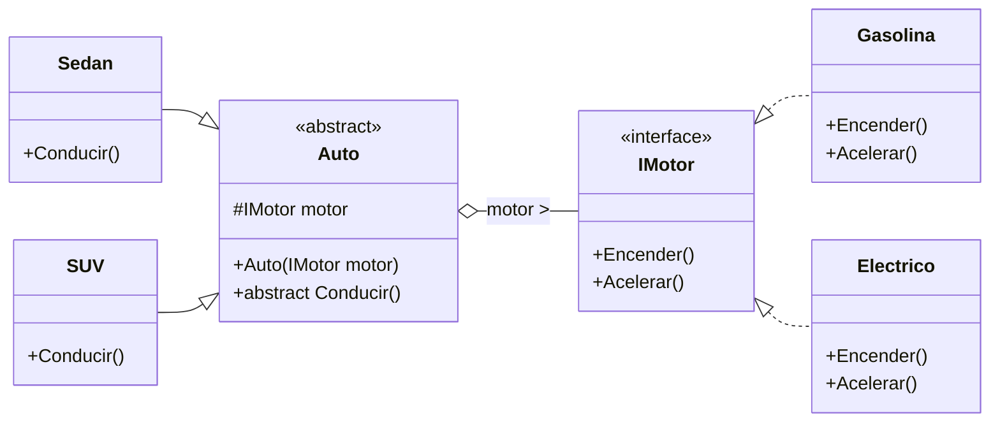
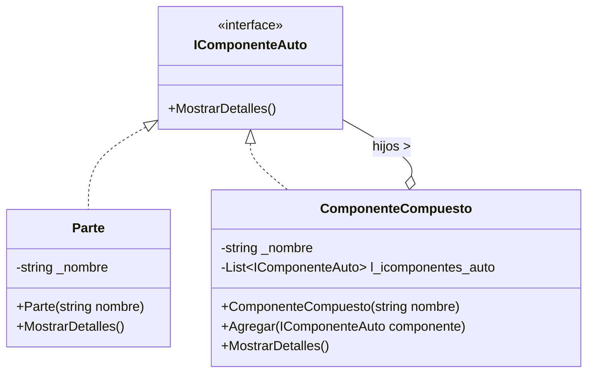
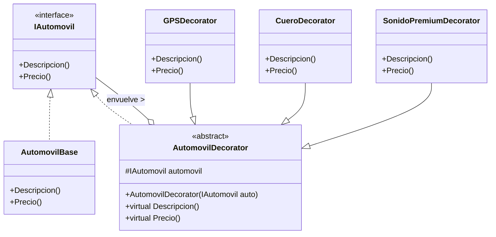
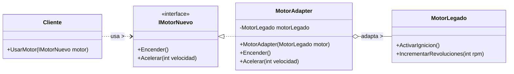
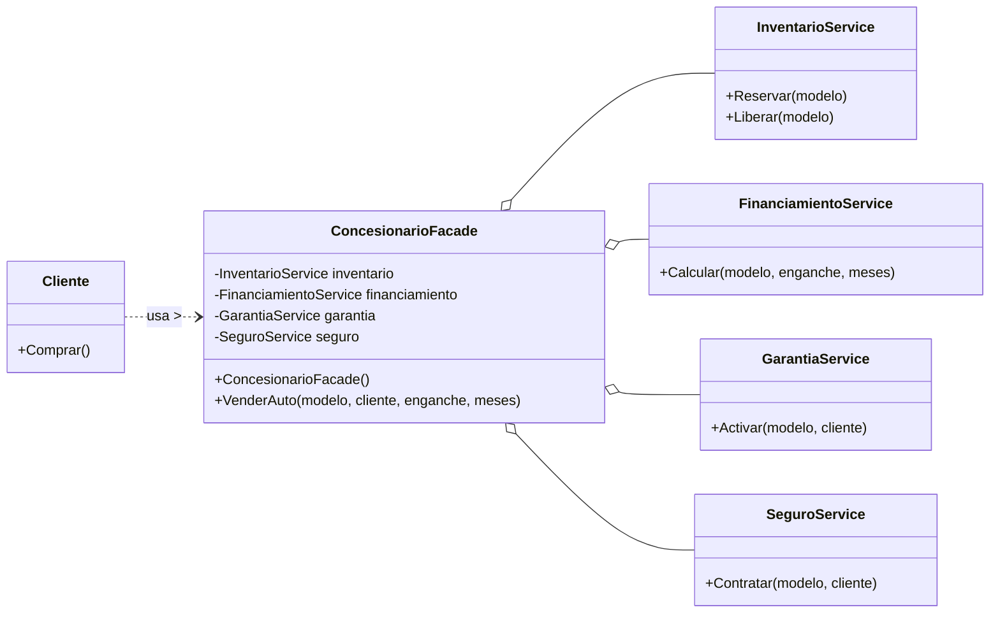
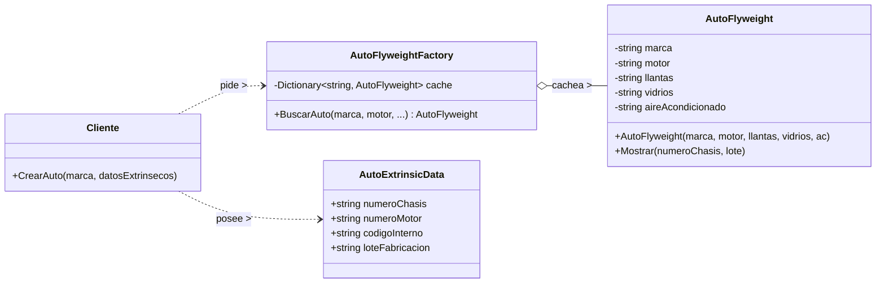
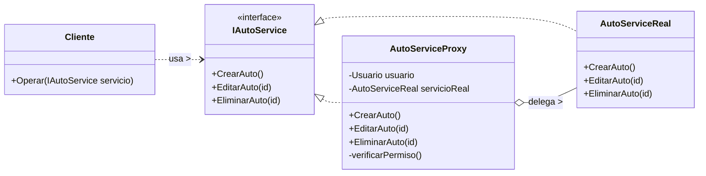
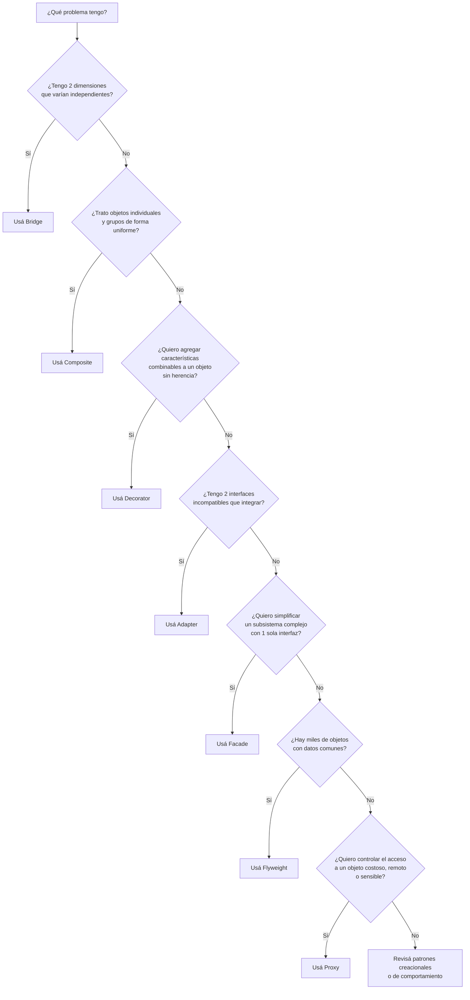

# Patrones Estructurales — Resumen Completo

> [!abstract] Resumen
> Este documento es un apunte de estudio + referencia técnica sobre los **7 patrones estructurales** vistos en clase: **Bridge, Composite, Decorator, Adapter, Facade, Flyweight y Proxy**. Para cada patrón vas a encontrar: definición, problema, solución, UML en Mermaid, código C# comentado, casos de uso profesional, pros/contras y preguntas que resuelve un equipo de desarrollo. Todos los ejemplos de código están en C# (.NET) y siguen la convención de namespaces `p_estr_xxx` del proyecto original.

> [!tip] Cómo usar este apunte en Obsidian
> - Los diagramas UML están en bloques `mermaid` y se renderizan automáticamente en Obsidian.
> - Los callouts (`> [!note]`, `> [!warning]`, etc.) son nativos de Obsidian.
> - Al final del documento hay un **mapa de decisión** y un **glosario** para repaso rápido.
> - Los `[[wiki-links]]` entre patrones se pueden activar si creás notas separadas por patrón.

---

## 1. Introducción a los Patrones de Diseño

### 1.1 ¿Qué son los patrones de diseño?

Los **patrones de diseño** son soluciones probadas a problemas recurrentes en el diseño de software. No son código que se copia y pega, sino **plantillas conceptuales** que guían cómo estructurar clases y objetos para resolver un tipo específico de problema. Fueron formalizados en 1994 por el libro *"Design Patterns: Elements of Reusable Object-Oriented Software"* de la banda de los cuatro (GoF — Gamma, Helm, Johnson, Vlissides), que catalogó 23 patrones clásicos.

La idea central es **no reinventar la rueda**: si muchos diseñadores se enfrentan al mismo problema una y otra vez, tiene sentido documentar la mejor solución conocida para que todos podamos hablar el mismo idioma. Cuando un colega dice "acá conviene un *Adapter*", el equipo completo entiende a qué se refiere sin necesidad de una explicación larga.

### 1.2 Las tres categorías de patrones (GoF)

Los patrones del GoF se agrupan en tres familias según el problema que atacan:

| Categoría | Intención | Patrones principales |
|-----------|-----------|----------------------|
| **Creacionales** | Cómo se crean los objetos | Singleton, Factory Method, Abstract Factory, Builder, Prototype |
| **Estructurales** | Cómo se componen clases y objetos en estructuras mayores | **Adapter, Bridge, Composite, Decorator, Facade, Flyweight, Proxy** ← los de este apunte |
| **De Comportamiento** | Cómo se distribuyen responsabilidades y se comunican los objetos | Strategy, Observer, Command, State, Template Method, Iterator, etc. |

> [!info] ¿Por qué importan los estructurales?
> Mientras los creacionales se ocupan del **nacimiento** de los objetos y los comportamentales del **diálogo** entre ellos, los estructurales se ocupan de la **anatomía**: cómo se ensamblan clases y objetos para formar estructuras más grandes, flexibles y eficientes. Sin patrones estructurales, los sistemas tienden a volverse rígidos (cualquier cambio rompe todo), duplicados (muchas clases que hacen casi lo mismo) o acoplados (todo depende de todo).

### 1.3 Principios SOLID relevantes para patrones estructurales

Los patrones estructurales **materializan** los principios SOLID. Conviene tenerlos presentes porque cada patrón los aplica:

- **S — Single Responsibility Principle (SRP):** una clase, una razón para cambiar. *Decorator* y *Facade* lo aplican dividiendo responsabilidades.
- **O — Open/Closed Principle (OCP):** abierto a extensión, cerrado a modificación. *Decorator, Composite, Bridge* permiten agregar comportamiento/tipos sin tocar código existente.
- **L — Liskov Substitution Principle (LSP):** cualquier subclase debe poder usarse donde se espera su padre. *Composite* lo exige para que hojas y compuestos sean intercambiables.
- **I — Interface Segregation Principle (ISP):** muchas interfaces específicas mejor que una general. *Bridge* separa dos interfaces ortogonales.
- **D — Dependency Inversion Principle (DIP):** depender de abstracciones, no de concreciones. *Bridge, Facade, Adapter, Proxy* dependen de interfaces, no de clases concretas.

### 1.4 Los 7 patrones estructurales que veremos

| Patrón | En una línea |
|--------|--------------|
| **Bridge** | Desacopla dos dimensiones de variación (abstracción vs implementación) para que evolucionen independientes. |
| **Composite** | Trata objetos individuales y compuestos de la misma forma (estructura de árbol). |
| **Decorator** | Agrega comportamiento a un objeto envolviéndolo, sin herencia. |
| **Adapter** | Convierte una interfaz incompatible en la que el cliente espera. |
| **Facade** | Ofrece una interfaz simplificada a un subsistema complejo. |
| **Flyweight** | Comparte datos comunes entre muchos objetos para ahorrar memoria. |
| **Proxy** | Controla el acceso a otro objeto (remoto, costoso o protegido). |

> [!note] Convención del proyecto
> Todos los ejemplos están en **C#** y mantienen la convención del proyecto de la cátedra:
> - Namespace por patrón: `p_estr_bridge`, `p_estr_composite`, `p_estr_decorator`, etc.
> - Subcarpetas `Interfaces` y `Clases`.
> - Nombres en español para clases y métodos.

---

## 2. Patrón Bridge

### 2.1 Definición

El patrón **Bridge** (Puente) permite **desacoplar una clase grande —o un grupo de clases estrechamente relacionadas— en dos jerarquías separadas** que pueden evolucionar de manera independiente:

1. **Abstracción** (la "forma" de alto nivel, típicamente una interfaz o GUI).
2. **Implementación** (la "plataforma" o mecanismo concreto, por ejemplo un API o un dispositivo).

Entre ambas jerarquías hay un "puente": la abstracción **contiene** una referencia a un objeto que implementa la interfaz de implementación, y **delega** en él el trabajo específico. Así podés añadir nuevas abstracciones o nuevas implementaciones sin tocar la otra jerarquía.

> [!quote] Refactoring Guru
> "Bridge es un patrón de diseño estructural que te permite dividir una clase grande, o un grupo de clases estrechamente relacionadas, en dos jerarquías separadas —abstracción e implementación— que pueden desarrollarse de forma independiente."

### 2.2 El problema

Imaginemos que estamos diseñando un sistema de automóviles que puede tener distintos tipos de **vehículos** (sedán, SUV, coupé, pick-up) y diferentes tipos de **motores** (gasolina, diésel, eléctrico, híbrido).

Si seguimos el camino naïve de la herencia múltiple (o combinaciones), terminamos con una **explosión combinatoria** de clases:

```
SedanGasolina    SedanDiesel    SedanElectrico    SedanHibrido
SUVPaGasolina    SUVDiesel      SUVElectrico      SUVHibrido
CoupeGasolina    CoupeDiesel    CoupeElectrico   CoupeHibrido
PickupGasolina   PickupDiesel   PickupElectrico  PickupHibrido
```

Eso son **16 clases** para 4 × 4. Y si mañana agregamos un 5° tipo de vehículo o un 5° tipo de motor, la cantidad se dispara. Cada nueva combinación requiere una clase nueva, cada cambio en una dimensión (por ejemplo, agregar el método `RecargarBateria()` a los eléctricos) repercute en muchísimas clases. El sistema se vuelve **inmanejable**.

> [!warning] Anti-patrón: explosión de subclases
> Cuando ves nombres de clases que son **sustantivo + sustantivo + sustantivo** (`SedanElectricoConGPS`), es una señal de que falta un Bridge. El problema no es la herencia en sí, sino **usarla para combinar dimensiones ortogonales**.

### 2.3 La solución con Bridge

Bridge propone **separar las dos dimensiones en jerarquías distintas**, conectadas por composición:

- **Jerarquía de abstracción:** `Auto` (abstracta) → `Sedan`, `SUV`, etc. Es el "qué" (el tipo de vehículo).
- **Jerarquía de implementación:** `IMotor` (interface) → `Gasolina`, `Electrico`, `Diesel`. Es el "cómo" (qué motor lo impulsa).

La abstracción **no conoce** la implementación concreta; solo sabe que tiene una referencia a un `IMotor` y le delega el trabajo. El cliente arma el puente en tiempo de ejecución inyectando el motor que quiera:

```csharp
Auto miAuto = new Sedan(new Electrico());
miAuto.Conducir();
```

Agregar un vehículo nuevo (por ejemplo `Coupe`) **no toca** la jerarquía de motores. Agregar un motor nuevo (por ejemplo `Hidrogeno`) **no toca** la jerarquía de vehículos. Cada jerarquía evoluciona por su lado.

### 2.4 Diagrama UML



> [!note] Lectura del UML
> - `--|>` es herencia.
> - `<|..` es realización de interfaz (línea punteada con triángulo hueco).
> - `o--` es **agregación**: `Auto` tiene una referencia a `IMotor` pero no es dueña de su ciclo de vida. La flecha va desde el lado del todo (`Auto`) hacia la parte (`IMotor`).

### 2.5 Código C# completo (proyecto `p_estr_bridge`)

#### 2.5.1 Interfaz de implementación — `IMotor.cs`

```csharp
using System;
using System.Collections.Generic;
using System.Linq;
using System.Threading.Tasks;

namespace p_estr_bridge.Interfaces
{
    public interface IMotor
    {
        void Encender();
        void Acelerar();
    }
}
```

> [!info] Lectura
> `IMotor` es la **jerarquía de implementación**. Define dos operaciones que cualquier motor concreto debe soportar. Es lo único que la abstracción `Auto` necesita saber sobre motores.

#### 2.5.2 Implementaciones concretas — `Gasolina.cs` y `Electrico.cs`

```csharp
// Gasolina.cs
using p_estr_bridge.Interfaces;

namespace p_estr_bridge.Clases
{
    public class Gasolina : IMotor
    {
        public void Encender()
        {
            Console.WriteLine("Motor de gasolina encendido.");
        }

        public void Acelerar()
        {
            Console.WriteLine("Acelerando con motor de gasolina.");
        }
    }
}

// Electrico.cs
using p_estr_bridge.Interfaces;

namespace p_estr_bridge.Clases
{
    public class Electrico : IMotor
    {
        public void Encender()
        {
            Console.WriteLine("Motor eléctrico encendido.");
        }

        public void Acelerar()
        {
            Console.WriteLine("Acelerando con motor eléctrico.");
        }
    }
}
```

> [!tip] Extensibilidad
> Si mañana aparece `Diesel` o `Hidrogeno`, basta con crear una clase nueva que implemente `IMotor`. **No se toca** ni `Auto`, ni `Sedan`, ni `SUV`. Ese es el principio Open/Closed en acción.

#### 2.5.3 Abstracción — `Auto.cs`

```csharp
using p_estr_bridge.Interfaces;

namespace p_estr_bridge.Clases
{
    public abstract class Auto
    {
        // Referencia al motor (el "puente" hacia la otra jerarquía)
        protected IMotor motor;

        // Inyección por constructor: el puente se arma al nacer el objeto
        public Auto(IMotor motor)
        {
            this.motor = motor;
        }

        // Operación de alto nivel que delega en el motor concreto
        public abstract void Conducir();
    }
}
```

> [!info] Puntos clave
> 1. El campo `motor` es `protected` para que las subclases (`Sedan`, `SUV`) puedan usarlo.
> 2. El constructor **recibe** el motor (inyección de dependencias). Esto es lo que materializa el puente.
> 3. `Conducir()` es `abstract`: cada tipo de auto lo implementa a su manera, pero **delega** el trabajo específico del motor a `motor.Encender()` / `motor.Acelerar()`.

#### 2.5.4 Abstracciones refinadas — `Sedan.cs` y `SUV.cs`

```csharp
// Sedan.cs
using p_estr_bridge.Interfaces;

namespace p_estr_bridge.Clases
{
    public class Sedan : Auto
    {
        // Pasa el motor al constructor de la base (Auto)
        public Sedan(IMotor motor) : base(motor) { }

        public override void Conducir()
        {
            Console.WriteLine("Conduciendo un sedán...");
            motor.Encender();   // Delegación al motor concreto
            motor.Acelerar();
        }
    }
}

// SUV.cs
using p_estr_bridge.Interfaces;

namespace p_estr_bridge.Clases
{
    public class SUV : Auto
    {
        public SUV(IMotor motor) : base(motor) { }

        public override void Conducir()
        {
            Console.WriteLine("Conduciendo un SUV...");
            motor.Encender();
            motor.Acelerar();
        }
    }
}
```

> [!note] Detalle sutil
> La llamada `: base(motor)` en el constructor de `Sedan`/`SUV` **delega** la inicialización del campo `motor` al constructor de `Auto`. Así no se duplica la lógica de asignación.

#### 2.5.5 Uso desde el cliente — `Program.cs`

```csharp
using p_estr_bridge.Clases;
using p_estr_bridge.Interfaces;

class Program
{
    static void Main()
    {
        // El cliente arma el puente: combina abstracción + implementación
        Auto sedanElectrico = new Sedan(new Electrico());
        Auto suvGasolina    = new SUV(new Gasolina());

        sedanElectrico.Conducir();
        // >> Conduciendo un sedán...
        // >> Motor eléctrico encendido.
        // >> Acelerando con motor eléctrico.

        suvGasolina.Conducir();
        // >> Conduciendo un SUV...
        // >> Motor de gasolina encendido.
        // >> Acelerando con motor de gasolina.
    }
}
```

### 2.6 Casos de uso profesional

Un arquitecto de software usa Bridge cuando hay **dos dimensiones de variación** que deben poder crecer independientemente:

- **Sistemas escalables:** cuando se quiere permitir la evolución independiente de dos jerarquías (tipos de vehículos × tipos de motores, tipos de vista × plataformas gráficas, etc.).
- **Frameworks modulares:** útil en software modular donde componentes intercambiables deben integrarse sin dependencias rígidas.
- **Interoperabilidad hardware/software:** cuando un sistema debe soportar múltiples tipos de hardware (sensors, actuators) sin cambiar su lógica de alto nivel.
- **GUIs multiplataforma:** el ejemplo clásico del GoF —una abstracción `Window` con implementaciones `WindowsWindow`, `MacWindow`, `LinuxWindow`.

### 2.7 Preguntas que se plantea un equipo antes de aplicar Bridge

- ¿Se puede definir una jerarquía de abstracción separada de la implementación?
- ¿Es probable agregar más tipos de vehículos o más motores en el futuro?
- ¿Cómo se reduce la cantidad de clases innecesarias con este patrón?
- ¿Es conveniente Bridge o conviene una estructura "Todo-Partes" (Composite)?

### 2.8 Pros y contras

| ✅ Pros | ❌ Contras |
|--------|-----------|
| Evita la explosión combinatoria de clases (n + m en vez de n × m). | Aumenta la cantidad de archivos/clases pequeñas. |
| Permite evolución independiente de abstracción e implementación (OCP). | El código cliente se complica un poco: debe conocer ambas jerarquías para armar el puente. |
| Cambiar de implementación en tiempo de ejecución es trivial (basta reasignar el `IMotor`). | Puede oscurecer la lógica: el lector debe entender la separación para seguir el flujo. |
| Cumple DIP: la abstracción depende de una interfaz, no de concreciones. | Si las dos dimensiones no son realmente ortogonales, Bridge agrega complejidad sin valor. |

> [!quote] Conclusión del arquitecto
> "Un arquitecto analiza si el desacoplamiento de abstracción e implementación es necesario para evitar problemas de escalabilidad y mantenimiento." — Diapositiva 7.

---
## 3. Patrón Composite

### 3.1 Definición

El patrón **Composite** (Compuesto) sirve para **modelar jerarquías de objetos complejos en forma de árbol** valiéndose de **composición recursiva**. La idea clave es esta: en estas jerarquías **se pueden tratar objetos individuales y grupos de objetos de la misma manera**, porque comparten una interfaz común.

Composite proporciona dos tipos de elementos básicos que implementan la misma interfaz:

- **Hojas (Leaf):** elementos simples, terminales, no contienen subcomponentes.
- **Compuestos (Composite):** contenedores que pueden tener hojas y otros compuestos como hijos.

> [!quote] Refactoring Guru
> "Al recibir una solicitud, un contenedor delega el trabajo a sus subelementos, procesa los resultados intermedios y devuelve el resultado final al cliente."

> [!warning] Confusión común
> De entrada es fácil confundir Composite con la **relación de composición "Todo-Partes"**. La diferencia es operativa: Composite te permite **recorrer y manipular recursivamente** la estructura como si fuera un único objeto, mientras que la composición simple es solo una relación estructural.

### 3.2 Diferencia con la relación "Todo-Partes" (composición simple)

| Criterio | Composición (Todo-Parte) | Patrón Composite |
|----------|--------------------------|-------------------|
| **Dependencia de vida** | La parte deja de existir si se destruye el todo. | Las hojas pueden existir independientemente o ser compartidas. |
| **Estructura** | Fija, conocida de antemano. | Recursiva, dinámica, en forma de árbol. |
| **Recorrido** | No necesariamente recursivo. | Recursivo: cada padre delega a sus hijos. |
| **Interfaz común** | No se exige. | Sí: hojas y compuestos implementan la misma interfaz. |
| **Caso típico** | `Auto` que contiene `Motor` y `Ruedas` (si se destruye el auto, esos componentes se descartan). | `Carpeta` que contiene `Archivos` y otras `Carpetas`. |

**Regla práctica:**
- ✅ Usá **Composición (Todo-Parte)** cuando un objeto depende totalmente de otro para existir, la estructura es fija y conocida, y no necesitás recorrerla recursivamente.
- ✅ Usá **Composite** cuando necesitás tratar objetos individuales y colecciones de manera uniforme y recorrer la estructura de forma recursiva.

### 3.3 El problema

Aproximación 2 del libro de referencia: tenemos **dos tipos de objetos**: **Productos** y **Cajas**. Una Caja puede contener varios Productos **y también cierto número de Cajas más pequeñas**. Estas cajas pequeñas también pueden contener Productos o cajas aún más pequeñas, y así recursivamente.

Queremos construir un **sistema de pedidos** donde un pedido puede tener productos sueltos, cajas con productos, cajas dentro de cajas, etc. **¿Cómo calculás el precio total del pedido**?

Sin Composite, el código cliente debería distinguir si cada elemento es un Producto o una Caja, recorrer cada caja, sumar, recursar... un desastre de `if` y `foreach` anidados. Y cada vez que aparezca un tipo nuevo de contenedor, hay que volver a tocar el código del cliente.

### 3.4 La solución con Composite

Se define una **interfaz común** `IComponenteAuto` (en nuestro caso: cualquier cosa que pueda `MostrarDetalles()`). Tanto las hojas (`Parte`) como los compuestos (`ComponenteCompuesto`) la implementan. El compuesto **mantiene una lista de hijos** que también son `IComponenteAuto`, y cuando le piden que muestre sus detalles, **recorre la lista y le delega** la operación a cada hijo.

- Para una **hoja**, mostrar detalles es trivial: imprimir su nombre.
- Para un **compuesto**, mostrar detalles significa: imprimir su propio nombre y luego pedirle a cada hijo que muestre los suyos (recursividad natural).

### 3.5 Diagrama UML



> [!note] Lectura del UML
> - `Parte` y `ComponenteCompuesto` **implementan la misma interfaz** `IComponenteAuto` — esto es lo que permite polimorfismo y recursión uniforme.
> - `ComponenteCompuesto` **agrega** una lista de `IComponenteAuto` (relación `o--`). El compuesto no es dueño estricto de la vida de sus hijos (pueden venir de afuera), pero los contiene y opera sobre ellos.

### 3.6 Código C# completo (proyecto `p_estr_composite`)

#### 3.6.1 Interfaz componente — `IComponenteAutomovil.cs`

```csharp
using System;
using System.Collections.Generic;
using System.Linq;
using System.Threading.Tasks;

namespace p_estr_composite.Interfaces
{
    public interface IComponenteAuto
    {
        void MostrarDetalles();
    }
}
```

> [!info] Punto clave
> `IComponenteAuto` es la **interfaz común** que tanto hojas como compuestos implementan. Es la clave del polimorfismo: el cliente (y el propio compuesto) pueden tratar a ambos de la misma forma. Si mañana agregamos `MostrarPrecio()`, se rompe el principio ISP — mejor crear otra interfaz `IPreciable` aparte.

#### 3.6.2 Hoja — `Parte.cs`

```csharp
using p_estr_composite.Interfaces;

namespace p_estr_composite.Clases
{
    // Implementación de una parte individual del auto
    public class Parte : IComponenteAuto
    {
        private string _nombre;

        public Parte(string nombre)
        {
            _nombre = nombre;
        }

        public void MostrarDetalles()
        {
            Console.WriteLine($"Parte: {_nombre}");
        }
    }
}
```

> [!tip] Hoja
> `Parte` es una **hoja del árbol**: no tiene hijos, no mantiene listas, no implementa `Agregar()`. Cuando recibe una solicitud, simplemente la ejecuta. En una versión más completa del patrón podrías declarar `Agregar()`/`Quitar()` en la interfaz y que la hoja lance `NotSupportedException`, pero para este ejemplo se omite.

#### 3.6.3 Compuesto — `ComponenteCompuesto.cs`

```csharp
using p_estr_composite.Interfaces;

namespace p_estr_composite.Clases
{
    public class ComponenteCompuesto : IComponenteAuto
    {
        private string _nombre;
        // Lista de hijos: pueden ser hojas (Parte) u otros compuestos
        private List<IComponenteAuto> l_icomponentes_auto = new List<IComponenteAuto>();

        public ComponenteCompuesto(string nombre)
        {
            _nombre = nombre;
        }

        public void Agregar(IComponenteAuto componente)
        {
            l_icomponentes_auto.Add(componente);
        }

        public void MostrarDetalles()
        {
            Console.WriteLine($"Componente: {_nombre}");
            // Delegación recursiva a cada hijo (hoja o compuesto)
            l_icomponentes_auto.ForEach(componente => componente.MostrarDetalles());
            /* Versión equivalente con foreach clásico:
            foreach (var componente in l_icomponentes_auto)
            {
                componente.MostrarDetalles();
            }
            */
        }
    }
}
```

> [!info] Detalles clave
> 1. La lista `l_icomponentes_auto` es de tipo `List<IComponenteAuto>` — puede contener **hojas y otros compuestos** indistintamente. Esa es la magia: **el compuesto no sabe ni le importa si cada hijo es hoja o compuesto**; solo llama a `MostrarDetalles()` y polimorfismos hace el resto.
> 2. `Agregar()` permite construir el árbol dinámicamente en tiempo de ejecución.
> 3. `MostrarDetalles()` primero imprime el propio nombre y luego **delegar recursivamente** a cada hijo. Si un hijo es un `ComponenteCompuesto`, este a su vez recorrerá a sus propios hijos, y así hasta que se terminen las hojas. **Recursividad natural**.

#### 3.6.4 Uso desde el cliente — `Program.cs`

```csharp
using p_estr_composite.Clases;
using p_estr_composite.Interfaces;

class Program
{
    static void Main()
    {
        // Hojas (partes individuales)
        IComponenteAuto motor     = new Parte("Motor 1.6");
        IComponenteAuto transmision = new Parte("Transmisión automática");
        IComponenteAuto bateria   = new Parte("Batería 12V");

        // Compuesto: suspensión agrupa partes
        ComponenteCompuesto suspension = new ComponenteCompuesto("Suspensión");
        suspension.Agregar(new Parte("Amortiguador"));
        suspension.Agregar(new Parte("Resorte helicoidal"));

        // Compuesto raíz: el auto completo
        ComponenteCompuesto auto = new ComponenteCompuesto("Auto");
        auto.Agregar(motor);
        auto.Agregar(transmision);
        auto.Agregar(bateria);
        auto.Agregar(suspension); // ¡Un compuesto dentro de otro compuesto!

        // El cliente NO sabe ni le importa qué es hoja y qué es compuesto
        auto.MostrarDetalles();
        // >> Componente: Auto
        // >> Parte: Motor 1.6
        // >> Parte: Transmisión automática
        // >> Parte: Batería 12V
        // >> Componente: Suspensión          <-- delega en el subárbol
        // >> Parte: Amortiguador
        // >> Parte: Resorte helicoidal
    }
}
```

> [!example] Salida esperada
> Al ejecutar `auto.MostrarDetalles()`, el cliente solo hace **una llamada**. El árbol se recorre solo por delegación recursiva: el `auto` le pide a sus hijos que muestren detalles; cuando llega al `suspension`, este a su vez le pide a sus hijos. Por eso la salida muestra "Componente: Suspensión" seguido de sus partes internas — **el cliente nunca tuvo que saber que suspensión era un compuesto**.

### 3.7 Casos de uso profesional

- **Modelado de estructuras jerárquicas:** un sistema de gestión de archivos donde una carpeta puede contener archivos y otras carpetas (caso clásico).
- **Diseño de interfaces de usuario:** un contenedor de UI puede tener elementos individuales (botones, etiquetas) o subcontroles compuestos (paneles con múltiples botones).
- **Sistema de organización de productos:** un catálogo donde un producto individual y un paquete de productos pueden ser tratados de la misma forma (un paquete puede contener productos sueltos y otros paquetes).
- **Árboles de expresión / ASTs:** representación de fórmulas matemáticas o de código fuente, donde un nodo compuesto (operador) tiene como hijos a operandos que pueden ser hojas o sub-expresiones.
- **Organigramas y estructuras empresariales:** un gerente puede tener empleados a cargo, y algunos de esos empleados son a su vez gerentes con su propio equipo.

### 3.8 Preguntas que resuelve un equipo con este patrón

1. **¿Se necesita tratar objetos individuales y colecciones de manera uniforme?**
   Si el sistema requiere manipular elementos simples y grupos sin diferenciar entre ellos, Composite es buena opción — el código cliente tratará ambos de la misma forma.

2. **¿Se tiene una estructura jerárquica de objetos?**
   Si los datos tienen jerarquía (un vehículo que tiene partes, que a su vez tienen subpartes), este patrón es útil.

3. **¿Es necesario recorrer la estructura de manera recursiva?**
   Si los elementos pueden contener otros elementos similares, Composite permite recorrer fácilmente usando recursión/polimorfismo.

### 3.9 Pros y contras

| ✅ Pros | ❌ Contras |
|--------|-----------|
| Trabajas con estructuras de árbol complejas cómodamente: polimorfismo y recursión a tu favor. | Puede ser difícil proporcionar una interfaz común para clases cuya funcionalidad difiere demasiado. |
| **OCP:** podés introducir nuevos tipos de elementos sin romper el código existente. | A veces hay que **generalizar en exceso** la interfaz componente, lo que la hace más difícil de comprender. |
| El código cliente se simplifica enormemente: no necesita distinguir hoja vs compuesto. | La interfaz puede volverse **demasiado amplia** si hojas y compuestos tienen necesidades muy diferentes. |

> [!quote] Conclusión
> "Composite te deja trabajar con estructuras de árbol complejas con mayor comodidad, utilizando el polimorfismo y la recursión a tu favor. Cumple el principio Open/Closed: podés introducir nuevos tipos de elementos sin descomponer el código existente." — Adaptado de Refactoring Guru.

---
## 4. Patrón Decorator

### 4.1 Definición

El patrón **Decorator** (Decorador) es un patrón estructural que permite **agregar funcionalidades a un objeto de manera flexible y sin modificar su estructura**. Se basa en la **composición en lugar de la herencia** (que es un diseño estático), proporcionando una forma de **extender el comportamiento de un objeto dinámicamente**.

> [!quote] Idea clave
> "Permite añadir dinámicamente funcionalidad a un objeto sin tener que crear sucesivas clases que hereden de la primera incorporando la nueva funcionalidad."

En vez de crear 100 subclases que representen todas las combinaciones posibles (`AutoConGPS`, `AutoConCuero`, `AutoConGPSyCuero`, ...), creás **un decorador por cada característica** y los **envolvés** (componéis) en tiempo de ejecución según lo que necesite el cliente.

### 4.2 El problema

Trabajás en un concesionario. Tenés una aplicación que maneja automóviles y necesitás incorporar diferentes modelos con diversas características **opcionales**: GPS, asientos de cuero, sistema de sonido premium, techo corredizo, pintura metalizada, etc.

- **Peor opción:** crear múltiples clases que representen todas las combinaciones posibles de características. Para 6 características tenés 2^6 = 64 clases. Agregás una opción más → 128. Insostenible.
- **Mejor opción:** usar el patrón Decorator.

> [!warning] Anti-patrón: explosión de subclases por combinaciones
> Si ves nombres de clases con sufijos `ConXYZ` o `YConXConZ`, te falta un Decorator. La diferencia con Bridge es sutil pero clave: **Bridge** separa dimensiones **estructurales** (qué tipo de motor + qué tipo de vehículo), **Decorator** agrega **características opcionales y combinables** sobre un mismo objeto base.

### 4.3 La solución con Decorator

Decorator se basa en **4 roles**:

1. **Componente:** interfaz para objetos que pueden ser decorados con responsabilidades adicionales (`IAutomovil`).
2. **Componente Concreto:** objeto que puede ser decorado (`AutomovilBase`).
3. **Decorador Base:** clase abstracta que **implementa la interfaz** y **contiene** una referencia a un `IAutomovil` (el componente envuelto).
4. **Decoradores Concretos:** clases que extienden el decorador base y añaden comportamiento antes/después de delegar al componente envuelto.



> [!note] Decorator como Wrapper
> El patrón Decorator actúa como un **wrapper** (envoltorio) porque **envuelve** un objeto existente y extiende su comportamiento sin modificar su estructura interna. Cada decorador envuelve a otro objeto como si fuera **una capa adicional**. El cliente puede ir envolviendo uno dentro de otro, formando una pila de capas.

### 4.4 Analogías para entenderlo

> [!example] Capas de ropa en invierno
> - Camisa Polo (Base)
> - Suéter (encima del polo)
> - Chaqueta (encima del suéter)
> - Bufanda (encima de la chaqueta)
>
> Cada capa **envuelve** a la anterior y agrega una característica (calor, abrigo, estilo). La persona que te ve por fuera solo ve "alguien vestido" — no necesita saber cuántas capas hay. Cada capa es un decorador concreto.

> [!example] Envolturas de regalos
> - Cajita de regalo → **objeto base**.
> - Papel de envoltura → **primer decorador**.
> - Cinta decorativa → **segundo decorador**.
> - Tarjeta personalizada → **tercer decorador**.
>
> Quitás la tarjeta → sigue siendo un regalo válido. Quitás la cinta → igual. Cada decorador puede **envolver o no** al anterior y el resultado sigue siendo "un regalo".

### 4.5 Código C# completo (proyecto `p_estr_decorator`)

> [!info] Sobre este código
> Este ejemplo **no estaba en los archivos** de la cátedra. Lo generé siguiendo el mismo estilo (namespace `p_estr_decorator`, subcarpetas `Interfaces` y `Clases`, naming en español) y la misma temática de autos.

#### 4.5.1 Componente — `IAutomovil.cs`

```csharp
namespace p_estr_decorator.Interfaces
{
    public interface IAutomovil
    {
        string Descripcion();
        decimal Precio();
    }
}
```

#### 4.5.2 Componente concreto — `AutomovilBase.cs`

```csharp
using p_estr_decorator.Interfaces;

namespace p_estr_decorator.Clases
{
    public class AutomovilBase : IAutomovil
    {
        private string _modelo;
        private decimal _precioBase;

        public AutomovilBase(string modelo, decimal precioBase)
        {
            _modelo = modelo;
            _precioBase = precioBase;
        }

        public string Descripcion()
        {
            return $"Auto base: {_modelo}";
        }

        public decimal Precio()
        {
            return _precioBase;
        }
    }
}
```

#### 4.5.3 Decorador base — `AutomovilDecorator.cs`

```csharp
using p_estr_decorator.Interfaces;

namespace p_estr_decorator.Clases
{
    public abstract class AutomovilDecorator : IAutomovil
    {
        // Referencia al objeto envuelto (otro IAutomovil)
        protected IAutomovil automovil;

        public AutomovilDecorator(IAutomovil automovil)
        {
            this.automovil = automovil;
        }

        // Delegación por defecto al objeto envuelto
        public virtual string Descripcion()
        {
            return automovil.Descripcion();
        }

        public virtual decimal Precio()
        {
            return automovil.Precio();
        }
    }
}
```

> [!info] Por qué un decorador base abstracto
> Centraliza la **delegación por defecto**. Los decoradores concretos solo reescriben lo que les interesa y **llaman a `base.X()`** para que la operación se propague al objeto envuelto. Esto evita repetir "devolver `automovil.Descripcion()`" en cada decorador concreto.

#### 4.5.4 Decoradores concretos — `GPSDecorator.cs`, `CueroDecorator.cs`, `SonidoPremiumDecorator.cs`

```csharp
// GPSDecorator.cs
using p_estr_decorator.Interfaces;

namespace p_estr_decorator.Clases
{
    public class GPSDecorator : AutomovilDecorator
    {
        private const decimal COSTO_GPS = 1500m;

        public GPSDecorator(IAutomovil automovil) : base(automovil) { }

        public override string Descripcion()
        {
            return $"{base.Descripcion()} + GPS integrado";
        }

        public override decimal Precio()
        {
            return base.Precio() + COSTO_GPS;
        }
    }
}

// CueroDecorator.cs
using p_estr_decorator.Interfaces;

namespace p_estr_decorator.Clases
{
    public class CueroDecorator : AutomovilDecorator
    {
        private const decimal COSTO_CUERO = 3200m;

        public CueroDecorator(IAutomovil automovil) : base(automovil) { }

        public override string Descripcion()
        {
            return $"{base.Descripcion()} + Asientos de cuero";
        }

        public override decimal Precio()
        {
            return base.Precio() + COSTO_CUERO;
        }
    }
}

// SonidoPremiumDecorator.cs
using p_estr_decorator.Interfaces;

namespace p_estr_decorator.Clases
{
    public class SonidoPremiumDecorator : AutomovilDecorator
    {
        private const decimal COSTO_SONIDO = 2800m;

        public SonidoPremiumDecorator(IAutomovil automovil) : base(automovil) { }

        public override string Descripcion()
        {
            return $"{base.Descripcion()} + Sistema de sonido premium";
        }

        public override decimal Precio()
        {
            return base.Precio() + COSTO_SONIDO;
        }
    }
}
```

> [!tip] Lectura
> Cada decorador concreto **extiende** `AutomovilDecorator` y **delega** al envuelto (vía `base.X()`) **añadiendo** su propio aporte al final. Esto es lo que permite **apilar** decoradores: el resultado es una composición de todos los aportes.

#### 4.5.5 Uso desde el cliente — `Program.cs`

```csharp
using p_estr_decorator.Clases;
using p_estr_decorator.Interfaces;

class Program
{
    static void Main()
    {
        // Auto base
        IAutomovil auto = new AutomovilBase("Sedán LX", 25000m);
        Console.WriteLine($"{auto.Descripcion()} -> ${auto.Precio()}");
        // >> Auto base: Sedán LX -> $25000

        // Apilamos decoradores en runtime
        auto = new GPSDecorator(auto);
        auto = new CueroDecorator(auto);
        auto = new SonidoPremiumDecorator(auto);

        Console.WriteLine($"{auto.Descripcion()} -> ${auto.Precio()}");
        // >> Auto base: Sedán LX + GPS integrado + Asientos de cuero + Sistema de sonido premium -> $32500
    }
}
```

> [!example] Análisis
> 1. Empezamos con un `AutomovilBase` que vale 25.000.
> 2. Lo **envolvemos** con `GPSDecorator`: ahora el auto tiene GPS y cuesta 25.000 + 1.500 = 26.500.
> 3. Envolver con `CueroDecorator`: 26.500 + 3.200 = 29.700.
> 4. Envolver con `SonidoPremiumDecorator`: 29.700 + 2.800 = 32.500.
> 5. Cuando se llama `Descripcion()` desde afuera, cada decorador delega al envuelto y **añade** su parte. Resultado: lista encadenada de características.

### 4.6 Casos de uso profesional

- **Middleware en frameworks web** (ASP.NET, Express.js): cada middleware actúa como un decorador que extiende el comportamiento de la solicitud sin alterar el código del servidor.
  ```csharp
  app.UseAuthentication();
  app.UseAuthorization();
  app.UseResponseCompression();
  app.UseCustomMiddleware();
  ```
- **Logging y auditoría en aplicaciones empresariales** que necesitan registros detallados de las operaciones que realizan:
  ```csharp
  IOrderService orderService = new BasicOrderService();
  orderService = new LoggingDecorator(orderService);
  orderService = new SecurityDecorator(orderService);
  orderService.ProcessOrder(order);
  ```
- **Capas de procesamiento para un sistema de pagos** (validación → impuestos → auditoría → notificación): cada capa es un decorador.
- **Stream de Java/.NET**: `BufferedStream(new FileStream(...))` es un decorador — envuelve otro stream y añade buffering.
- **Clases `sealed`/`final` que no pueden heredarse:** para una clase final, la única forma de reutilizar el comportamiento existente es **envolverla** con tu propio wrapper.

### 4.7 Preguntas que resuelve un equipo con este patrón

1. **¿Cómo extendemos la funcionalidad de un objeto sin cambiar su código fuente?**
   Se resuelve utilizando decoradores en lugar de modificar la clase base — permite añadir nuevas características sin alterar el código existente.

2. **¿Cómo evitar la proliferación de subclases cuando necesitamos combinaciones de características?**
   En vez de crear `CarConGPS`, `CarConCuero`, `CarConGPSyCuero`, etc., usamos decoradores dinámicos.

3. **¿Cómo habilitar/deshabilitar características en tiempo de ejecución sin afectar el diseño original?**
   Aplicamos decoradores según los requerimientos del usuario, de forma dinámica (envolver/desenvolver).

### 4.8 Pros y contras

| ✅ Pros | ❌ Contras |
|--------|-----------|
| Extendés el comportamiento de un objeto sin crear una nueva subclase. | Es **difícil eliminar un wrapper específico** de la pila de wrappers (hay que mantener referencias o re-construir la pila). |
| Añadís o quitás responsabilidades de un objeto durante el tiempo de ejecución. | El comportamiento puede **depender del orden** en la pila de decoradores (GPS → Cuero vs Cuero → GPS podrían dar resultados distintos si los decoradores no son conmutativos). |
| Combinás varios comportamientos envolviendo un objeto con varios decoradores. | El **código de configuración inicial** de las capas puede tener un aspecto desagradable (un constructor dentro de otro dentro de otro). |
| **SRP:** dividís una clase monolítica en varias clases más pequeñas, cada una con una responsabilidad. | Mayor cantidad de objetos pequeños en memoria (cada decorador es un objeto aparte). |

> [!quote] Conclusión
> "Utiliza el patrón Decorator cuando necesites asignar funcionalidades adicionales a objetos durante el tiempo de ejecución sin descomponer el código que utiliza esos objetos. El código cliente puede tratar a todos estos objetos de la misma forma, ya que todos siguen una interfaz común." — Refactoring Guru.

---
## 5. Patrón Adapter

### 5.1 Definición

El patrón **Adapter** (Adaptador) permite que **dos interfaces incompatibles trabajen juntas**. Se usa para **convertir la interfaz de una clase en otra interfaz esperada por los clientes** sin modificar el código original.

> [!quote] Idea clave
> Es el mismo concepto del adaptador de corriente: cuando viajás a un país con enchufes diferentes, no abrís tu notebook para cambiarle el conector — comprás un **adaptador** que encaja entre tu notebook y la pared. En software, el adaptador hace lo mismo: encaja entre dos interfaces que no fueron diseñadas para coincidir.

### 5.2 El problema

Tenés una **clase existente** que funciona perfectamente — por ejemplo, un motor heredado (legacy) que expone su interfaz de cierta forma. Y tenés un **cliente nuevo** (o un sistema nuevo) que espera una interfaz diferente.

Las opciones son:
1. **Modificar la clase existente** → rompés a todos los clientes que ya dependían de la interfaz original.
2. **Reescribir todo** → costoso y peligroso.
3. **Crear una clase adaptadora** que exponga la interfaz esperada y, internamente, traduzca las llamadas a la interfaz original → eso es Adapter.

Adapter brilla en estos escenarios:
- **Migraciones de sistemas:** migrás de una API antigua a una nueva, mantenés compatibilidad con un adaptador.
- **Uso de bibliotecas de terceros:** la librería expone otra interfaz; la envolvés con un Adapter.
- **Software heredado:** un sistema viejo necesita interactuar con un componente nuevo sin refactorizarlo.

### 5.3 La solución con Adapter

Hay **3 roles**:
1. **Target (Interfaz objetivo):** la interfaz que el **cliente espera** (`IMotorNuevo`).
2. **Adaptee (Clase incompatible):** la clase existente que **no implementa** esa interfaz, pero tiene la funcionalidad que necesitamos (`MotorLegado`).
3. **Adapter:** clase que **implementa Target** y **contiene** una referencia al `Adaptee`. Traduce cada llamada del cliente en una llamada equivalente al adaptee.



> [!note] Lectura del UML
> - `MotorAdapter` **implementa** `IMotorNuevo` (por eso puede usarse donde el cliente espera un `IMotorNuevo`).
> - `MotorAdapter` **contiene** un `MotorLegado` y **delega** en él traduciendo nombres de métodos.
> - El `Cliente` solo conoce `IMotorNuevo` — nunca se entera de que detrás hay un motor legado.

### 5.4 Código C# completo (proyecto `p_estr_adapter`)

> [!info] Sobre este código
> Este ejemplo **no estaba en los archivos** de la cátedra. Lo generé siguiendo el mismo estilo (namespace `p_estr_adapter`, subcarpetas `Interfaces` y `Clases`) y manteniendo la temática de motores de auto.

#### 5.4.1 Interfaz objetivo — `IMotorNuevo.cs`

```csharp
namespace p_estr_adapter.Interfaces
{
    // Interfaz que el sistema nuevo espera
    public interface IMotorNuevo
    {
        void Encender();
        void Acelerar(int velocidad);
    }
}
```

#### 5.4.2 Adaptee — `MotorLegado.cs`

```csharp
namespace p_estr_adapter.Clases
{
    // Clase existente, interfaz "vieja" incompatible con la nueva
    public class MotorLegado
    {
        public void ActivarIgnicion()
        {
            Console.WriteLine("Motor legado: ignición activada.");
        }

        public void IncrementarRevoluciones(int rpm)
        {
            Console.WriteLine($"Motor legado: revoluciones subidas a {rpm} RPM.");
        }
    }
}
```

> [!warning] Incompatibilidad
> `MotorLegado` **no** implementa `IMotorNuevo`. Sus métodos tienen **otros nombres** (`ActivarIgnicion` vs `Encender`, `IncrementarRevoluciones` vs `Acelerar`). El cliente nuevo no puede usarlo directamente.

#### 5.4.3 Adapter — `MotorAdapter.cs`

```csharp
using p_estr_adapter.Interfaces;

namespace p_estr_adapter.Clases
{
    // Adapter: implementa el Target (IMotorNuevo) y traduce al Adaptee (MotorLegado)
    public class MotorAdapter : IMotorNuevo
    {
        private MotorLegado _motorLegado;

        public MotorAdapter(MotorLegado motorLegado)
        {
            _motorLegado = motorLegado;
        }

        public void Encender()
        {
            // Traducción de llamada
            _motorLegado.ActivarIgnicion();
        }

        public void Acelerar(int velocidad)
        {
            // Traducción + cálculo adicional (de km/h a RPM aproximado)
            int rpm = velocidad * 50;
            _motorLegado.IncrementarRevoluciones(rpm);
        }
    }
}
```

> [!info] Lectura
> - `MotorAdapter` **implementa `IMotorNuevo`**, por eso el cliente nuevo lo puede usar sin saber qué hay detrás.
> - Internamente **contiene** un `MotorLegado` (inyectado por constructor) y **traduce** cada llamada: cuando el cliente dice `Encender()`, el adapter le pide al legado `ActivarIgnicion()`.
> - El adapter puede añadir **lógica de conversión** (en `Acelerar` se convierte km/h a RPM con un factor). Eso es parte del "trabajo de adaptación".

#### 5.4.4 Uso desde el cliente — `Program.cs`

```csharp
using p_estr_adapter.Clases;
using p_estr_adapter.Interfaces;

class Program
{
    static void Main()
    {
        // El cliente solo conoce IMotorNuevo
        IMotorNuevo motor = new MotorAdapter(new MotorLegado());

        motor.Encender();
        // >> Motor legado: ignición activada.

        motor.Acelerar(60);
        // >> Motor legado: revoluciones subidas a 3000 RPM.

        // El cliente puede usar CUALQUIER IMotorNuevo: el legacy vía adapter,
        // o uno nuevo que implemente directamente la interfaz
        // IMotorNuevo motorDirecto = new MotorModernoDirecto();
    }
}
```

> [!example] Análisis
> El cliente **no sabe ni le importa** si el `IMotorNuevo` que recibió es un motor moderno que implementa la interfaz nativa, o un `MotorAdapter` que envuelve un motor legado. Solo llama a `Encender()` y `Acelerar()`. Ese es el objetivo: **transparencia para el cliente**.

### 5.5 Variantes de Adapter

> [!note] Dos formas de implementar
> - **Adapter de objeto (composition):** el adapter **contiene** una instancia del adaptee (el ejemplo de arriba). Es la forma más común en C# (porque no hay herencia múltiple de clases).
> - **Adapter de clase (inheritance):** el adapter **hereda** del Target y del Adaptee. Solo posible en lenguajes con herencia múltiple (C++, Python). En C#/.NET se usa la variante por composición.

### 5.6 Casos de uso profesional

- **Migraciones de sistemas:** si un equipo está migrando de una API antigua a una nueva, pueden usar Adapter para mantener la compatibilidad sin cambiar toda la base de código.
- **Uso de bibliotecas de terceros:** si una biblioteca externa usa una interfaz diferente a la esperada, se puede adaptar con un Adapter.
- **Compatibilidad con software heredado:** cuando un sistema viejo necesita interactuar con un nuevo componente sin refactorizarlo.
- **Unificación de fuentes de datos:** adaptadores que normalizan respuestas de múltiples APIs REST para que el resto del sistema las consuma uniformemente.
- **Wrappers de tipos primitivos:** patrón adaptador para "envolver" tipos `int`/`string` en objetos con responsabilidad — ejemplo clásico en Java (`Integer`, `BigDecimal`).

### 5.7 Preguntas que resuelve un equipo con este patrón

1. **¿Podemos modificar directamente la clase existente o debemos usar un adaptador?**
   Si la clase es heredada o de terceros, no la tocamos → Adapter.
2. **¿Es más eficiente usar un Adapter o refactorizar la clase para soportar ambas interfaces?**
   Depende del costo de refactorización vs el costo de mantenimiento del adapter.
3. **¿Cómo evitamos la duplicación de código al usar un Adapter?**
   Centralizando la lógica de traducción en una sola clase adapter.
4. **¿Cuál es el impacto de performance al agregar una capa adicional con el Adapter?**
   Generalmente despreciable (un salto de método más), pero en hot paths puede sumar.

### 5.8 Pros y contras

| ✅ Pros | ❌ Contras |
|--------|-----------|
| **No modificás** ni la clase existente ni el código cliente. | Aumentás la cantidad de clases del sistema. |
| Cumple **OCP**: podés agregar adaptadores para nuevas interfaces sin tocar el código existente. | La capa de traducción puede **introducir bugs** si los comportamientos no son 1:1 (ej: conversión de unidades, manejo de nulls). |
| Permite **reutilizar** clases heredadas que no pueden modificarse. | Performance: una indirección más (normalmente despreciable). |
| Aísla al cliente de los detalles de la interfaz original. | Si muchas clases necesitan adaptarse, el código puede llenarse de adapters. |

> [!quote] Conclusión del arquitecto
> "Un arquitecto evalúa si el costo de implementación de un Adapter es menor que refactorizar el código existente. Además, verifica que la solución no afecte la escalabilidad y mantenibilidad del sistema." — Diapositiva 30.

---
## 6. Patrón Facade

### 6.1 Definición

**Facade** (Fachada) es un patrón de diseño estructural que proporciona una **interfaz simplificada, sencilla y simple** a una biblioteca, un framework o cualquier otro grupo complejo de interfaces y clases.

> [!quote] Idea clave
> Posibilita estructurar un entorno de programación y **reducir su complejidad** mediante la división en subsistemas, minimizando las comunicaciones y dependencias entre estos. **Solo te comunicás con la fachada.**

La fachada es una clase que proporciona una interfaz simple a un subsistema complejo. La mayoría de las veces la funcionalidad va a estar limitada a todo lo ofrecido por las clases del subsistema — por eso en el diseño se debe tener cuidado de incluir en esa fachada **las funciones realmente importantes para los clientes**.

### 6.2 El problema

Imaginá que estás integrando un concesionario de autos. Para vender un auto, el proceso involucra:
1. Consultar el **inventario** para verificar disponibilidad.
2. Calcular el **financiamiento** (cuotas, intereses, enganche).
3. Activar la **garantía** del fabricante.
4. Contratar el **seguro** del vehículo.
5. Generar el **contrato** y la factura.
6. Registrar la venta en el **sistema CRM**.

Si el cliente (la página web, el vendedor desde la app) tuviera que orquestar todos esos subsistemas, terminaría con 10 líneas de código y dependencias a 6 clases distintas. Cada vez que un subsistema cambia su API, **todos los puntos de uso** se rompen. Peor: cualquier nuevo desarrollador debe entender cómo interactúan 6 subsistemas antes de poder vender un auto.

### 6.3 La solución con Facade

Se crea una clase **`ConcesionarioFacade`** que expone un solo método "amigable" — por ejemplo `VenderAuto(modelo, cliente, enganche, meses)` — y **internamente orquesta las llamadas** a Inventario, Financiamiento, Garantía, Seguro, Contrato y CRM.

El cliente solo tiene que:
```csharp
var facade = new ConcesionarioFacade();
var resultado = facade.VenderAuto("Corolla", cliente, 0.20m, 48);
```

Detrás, la fachada:
1. Llama a `InventarioService.Reservar(modelo)`.
2. Llama a `FinanciamientoService.Calcular(modelo, enganche, meses)`.
3. Llama a `GarantiaService.Activar(modelo, cliente)`.
4. Llama a `SeguroService.Contratar(modelo, cliente)`.
5. Llama a `ContratoService.Generar(cliente, auto, plan)`.
6. Llama a `CRMService.RegistrarVenta(...)`.

> [!info] Beneficios
> - El cliente **no debe entender las complejidades de los subsistemas** ni comunicarse directamente con ellos.
> - La fachada **expone lo que le es útil** y se encarga de la complejidad.
> - El cliente solo necesita una instancia, **a la fachada**.

### 6.4 Diagrama UML



### 6.5 Relaciones de la fachada con sus subsistemas

La diapositiva destaca **3 tipos de relación** que puede tener la fachada con los subsistemas:

| Tipo | Característica | UML | Cuándo aplica |
|------|---------------|-----|---------------|
| **Composición** | La fachada **crea** y **es dueña** de las instancias de los subsistemas. Si la fachada se destruye, los subsistemas también desaparecen. | `*--` (composición) | Cuando los subsistemas solo existen para esa fachada y no se reutilizan fuera. |
| **Agregación** | Los subsistemas se **inyectan** en la fachada pero existen de manera independiente a ella. La fachada los **usa pero no crea ni destruye**. | `o--` (agregación) | Cuando los subsistemas son compartidos por varios consumidores o tienen su propio ciclo de vida (DI típica). |
| **Dependencia** | La fachada solo **llama a métodos** de los subsistemas sin poseer referencias directas (por ejemplo, métodos estáticos o locales). | `..>` (dependencia) | Cuando los subsistemas no tienen estado o son utilitarios estáticos. |

> [!tip] Cuál elegir
> - **Composición:** si los subsistemas solo tienen sentido dentro de la fachada (ej: una fachada que arma un objeto complejo desde partes internas que no se usan afuera).
> - **Agregación:** si los subsistemas son servicios reutilizables y/o testables (lo más común en código moderno con DI).
> - **Dependencia:** para utilidades sin estado (validadores, helpers).

### 6.6 Código C# completo (proyecto `p_estr_facade`)

> [!info] Sobre este código
> Este ejemplo **no estaba en los archivos** de la cátedra. Lo generé siguiendo el mismo estilo (namespace `p_estr_facade`, subcarpetas `Subsistemas` y `Fachada`) y manteniendo la temática de autos/concesionario.

#### 6.6.1 Subsistemas — `Subsistemas/*.cs`

```csharp
// InventarioService.cs
namespace p_estr_facade.Subsistemas
{
    public class InventarioService
    {
        public bool Reservar(string modelo)
        {
            Console.WriteLine($"[Inventario] Reservando unidad del modelo {modelo}...");
            return true; // Simulación
        }

        public void Liberar(string modelo)
        {
            Console.WriteLine($"[Inventario] Liberando reserva de {modelo}.");
        }
    }
}

// FinanciamientoService.cs
namespace p_estr_facade.Subsistemas
{
    public class FinanciamientoService
    {
        public PlanFinanciamiento Calcular(string modelo, decimal enganchePct, int meses)
        {
            decimal precioBase = 35000m; // simulación
            decimal enganche = precioBase * enganchePct;
            decimal restante = precioBase - enganche;
            decimal cuota = restante / meses;
            Console.WriteLine($"[Financiamiento] Enganche: ${enganche}, Cuota: ${cuota:F2}/mes por {meses} meses.");
            return new PlanFinanciamiento(enganche, cuota, meses);
        }
    }

    public record PlanFinanciamiento(decimal Enganche, decimal CuotaMensual, int Meses);
}

// GarantiaService.cs
namespace p_estr_facade.Subsistemas
{
    public class GarantiaService
    {
        public void Activar(string modelo, string cliente)
        {
            Console.WriteLine($"[Garantía] Activando garantía de fábrica para {modelo} a nombre de {cliente}.");
        }
    }
}

// SeguroService.cs
namespace p_estr_facade.Subsistemas
{
    public class SeguroService
    {
        public void Contratar(string modelo, string cliente)
        {
            Console.WriteLine($"[Seguro] Contratando póliza para {modelo} ({cliente}).");
        }
    }
}
```

#### 6.6.2 Fachada — `ConcesionarioFacade.cs`

```csharp
using p_estr_facade.Subsistemas;

namespace p_estr_facade.Fachada
{
    public class ConcesionarioFacade
    {
        // Agregación: los subsistemas vienen inyectados pero por simplicidad
        // los creamos acá (composición). En código profesional conviene DI.
        private readonly InventarioService _inventario = new();
        private readonly FinanciamientoService _financiamiento = new();
        private readonly GarantiaService _garantia = new();
        private readonly SeguroService _seguro = new();

        // Método "amigable" que orquesta todos los subsistemas
        public bool VenderAuto(string modelo, string cliente,
                              decimal enganchePct, int meses)
        {
            Console.WriteLine($"=== Iniciando venta de {modelo} para {cliente} ===");

            if (!_inventario.Reservar(modelo))
            {
                Console.WriteLine("No hay unidades disponibles.");
                return false;
            }

            var plan = _financiamiento.Calcular(modelo, enganchePct, meses);
            _garantia.Activar(modelo, cliente);
            _seguro.Contratar(modelo, cliente);

            Console.WriteLine($"=== Venta completada ===");
            Console.WriteLine($"Resumen: enganche ${plan.Enganche}, " +
                              $"cuota ${plan.CuotaMensual:F2}/mes por {plan.Meses} meses.");
            return true;
        }
    }
}
```

> [!info] Punto clave
> La fachada **oculta** la complejidad de coordinar 4 subsistemas detrás de **un solo método**. El cliente no conoce `InventarioService`, `FinanciamientoService`, etc. — solo conoce `ConcesionarioFacade.VenderAuto(...)`.

#### 6.6.3 Uso desde el cliente — `Program.cs`

```csharp
using p_estr_facade.Fachada;

class Program
{
    static void Main()
    {
        var facade = new ConcesionarioFacade();
        bool ok = facade.VenderAuto("Corolla", "María Pérez", 0.20m, 48);

        // El cliente NO tiene que saber nada de inventario, financiamiento, garantía o seguro.
        // Una sola línea y se vendió el auto.
    }
}
```

> [!example] Salida esperada
> ```
> === Iniciando venta de Corolla para María Pérez ===
> [Inventario] Reservando unidad del modelo Corolla...
> [Financiamiento] Enganche: $7000, Cuota: $583.33/mes por 48 meses.
> [Garantía] Activando garantía de fábrica para Corolla a nombre de María Pérez.
> [Seguro] Contratando póliza para Corolla (María Pérez).
> === Venta completada ===
> Resumen: enganche $7000, cuota $583.33/mes por 48 meses.
> ```

### 6.7 Casos de uso profesional

1. **Desarrollo de APIs y SDKs:**
   - Librerías como `System.IO` en .NET usan fachadas para simplificar el acceso a operaciones de archivos.
   - En frameworks como ASP.NET Core, `ILogger` actúa como una fachada para diferentes sistemas de logging.
2. **Sistemas de gestión empresarial (ERP, CRM, etc.):**
   - Si un sistema tiene módulos separados para facturación, inventario y clientes, se puede crear una fachada para interactuar con estos subsistemas sin exponer la complejidad interna.
3. **Integraciones con terceros:**
   - Si tu aplicación debe interactuar con múltiples servicios externos (como pagos con Stripe, PayPal y MercadoPago), podés crear una **fachada de pagos** que encapsule la lógica común y oculte las diferencias entre estos servicios.
4. **Videojuegos:**
   - Motores como Unity usan fachadas para manejar gráficos, sonido y físicas con una interfaz sencila en lugar de exponer los detalles de bajo nivel.

### 6.8 Preguntas que resuelve un equipo con este patrón

1. **¿Cómo simplificamos la interfaz de un sistema complejo para el usuario final?**
   La fachada ofrece una interfaz más simple sin exponer detalles complejos.
2. **¿Cómo protegemos a otros componentes del sistema de cambios internos?**
   Si un subsistema cambia, la fachada lo oculta y mantiene las interacciones sencillas.
3. **¿Cómo manejamos interacciones entre diferentes subsistemas sin acoplarlos demasiado?**
   La fachada puede servir como un **punto único de acceso**, ayudando a desacoplar subsistemas.
4. **¿Cómo evitamos que otros desarrolladores tengan que entender los detalles internos de un subsistema?**
   Al crear una fachada, los desarrolladores pueden usar el sistema sin conocer las complejidades de los subsistemas individuales.

### 6.9 Pros y contras

| ✅ Pros | ❌ Contras |
|--------|-----------|
| Reducción de complejidad para el cliente (una sola interfaz). | **Alto acoplamiento** entre la fachada y los subsistemas. |
| Aislamiento de cambios internos: si un subsistema cambia, solo se actualiza la fachada. | Si la fachada crece demasiado, se convierte en un **dios de las dependencias**. |
| Punto centralizado de interacción. | Riesgo de **anti-patrón "God Object"** si se mete demasiada lógica en la fachada. |
| Facilita la integración entre equipos. | Puede convertirse en un cuello de botella de mantenimiento. |

> [!warning] Cómo reducir el acoplamiento
> En el patrón Facade hay un **alto acoplamiento** entre la fachada y los subsistemas. Si cambian las interfaces de los subsistemas, la fachada debe adaptarse. Para mitigarlo:
> - Usar **interfaces o abstracciones** para los subsistemas y luego inyectar dependencias.
> - **Inyectar dependencias dentro de la fachada en lugar de `new`** (DI puro).
> - Limitar la fachada a "orquestación" — que la lógica de negocio viva en los subsistemas.

> [!quote] Conclusión
> "Un arquitecto de software usa el patrón Facade para simplificar la interacción entre el usuario o el cliente y sistemas complejos." — Diapositiva 34.

---
## 7. Patrón Flyweight

### 7.1 Definición

El patrón **Flyweight** (Peso Mosca) es un patrón estructural que ayuda a **optimizar el uso de la memoria y mejorar el rendimiento al compartir objetos** en lugar de crearlos de manera redundante.

Normalmente se encuentran casos donde los objetos tienen **partes comunes** que se repiten en todos y otras que **no**. La utilidad de este patrón será poder compartir los datos comunes (**intrínsecos**) entre todos los objetos y manejar la privada o no común (**extrínseca**) que puede ser modificada en tiempo de ejecución.

> [!quote] Idea clave
> "Con esto se optimiza el consumo de recursos." — Diapositiva 38.

### 7.2 El problema

En una **línea de ensamble de vehículos** estás produciendo miles de autos del mismo modelo. Cada auto tiene:
- **Datos comunes a todos** (intrínsecos):
  - Motor: híbrido 1300 turbo
  - Llantas: "Michelin"
  - Vidrio panorámico: "Saint-Gobain"
  - Vidrio trasero: "Saint-Gobain"
  - Aire acondicionado: "Denso"
  - Vidrios laterales: "Vico"
- **Datos únicos de cada unidad** (extrínsecos):
  - Número de chasis
  - Número del motor
  - Código interno
  - Datos del lote de fabricación

Si generás 100.000 objetos `Auto` y cada uno guarda **su propia copia** de "Motor: híbrido 1300 turbo", "Llantas: Michelin", etc., estás **duplicando** los mismos strings 100.000 veces. Si cada atributo común pesa 200 bytes y tenés 6, eso son 1.2 KB por auto → 120 MB en total solo para repetir lo mismo.

> [!warning] Anti-patrón: redundancia de memoria
> Si tenés miles de objetos idénticos en sus datos compartidos y distintos solo en unos pocos identificadores, te falta Flyweight. Lo mismo ocurre en juegos con miles de partículas o árboles idénticos en pantalla, o en mapas con millones de marcadores del mismo tipo.

### 7.3 La solución con Flyweight

Se **separa** el estado del objeto en dos partes:

| Tipo | Descripción | Quién lo guarda |
|------|-------------|------------------|
| **Intrínseco** | Datos **comunes** a todos los objetos del mismo tipo. **Inmutable**. Compartido. | El objeto Flyweight compartido |
| **Extrínseco** | Datos **propios** de cada instancia. **Mutable** o variable. | El cliente, que lo pasa al flyweight cuando lo usa |

Cuando el cliente necesita un auto:
1. Le pide a la **Flyweight Factory** un `AutoFlyweight` con cierto conjunto de datos intrínsecos.
2. La fábrica lo busca en un **diccionario (caché)**:
   - Si ya existe, lo devuelve.
   - Si no existe, lo crea, lo guarda en caché y lo devuelve.
3. El cliente le **añade los datos extrínsecos** (número de chasis, etc.) y lo usa.

### 7.4 Relación con el patrón Factory

> [!quote] Diapositiva 40
> "El objeto que implementa este patrón es el que gestione la separación entre la parte común (intrínseca) y la parte privada (extrínseca). Con factory se centraliza el proceso asegurando que pierdan referencias, riesgo que se tiene si no se implementa la factory."

Flyweight usa un **Factory** para gestionar el caché. Sin factory, cada cliente podría crear su propia copia y perderse el beneficio de compartir. El factory centraliza y garantiza que **dos clientes pidiendo el mismo flyweight obtengan la misma instancia**.

### 7.5 Diagrama UML



> [!note] Flujo de implementación
> 1. El cliente quiere crear un objeto `Auto` (`AutoFlyweight`).
> 2. Invoca a la fábrica en el método `BuscarAuto(...)`.
> 3. `BuscarAuto` lo busca en el diccionario (caché).
> 4. Si el auto existe en el diccionario, **trae el objeto flyweight almacenado**.
> 5. Si no existe, **crea un nuevo flyweight** con los valores intrínsecos y lo almacena.
> 6. Luego se adicionan los valores extrínsecos y se tiene un auto completo.

### 7.6 Código C# completo (proyecto `p_estr_flyweight`)

> [!info] Sobre este código
> Este ejemplo **no estaba en los archivos** de la cátedra. Lo generé siguiendo el mismo estilo y manteniendo la temática de autos/línea de ensamble.

#### 7.6.1 Flyweight (datos intrínsecos) — `AutoFlyweight.cs`

```csharp
namespace p_estr_flyweight.Clases
{
    // Estado INTRÍNSECO: datos comunes a todos los autos del mismo tipo.
    // Inmutable una vez creado. Compartido por todos los clientes.
    public class AutoFlyweight
    {
        public string Marca { get; }
        public string Motor { get; }
        public string Llantas { get; }
        public string Vidrios { get; }
        public string AireAcondicionado { get; }

        public AutoFlyweight(string marca, string motor,
                             string llantas, string vidrios,
                             string aireAcondicionado)
        {
            Marca = marca;
            Motor = motor;
            Llantas = llantas;
            Vidrios = vidrios;
            AireAcondicionado = aireAcondicionado;
        }

        // Recibe el estado extrínseco en cada llamada (no lo guarda)
        public void Mostrar(string numeroChasis, string lote)
        {
            Console.WriteLine($"[{Marca}] Motor={Motor}, Llantas={Llantas}, " +
                              $"Vidrios={Vidrios}, AC={AireAcondicionado} | " +
                              $"Chasis={numeroChasis}, Lote={lote}");
        }
    }
}
```

> [!info] Punto clave
> El `AutoFlyweight` **no guarda** el número de chasis ni el lote — los recibe como parámetro en `Mostrar(...)`. Eso significa que **un solo flyweight puede representar miles de autos** (cada vez con un chasis distinto) sin duplicar memoria.

#### 7.6.2 Flyweight Factory (caché) — `AutoFlyweightFactory.cs`

```csharp
using System.Collections.Generic;

namespace p_estr_flyweight.Clases
{
    // Fábrica con caché: centraliza la creación y evita duplicados
    public class AutoFlyweightFactory
    {
        private readonly Dictionary<string, AutoFlyweight> _cache = new();

        // Clave compuesta: combina los datos intrínsecos
        private string Llave(string marca, string motor, string llantas,
                             string vidrios, string ac)
            => $"{marca}|{motor}|{llantas}|{vidrios}|{ac}";

        public AutoFlyweight BuscarAuto(string marca, string motor,
                                        string llantas, string vidrios,
                                        string aireAcondicionado)
        {
            string key = Llave(marca, motor, llantas, vidrios, aireAcondicionado);

            if (!_cache.ContainsKey(key))
            {
                Console.WriteLine($"[Factory] Creando flyweight para: {marca}");
                _cache[key] = new AutoFlyweight(marca, motor, llantas,
                                               vidrios, aireAcondicionado);
            }
            else
            {
                Console.WriteLine($"[Factory] Reutilizando flyweight existente para: {marca}");
            }
            return _cache[key];
        }

        public int TotalFlyweightsCreados => _cache.Count;
    }
}
```

> [!tip] Lectura
> - El `_cache` es un `Dictionary<string, AutoFlyweight>`.
> - La **clave** combina todos los datos intrínsecos para distinguir tipos distintos de auto.
> - Cuando dos clientes piden el mismo tipo de auto, reciben **la misma instancia** (no dos copias).
> - El factory puede tener un método `TotalFlyweightsCreados` para inspección/diagnóstico.

#### 7.6.3 Datos extrínsecos — `AutoExtrinsicData.cs`

```csharp
namespace p_estr_flyweight.Clases
{
    // Estado EXTRÍNSECO: único por unidad. Lo guarda el cliente, no el flyweight.
    public class AutoExtrinsicData
    {
        public string NumeroChasis { get; }
        public string NumeroMotor { get; }
        public string CodigoInterno { get; }
        public string LoteFabricacion { get; }

        public AutoExtrinsicData(string numeroChasis, string numeroMotor,
                                 string codigoInterno, string loteFabricacion)
        {
            NumeroChasis = numeroChasis;
            NumeroMotor = numeroMotor;
            CodigoInterno = codigoInterno;
            LoteFabricacion = loteFabricacion;
        }
    }
}
```

#### 7.6.4 Uso desde el cliente — `Program.cs`

```csharp
using p_estr_flyweight.Clases;

class Program
{
    static void Main()
    {
        var factory = new AutoFlyweightFactory();

        // Datos intrínsecos compartidos (todos los Corolla tienen estos componentes)
        string marca = "Toyota Corolla";
        string motor = "Híbrido 1300 turbo";
        string llantas = "Michelin";
        string vidrios = "Saint-Gobain";
        string ac = "Denso";

        // Producción de 3 unidades: cada una con chasis distinto pero
        // TODAS comparten el mismo AutoFlyweight en caché.
        var auto1 = factory.BuscarAuto(marca, motor, llantas, vidrios, ac);
        var auto2 = factory.BuscarAuto(marca, motor, llantas, vidrios, ac);
        var auto3 = factory.BuscarAuto(marca, motor, llantas, vidrios, ac);

        auto1.Mostrar("CHS-001", "Lote-A");
        auto2.Mostrar("CHS-002", "Lote-A");
        auto3.Mostrar("CHS-003", "Lote-B");

        Console.WriteLine($"\nFlyweights únicos en caché: {factory.TotalFlyweightsCreados}");
        // >> 1  (las 3 unidades comparten el mismo flyweight)
    }
}
```

> [!example] Salida esperada
> ```
> [Factory] Creando flyweight para: Toyota Corolla
> [Factory] Reutilizando flyweight existente para: Toyota Corolla
> [Factory] Reutilizando flyweight existente para: Toyota Corolla
> [Toyota Corolla] Motor=Híbrido 1300 turbo, Llantas=Michelin, Vidrios=Saint-Gobain, AC=Denso | Chasis=CHS-001, Lote=Lote-A
> [Toyota Corolla] Motor=Híbrido 1300 turbo, Llantas=Michelin, Vidrios=Saint-Gobain, AC=Denso | Chasis=CHS-002, Lote=Lote-A
> [Toyota Corolla] Motor=Híbrido 1300 turbo, Llantas=Michelin, Vidrios=Saint-Gobain, AC=Denso | Chasis=CHS-003, Lote=Lote-B
>
> Flyweights únicos en caché: 1
> ```
>
> **3 autos producidos, 1 solo flyweight en memoria** — ahorro de ~67% en este ejemplo mínimo. En un escenario real con 100k unidades, el ahorro es del 99.999%.

### 7.7 Casos de uso profesional

En un entorno profesional, un arquitecto de software usa Flyweight en escenarios donde hay **gran cantidad de objetos con atributos repetitivos**. Algunos ejemplos:

- **Juegos:** compartir modelos 3D de personajes o texturas (mil enemigos iguales en pantalla).
- **Sistemas de mapas:** reutilizar íconos y datos de puntos de interés (POIs) del mismo tipo.
- **Aplicaciones bancarias:** representar clientes con tipos de cuentas comunes.
- **Renderizado de interfaces:** compartir elementos gráficos en UI (botones reutilizables).
- **Editores de texto:** caracteres con fuente/tamaño compartidos, posición extrínseca (este fue el ejemplo original del GoF).

### 7.8 Pros y contras

| ✅ Pros | ❌ Contras |
|--------|-----------|
| **Ahorro de memoria** — datos comunes se comparten. | **Mayor complejidad** de implementación y mantenimiento. |
| **Mejora el rendimiento** — menos objetos creados en heap. | **Mayor costo de búsqueda** en el elemento que maneja la caché (el factory). |
| **Centralización de datos comunes** en un solo lugar. | **Dificultad con datos mutables** — si el estado intrínseco cambia, hay que invalidar caché. |
| **Escalabilidad mejorada** — útil en representación gráfica masiva. | El **ahorro puede no ser significativo** si los objetos son pocos o si los datos compartidos son chicos. |

> [!warning] Cuándo NO usar Flyweight
> - Cuando la cantidad de objetos es **pequeña** (los gastos de implementación superan al ahorro).
> - Cuando los datos comunes son **casi nulos** o todos los objetos son distintos.
> - En código que se ejecuta **poco** (no justifica la complejidad).
> - Cuando la inmutabilidad del estado intrínseco es difícil de garantizar.

> [!quote] Cuándo se usa
> Videojuegos (renderizado de objetos y personajes), Mapas y sistemas de navegación, UI (interfaz de usuario).

---
## 8. Patrón Proxy

### 8.1 Definición

El patrón **Proxy** (Suplente / Apoderado) es un patrón estructural que se usa para **controlar el acceso, añadir seguridad, optimizar rendimiento o diferir la creación de objetos costosos**.

Es una clase que funciona como **una interfaz para otra cosa**. Podría interactuar con cualquier cosa: una conexión de red, un objeto grande en la memoria, un archivo o algún otro recurso que sea **costoso o imposible de duplicar**.

> [!quote] Idea clave
> "Un conductor necesita cargar artículos desde una bodega. Normalmente, un intermediario con acceso controlado a la bodega es quien trae los artículos hasta el camión para ser cargados." — Diapositiva 44.

El proxy **se interpone** entre el cliente y el objeto real. El cliente habla con el proxy creyendo que habla con el objeto real, y el proxy decide si, cuándo y cómo delegar al sujeto real.

### 8.2 Tipos de Proxy

| Tipo | Qué hace | Ejemplo |
|------|----------|---------|
| **Proxy Remoto** | Representa un objeto que **vive en otro proceso o máquina** (servidor remoto). Maneja la comunicación de red. | Un `GoogleDriveProxy` que el cliente usa como si fuera local, pero que internamente hace HTTP/REST al servidor. |
| **Proxy Virtual** | Difiere la creación de un objeto **costoso** hasta que se necesita (lazy loading). | Un `ImagenProxy` que solo carga la imagen real cuando se va a mostrar. |
| **Proxy de Protección** (Security Proxy) | Controla el acceso al objeto real según **permisos/credenciales** del cliente. | Un `AutoServiceProxy` que verifica si el usuario es administrador antes de permitir operaciones de borrado. |
| **Smart Proxy** | Añade comportamiento adicional al acceso (logging, caché, lock, contador de referencias). | Un proxy que mide tiempos de llamada o cachea respuestas. |

### 8.3 El problema

Imaginá que tu app necesita acceder a archivos en **Google Drive o Dropbox**. El usuario **no debe acceder directamente a los archivos remotos** — eso requeriría manejar autenticación, tokens, HTTP, reintentos y caché en cada punto de uso. La solución es crear un **proxy remoto** que maneje la comunicación entre el usuario y los servidores en la nube, ofreciendo al cliente una interfaz simple y local.

Otros ejemplos:
- Una imagen muy grande que tarda 5 segundos en cargar desde disco. No querés cargarla hasta que realmente se va a mostrar.
- Una operación sensible que solo algunos usuarios pueden ejecutar.
- Un servicio cuyo acceso querés loggear.

### 8.4 La solución con Proxy

Se define una **interfaz común** (`IAutoService`) que tanto el **objeto real** (`AutoServiceReal`) como el **proxy** (`AutoServiceProxy`) implementan. El proxy **contiene** una referencia al objeto real y, ante cada llamada, decide si:

- Verificar permisos (security proxy).
- Cargar el objeto real perezosamente (virtual proxy).
- Hacer la llamada remota (remote proxy).
- Loggear / cachear (smart proxy).

Y finalmente **delega** al objeto real.



> [!note] Lectura del UML
> - El **cliente** solo conoce `IAutoService` — no sabe si está hablando con el real o con el proxy.
> - El **proxy implementa la misma interfaz** que el real, por eso puede sustituirlo.
> - El proxy **contiene** al real (típicamente perezosamente) y **delega** tras aplicar su lógica (auth, cache, log).

### 8.5 Código C# completo (proyecto `p_estr_proxy`)

> [!info] Sobre este código
> Este ejemplo **no estaba en los archivos** de la cátedra. Lo generé siguiendo el mismo estilo y manteniendo la temática de autos.

#### 8.5.1 Sujeto (interfaz común) — `IAutoService.cs`

```csharp
namespace p_estr_proxy.Interfaces
{
    public interface IAutoService
    {
        void CrearAuto(string modelo);
        void EditarAuto(int id, string modelo);
        void EliminarAuto(int id);
    }
}
```

#### 8.5.2 Sujeto real — `AutoServiceReal.cs`

```csharp
using p_estr_proxy.Interfaces;

namespace p_estr_proxy.Clases
{
    // Objeto "real" — hace el trabajo pesado (DB, archivo, red, etc.)
    public class AutoServiceReal : IAutoService
    {
        public AutoServiceReal()
        {
            Console.WriteLine("[Real] Inicializando servicio (costoso)...");
        }

        public void CrearAuto(string modelo)
        {
            Console.WriteLine($"[Real] Auto {modelo} creado.");
        }

        public void EditarAuto(int id, string modelo)
        {
            Console.WriteLine($"[Real] Auto {id} editado a {modelo}.");
        }

        public void EliminarAuto(int id)
        {
            Console.WriteLine($"[Real] Auto {id} eliminado.");
        }
    }
}
```

> [!tip] Sujeto "costoso"
> Hacemos que el constructor del `AutoServiceReal` sea "costoso" (simulado con un print). En la vida real sería: abrir conexión a BD, leer un archivo grande, hacer handshake TLS, etc. Por eso interesa diferir su creación (lazy) — el proxy la pospone hasta que realmente hace falta.

#### 8.5.3 Proxy — `AutoServiceProxy.cs`

```csharp
using p_estr_proxy.Interfaces;

namespace p_estr_proxy.Clases
{
    // Proxy de protección: verifica permisos antes de delegar al real.
    // Crea el real perezosamente (lazy) solo cuando hace falta.
    public class AutoServiceProxy : IAutoService
    {
        private readonly string _usuario;
        private AutoServiceReal _servicioReal;

        public AutoServiceProxy(string usuario)
        {
            _usuario = usuario;
        }

        // Inicialización perezosa del sujeto real
        private AutoServiceReal ServicioReal =>
            _servicioReal ??= new AutoServiceReal();

        public void CrearAuto(string modelo)
        {
            if (!TienePermiso("crear"))
            {
                Console.WriteLine($"[Proxy] {_usuario} NO tiene permiso 'crear'.");
                return;
            }
            Console.WriteLine($"[Proxy] {_usuario} -> crear autorizado.");
            ServicioReal.CrearAuto(modelo);
        }

        public void EditarAuto(int id, string modelo)
        {
            if (!TienePermiso("editar"))
            {
                Console.WriteLine($"[Proxy] {_usuario} NO tiene permiso 'editar'.");
                return;
            }
            Console.WriteLine($"[Proxy] {_usuario} -> editar autorizado.");
            ServicioReal.EditarAuto(id, modelo);
        }

        public void EliminarAuto(int id)
        {
            if (!TienePermiso("eliminar"))
            {
                Console.WriteLine($"[Proxy] {_usuario} NO tiene permiso 'eliminar'.");
                return;
            }
            Console.WriteLine($"[Proxy] {_usuario} -> eliminar autorizado.");
            ServicioReal.EliminarAuto(id);
        }

        // Simulación de verificación de permisos
        private bool TienePermiso(string operacion)
        {
            // Admin = todos los permisos; vendedor = crear/editar; invitado = ninguno
            return _usuario switch
            {
                "admin"     => true,
                "vendedor"  => operacion is "crear" or "editar",
                _           => false
            };
        }
    }
}
```

> [!info] Puntos clave
> 1. El proxy **implementa `IAutoService`** → el cliente lo puede usar como si fuera el real.
> 2. El proxy **mantiene una referencia perezosa** al real: solo se crea cuando se necesita (lazy). Si el cliente nunca llama a un método, el real nunca se instancia.
> 3. En cada método, el proxy **verifica permisos** antes de delegar. Si no autoriza, ni siquiera toca el real.

#### 8.5.4 Uso desde el cliente — `Program.cs`

```csharp
using p_estr_proxy.Clases;
using p_estr_proxy.Interfaces;

class Program
{
    static void Main()
    {
        Console.WriteLine("--- Usuario: admin ---");
        IAutoService admin = new AutoServiceProxy("admin");
        admin.CrearAuto("Corolla");
        admin.EditarAuto(1, "Yaris");
        admin.EliminarAuto(2);

        Console.WriteLine("\n--- Usuario: vendedor ---");
        IAutoService vendedor = new AutoServiceProxy("vendedor");
        vendedor.CrearAuto("Hilux");
        vendedor.EditarAuto(3, "SW4");
        vendedor.EliminarAuto(4);  // NO permitido

        Console.WriteLine("\n--- Usuario: invitado ---");
        IAutoService invitado = new AutoServiceProxy("invitado");
        invitado.CrearAuto("Corolla");   // NO permitido
    }
}
```

> [!example] Salida esperada
> ```
> --- Usuario: admin ---
> [Proxy] admin -> crear autorizado.
> [Real] Inicializando servicio (costoso)...
> [Real] Auto Corolla creado.
> [Proxy] admin -> editar autorizado.
> [Real] Auto 1 editado a Yaris.
> [Proxy] admin -> eliminar autorizado.
> [Real] Auto 2 eliminado.
>
> --- Usuario: vendedor ---
> [Proxy] vendedor -> crear autorizado.
> [Real] Auto Hilux creado.
> [Proxy] vendedor -> editar autorizado.
> [Real] Auto 3 editado a SW4.
> [Proxy] vendedor NO tiene permiso 'eliminar'.
>
> --- Usuario: invitado ---
> [Proxy] invitado NO tiene permiso 'crear'.
> ```
>
> **Observá:** `[Real] Inicializando servicio (costoso)...` aparece **una sola vez** y solo después de la primera llamada autorizada. Eso es porque el proxy difirió la creación del real hasta que fue estrictamente necesario. Para el `invitado`, el real **nunca se instancia** porque el proxy bloquea todo en la verificación.

### 8.6 Ejemplo profesional: Google Drive como proxy remoto

> [!example] Diapositiva 45
> En servicios en la nube como Google Drive o Dropbox:
> - El usuario **no accede directamente** a los archivos remotos.
> - Un **proxy remoto** maneja la comunicación entre el usuario y los servidores en la nube.
>
> El cliente llama a `proxy.AbrirArchivo("doc.txt")` creyendo que es local. El proxy:
> 1. Autentica al usuario con su token OAuth.
> 2. Hace una petición HTTPS al servidor de Google Drive.
> 3. Recibe los bytes del archivo.
> 4. Los retorna al cliente como si vinieran de un disco local.

### 8.7 Casos de uso profesional

- **Servicios cloud (Google Drive, Dropbox, AWS S3):** proxy remoto para acceso a archivos en la nube.
- **ORMs (Entity Framework, Hibernate):** lazy loading de relaciones — el proxy representa una colección que solo se carga desde la BD cuando se itera.
- **WCF / gRPC clients:** proxies autogenerados que abstraen la comunicación de red.
- **Servicios con autenticación:** proxies que validan tokens JWT antes de pasar la llamada al servicio real.
- **Caching:** proxies que cachean resultados repetitivos (ej: un proxy de WeatherService que cachea por 10 minutos).
- **Auditoría y logging:** proxies que loggean cada operación sin acoplar esa lógica al servicio real.

### 8.8 Pros y contras

| ✅ Pros | ❌ Contras |
|--------|-----------|
| **Control de acceso centralizado** (security proxy). | Aumenta la cantidad de clases. |
| **Lazy initialization** — deferir creación de objetos costosos hasta que se necesitan. | El cliente no sabe si está trabajando con el real o el proxy — esto puede ser **opaco**. |
| **Logging, cache, lock** sin tocar el objeto real (SRP). | Una indirección más → leve overhead de performance. |
| El objeto real permanece **inalterado** (OCP). | Si el proxy introduce bugs, son difíciles de detectar porque son invisibles para el cliente. |
| Cumple DIP — el cliente depende de la interfaz, no del real. | Para proxies remotos, hay que manejar fallos de red, timeouts, reintentos — complejidad no trivial. |

> [!quote] Conclusión
> "El patrón Proxy te permite controlar el acceso a un objeto sin que el cliente se entere de que está hablando con un sustituto. Es ideal para añadir responsabilidades transversales (auth, cache, log, lazy init) sin tocar el objeto real." — Adaptado de Refactoring Guru.

---
## 9. Cierre comparativo y apéndices

### 9.1 Tabla comparativa de los 7 patrones estructurales

| Patrón | Intención principal | Cuándo usarlo | Cuándo **NO** usarlo | Ejemplo clave |
|--------|---------------------|--------------|----------------------|---------------|
| **Bridge** | Desacoplar dos dimensiones ortogonales (abstracción × implementación). | Hay 2 dimensiones de variación que deben evolucionar independientes (tipos de vehículos × tipos de motores). | Solo hay una dimensión de variación; las dos dimensiones no son realmente ortogonales. | `Auto` (abstracción) × `IMotor` (implementación). |
| **Composite** | Tratar objetos individuales y compuestos de forma uniforme (árbol recursivo). | Necesitás manipular elementos simples y grupos con la misma interfaz; hay jerarquía natural. | La estructura es fija y no se recorre recursivamente (usar composición simple). | `Parte` y `ComponenteCompuesto` con `IComponenteAuto`. |
| **Decorator** | Agregar comportamiento a un objeto envolviéndolo, sin herencia. | Hay combinaciones de características opcionales; querés extensión en runtime. | Las características no son combinables; podés modelar con herencia simple. | `GPSDecorator`, `CueroDecorator` sobre `IAutomovil`. |
| **Adapter** | Convertir una interfaz incompatible en la que el cliente espera. | Necesitás integrar una clase existente con una interfaz distinta; migración legacy. | Las interfaces son compatibles o podés refactorizar con bajo costo. | `MotorAdapter` que envuelve `MotorLegado` y expone `IMotorNuevo`. |
| **Facade** | Proveer una interfaz simplificada a un subsistema complejo. | Un subsistema tiene muchas clases y el cliente solo necesita un subconjunto de operaciones. | El subsistema es simple o solo hay un cliente que ya conoce la complejidad. | `ConcesionarioFacade.VenderAuto(...)` que orquesta 4 servicios. |
| **Flyweight** | Compartir datos comunes entre muchos objetos para ahorrar memoria. | Hay miles de objetos con gran parte compartida y solo unos pocos datos únicos. | Pocos objetos, o los datos compartidos son nulos o variables. | `AutoFlyweight` (intrínseco) + `AutoExtrinsicData` (extrínseco). |
| **Proxy** | Controlar el acceso a otro objeto (auth, lazy, cache, remoto). | El objeto es costoso de crear, remoto, o requiere control de acceso. | El objeto es local, barato y libre de restricciones. | `AutoServiceProxy` con control de permisos sobre `AutoServiceReal`. |

### 9.2 Mapa de decisión rápida



> [!tip] Cómo leer el mapa
> Empezá por el cuadro de arriba y bajá por las preguntas. La primera que se responda con "Sí" te dice qué patrón aplicar. Es un árbol de decisión — **no** todos los problemas se resuelven con patrones estructurales (algunos requieren creacionales o de comportamiento).

### 9.3 Glosario de términos técnicos

| Término | Definición |
|---------|------------|
| **Abstracción** | La "forma" o rol de alto nivel que un objeto cumple (en Bridge: la jerarquía de `Auto`). |
| **Implementación** | El "cómo" o mecanismo concreto (en Bridge: la jerarquía de `IMotor`). |
| **Wrapper** | Envoltorio: objeto que contiene a otro y añade comportamiento. Sinónimo de Decorator. |
| **Fachada** | Clase que expone una interfaz simplificada a un subsistema complejo. |
| **Composición (UML `*--`)** | Relación "todo-parte" donde el todo **es dueño** de la vida de las partes (si muere el todo, mueren las partes). |
| **Agregación (UML `o--`)** | Relación "todo-parte" donde el todo **usa pero no es dueño** de las partes (sobreviven al todo). |
| **Dependencia (UML `..>`)** | Relación donde un objeto **usa temporalmente** a otro sin mantener referencia. |
| **Intrínseco (Flyweight)** | Estado **compartido** e inmutable entre todos los objetos del mismo tipo. |
| **Extrínseco (Flyweight)** | Estado **único** por instancia, variable en runtime. Lo guarda el cliente. |
| **Hojas (Composite)** | Elementos terminales del árbol — no tienen hijos. |
| **Compuesto (Composite)** | Contenedor que puede tener hojas u otros compuestos como hijos. |
| **Sujeto real (Proxy)** | El objeto original al que el proxy controla el acceso. |
| **Delegación** | Cuando un objeto le pide a otro que haga el trabajo (le "delega" la responsabilidad). |
| **Polimorfismo** | Capacidad de tratar objetos distintos mediante una interfaz común. Base de Composite y Decorator. |
| **Open/Closed Principle (OCP)** | Abierto a extensión, cerrado a modificación. Lo cumplen Bridge, Composite, Decorator, Adapter. |
| **Inyección de dependencias (DI)** | Técnica donde un objeto recibe sus dependencias desde afuera (constructor) en vez de crearlas internamente. |
| **Lazy initialization** | Posponer la creación de un objeto hasta que se necesite. |
| **SOLID** | Acrónimo de 5 principios OOP: SRP, OCP, LSP, ISP, DIP. |

### 9.4 Principios SOLID por patrón

| Patrón | SRP | OCP | LSP | ISP | DIP |
|--------|----|----|----|----|----|
| Bridge | — | ✅ | — | ✅ | ✅ |
| Composite | — | ✅ | ✅ | ⚠️ | — |
| Decorator | ✅ | ✅ | ✅ | — | ✅ |
| Adapter | — | ✅ | — | — | ✅ |
| Facade | ✅ | — | — | — | ✅ |
| Flyweight | — | ✅ | — | — | — |
| Proxy | ✅ | ✅ | ✅ | — | ✅ |

> [!note] Cómo leer la tabla
> - ✅ = El patrón aplica directamente ese principio.
> - ⚠️ = Aplica con cuidado (Composite puede violar ISP si la interfaz común es muy ancha).
> - — = No es central para ese patrón.

### 9.5 Referencias bibliográficas

- **Diapositiva principal:** *5_Patrones_Estructurales.pptx* — MSc. César Augusto López Gallego, UPB.
- **Refactoring Guru:** *Dive Into Design Patterns* — https://refactoring.guru/design-patterns (fuente visual principal de la diapositiva).
- **GoF (1994):** *Design Patterns: Elements of Reusable Object-Oriented Software* — Gamma, Helm, Johnson, Vlissides. Addison-Wesley.
- **Head First Design Patterns (2004):** Freeman & Robson. O'Reilly.
- **Pattern-Oriented Software Architecture (1996):** Buschmann et al. Wiley.

### 9.6 Preguntas tipo de examen (auto-evaluación)

> [!question] Bridge
> 1. ¿Qué dos jerarquías separa Bridge y por qué es útil?
> 2. Si tenés 4 tipos de vehículos y 5 tipos de motores, ¿cuántas clases creaste sin Bridge vs con Bridge?
> 3. En el código de la cátedra, ¿qué línea materializa el "puente" entre las jerarquías?

> [!question] Composite
> 1. ¿Cuál es la diferencia entre Composite y la composición simple "Todo-Parte"?
> 2. En `ComponenteCompuesto`, ¿por qué la lista es de `IComponenteAuto` y no de `Parte`?
> 3. Dibujá el UML de un sistema de archivos (Carpeta contiene Archivos y otras Carpetas) usando Composite.

> [!question] Decorator
> 1. ¿Por qué se dice que Decorator "es un wrapper"?
> 2. ¿Cuál es el rol del decorador base abstracto?
> 3. ¿Qué pasa si el orden de los decoradores importa? Da un ejemplo donde sí importe.

> [!question] Adapter
> 1. ¿Cuándo conviene usar Adapter en vez de refactorizar la clase existente?
> 2. Diferencia entre Adapter de objeto y Adapter de clase.
> 3. ¿Cómo cumple Adapter con el principio Open/Closed?

> [!question] Facade
> 1. ¿Por qué se dice que Facade tiene "alto acoplamiento" y cómo se mitiga?
> 2. Diferencia entre composición, agregación y dependencia de la fachada con sus subsistemas.
> 3. Da un ejemplo donde Facade es el anti-patrón "God Object".

> [!question] Flyweight
> 1. Definí estado intrínseco y extrínseco con un ejemplo.
> 2. ¿Por qué Flyweight se relaciona con Factory?
> 3. ¿En qué escenarios el ahorro de Flyweight **no** es significativo?

> [!question] Proxy
> 1. Nombrá los 4 tipos de Proxy y un ejemplo de cada uno.
> 2. ¿Por qué el proxy y el sujeto real deben implementar la misma interfaz?
> 3. En el código de la cátedra, ¿dónde está la inicialización perezosa (`??=`) y por qué es importante?

---

## Tags de Obsidian

#patrones-diseno #estructurales #bridge #composite #decorator #adapter #facade #flyweight #proxy #CSharp #OOP #SOLID #mermaid #obsidian #estudio #UPB

## Links sugeridos (activables en Obsidian)

Si querés descomponer este apunte en notas por patrón (recomendado para repaso activo), renombrá cada sección H2 a un archivo separado y conectalos así:

- [[Bridge]]
- [[Composite]]
- [[Decorator]]
- [[Adapter]]
- [[Facade]]
- [[Flyweight]]
- [[Proxy]]
- [[SOLID]]
- [[Refactoring Guru]]
- [[Patrones Creacionales]] (próximo apunte)
- [[Patrones de Comportamiento]] (próximo apunte)

---

> [!success] Fin del apunte
> Este resumen cubrió los **7 patrones estructurales** del GoF con definición, problema, solución, UML en Mermaid, código C# comentado, casos de uso profesional, pros/contras y preguntas de auto-evaluación. Los ejemplos de código para **Bridge** y **Composite** fueron tomados del proyecto original del curso (`p_estr_bridge` y `p_estr_composite`); los ejemplos para **Decorator, Adapter, Facade, Flyweight y Proxy** fueron generados siguiendo el mismo estilo, namespace y convención de nombres para mantener consistencia.
