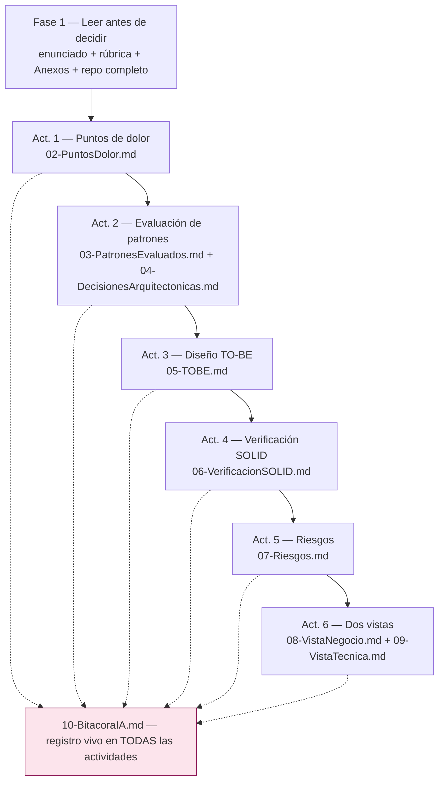

# 00 — Plan de Trabajo · Reto 2 (Proyecto Hacienda)

> [!abstract] Propósito
> Este documento fija el encuadre, el alcance, la metodología y el mapa de artefactos del Reto 2. Es el punto de entrada del vault: desde aquí se navega a cada entregable. Todas las decisiones que aquí se registran fueron aprobadas por el equipo.

---

## 1. Objetivo y criterio de éxito

**Objetivo:** evolucionar el diseño del back de Hacienda (entregado en el Reto 1 como `SolucionSOLID`) desde un diseño *correcto* (SOLID) hacia un diseño *robusto* (SOLID + patrones), incorporando entre **3 y 5 patrones** del Anexo A, cada uno anclado a un punto de dolor real, medido y trazable al código.

**Criterio de éxito (rúbrica, cada criterio 0.0–5.0):**

| # | Criterio | Peso | Artefacto principal |
|---|----------|------|---------------------|
| 1 | Detección de puntos de dolor | 15 % | [[Reto2-Hacienda/Opcion1/02-PuntosDolor]] |
| 2 | Decisión de patrones + criterio frente a la IA | 20 % | [[Reto2-Hacienda/Opcion1/03-PatronesEvaluados]], [[Reto2-Hacienda/Opcion1/10-BitacoraIA]] |
| 3 | Diseño TO-BE (sale / entra / se relaciona / impacto) | 20 % | [[Reto2-Hacienda/Opcion1/05-TOBE]] |
| 4 | Garantía de SOLID y del comportamiento | 15 % | [[Reto2-Hacienda/Opcion1/06-VerificacionSOLID]] |
| 5 | Análisis de riesgos | 15 % | [[Reto2-Hacienda/Opcion1/07-Riesgos]] |
| 6 | Dos vistas y sustentación | 15 % | [[Reto2-Hacienda/Opcion1/08-VistaNegocio]], [[Reto2-Hacienda/Opcion1/09-VistaTecnica]] |

> [!important] Meta declarada por el equipo
> Obtener **5.0**. Eso exige que cada decisión responda las ocho preguntas del método (dolor → evidencia → costo → candidatos → alternativas → costo de cada alternativa → recomendación → impacto SOLID). Ningún patrón se adopta "por buena práctica".

---

## 2. Encuadre del encargo (límites no negociables)

Provenientes del correo de la Líder Técnica y de la sección 3 (Alcance) del enunciado:

1. **El comportamiento observable está congelado.** Ni una salida, ni un cálculo, ni una regla cambia. Penalización: −0.5 sobre la nota final por cada caso.
2. **No se cambia el estilo arquitectónico.** Nada de Clean, Hexagonal, capas nuevas ni servicios separados. El trabajo ocurre en *cómo colaboran los objetos dentro del back existente*. Penalización: criterio 3 no supera 2.5.
3. **SOLID no se toca** (salvo tensión declarada y compensada). Ninguna celda "Roto" sin declaración explícita del beneficio que la compensa.
4. **Sin frameworks, ORMs, contenedores de DI automática ni librerías** que resuelvan el problema por nosotros.
5. **Sin base de datos nueva, red, nube, concurrencia ni UI nueva.**
6. **Todo patrón adoptado debe anclarse a un punto concreto del AS-IS** que puede robustecerse. Patrón sin ancla = sobre-ingeniería, penalizada (−0.3 por patrón).
7. **Bitácora obligatoria** (mínimo 10 registros): sin ella el criterio 2 se califica 0.0.
8. **Diagramas = código entregado.** Si divergen, los criterios 3 y 4 no superan 3.0.

### 2.1 Sí se interviene (eje del encargo)

- Cómo se **crean** los objetos y dónde se decide qué implementación concreta se instancia.
- Cómo se **componen y relacionan** las estructuras existentes.
- Cómo se **selecciona y coordina el comportamiento en tiempo de ejecución**.
- El punto donde se **ensambla** el sistema.

### 2.2 Decisiones de alcance del equipo

> [!warning] Decisión del equipo — 2026-08-30
> 1. **El frontend queda FUERA del alcance.** Las vistas Razor (28 archivos `.cshtml`) permanecen exactamente iguales. El TO-BE debe ser *compatible con lo que las vistas consumen hoy* (bindings a entidades de dominio, `ViewBag.TiposRes`, mensajes en `TempData`). Esto es una restricción de diseño, no una omisión: cualquier cambio que exija tocar vistas queda descartado o restringido.
> 2. **Los hallazgos del análisis AS-IS se tratan como deuda técnica heredada del Reto 1**, a corregir dentro de esta evolución cuando el costo del remedio lo justifique. El detalle se desarrolla en [[Reto2-Hacienda/Opcion1/02-PuntosDolor]].

---

## 3. Metodología y flujo de trabajo

**Regla de avance:** al terminar cada actividad se genera el archivo Markdown, se presenta al equipo (resumen ejecutivo, decisiones críticas, dudas abiertas, riesgos) y **se espera aprobación explícita** antes de continuar. La IA nunca avanza por iniciativa propia ni toma decisiones finales: propone con evidencia; el equipo decide.

**División del trabajo de análisis (Act. 1):** cada integrante relee el código por su cuenta y anota puntos de dolor *sin IA* (mínimo 3 del total deben ser hallazgos propios); luego se consolida en grupo contra la evidencia recolectada.

---

## 4. Mapa de artefactos del vault

| Archivo | Actividad | Contenido | Estado |
|---------|-----------|-----------|--------|
| [[00-Plan]] | — | Este documento | ✅ Aprobado |
| [[Reto2-Hacienda/Opcion1/01-AS-IS]] | Base | Comprensión del sistema actual con evidencia | ✅ Aprobado |
| [[Reto2-Hacienda/Opcion1/02-PuntosDolor]] | Act. 1 | Tabla P-XX: dolor, evidencia, costo real (clases/archivos), prioridad, intervención | ✅ Aprobado |
| [[Reto2-Hacienda/Opcion1/03-PatronesEvaluados]] | Act. 2.1 | Fichas de los 22 patrones del Anexo A + tabla de decisión | ✅ Aprobado |
| [[Reto2-Hacienda/Opcion1/04-DecisionesArquitectonicas]] | Act. 2 (cierre) | Decisiones finales con justificación extensa y alternativas | ✅ Aprobado |
| [[Reto2-Hacienda/Opcion1/05-TOBE]] | Act. 3 | Diagrama de lo que sale / lo que entra, tabla de cambio estructural E-XX, fichas por patrón adoptado | ✅ Aprobado (D-05 → Variante A) |
| [[Reto2-Hacienda/Opcion1/06-VerificacionSOLID]] | Act. 4 | Matriz Patrón×SOLID con evidencia + 12 casos de comportamiento congelado | ✅ Aprobado |
| [[Reto2-Hacienda/Opcion1/07-Riesgos]] | Act. 5 | Registro R-XX: condición→consecuencia, P×I, prevención, señal observable | ✅ Aprobado |
| [[Reto2-Hacienda/Opcion1/08-VistaNegocio]] | Act. 6a | Vista para decidores sin lenguaje técnico | ✅ Aprobado |
| [[Reto2-Hacienda/Opcion1/09-VistaTecnica]] | Act. 6b | Vista para el ingeniero nuevo + guía "dónde tocar" | ✅ Aprobado |
| [[Reto2-Hacienda/Opcion1/10-BitacoraIA]] | Act. 2.2 | Registro de decisiones frente a la IA (vivo desde ya) | ✅ Vivo — 12/10 registros |

**Fuera del vault pero entregables del Reto 2:** documento PDF (máx. 15 páginas), código refactorizado que siga el TO-BE, video de 20 minutos (fecha límite: domingo 6 de septiembre, 23:59).

---

## 5. Reglas de evidencia y trazabilidad

El Reto 1 dejó documentación que promete cosas que el código no cumple (ej.: `02-diseno/TOBE_Arquitectura_Completa.md:938` afirma que agregar un subtipo de Res cuesta "1 clase + 1 entrada, 0 modificaciones"; la medición real da **9 puntos de modificación en 4 capas**). Para no repetir ese error:

1. **Toda afirmación importante cita `archivo:línea`.**
2. **Todo costo se mide contando clases y archivos reales** — el enunciado no acepta "alto/medio/bajo".
3. **Todo síntoma se describe como dolor, no como principio violado** (el principio es consecuencia, no evidencia).
4. **Los diagramas se generan a partir del código**, nunca al revés.
5. **Nada de lo documentado contradice lo implementado**; si hay deriva, se declara.

---

## 6. Glosario y convenciones críticas

| Término | Convención para el Reto 2 |
|---------|---------------------------|
| **AS-IS** | El código `03-src/SolucionSOLID` tal como está hoy. ⚠️ En la documentación del Reto 1 ese mismo código se llama "TO-BE" (terminología de ese reto) e incluso el archivo de solución se llama `Hacienda.TOBE.sln`. Para el Reto 2 **ese código ES el AS-IS**. |
| **TO-BE** | El diseño nuevo: AS-IS + patrones adoptados. Se documenta en [[Reto2-Hacienda/Opcion1/05-TOBE]]. |
| **P-XX** | Punto de dolor ([[Reto2-Hacienda/Opcion1/02-PuntosDolor]]). |
| **E-XX** | Elemento de cambio estructural ([[Reto2-Hacienda/Opcion1/05-TOBE]], tabla de la Act. 3). |
| **R-XX** | Riesgo ([[Reto2-Hacienda/Opcion1/07-Riesgos]]). |
| **B-XX** | Registro de bitácora frente a la IA ([[Reto2-Hacienda/Opcion1/10-BitacoraIA]]). |
| **SC-1 / SC-3** | Solicitudes de cambio del Anexo B pendientes: derivados (lácteos/carne/piel) / historia clínica por res. En el Reto 1 se implementó **SC-2 (chips + geolocalización)**; el Reto 2 exige implementar una **distinta**. |
| **Deuda técnica heredada** | Hallazgos del Reto 1 que el equipo se compromete a corregir en esta evolución cuando el remedio se justifique. |

---

## 7. Roles y frentes

Roles del Reto 2 según el enunciado (§4) y su distribución propuesta:

| Frente                             | Responde por                                                 | Integrante  |
| ---------------------------------- | ------------------------------------------------------------ | ----------- |
| Arquitecto Líder                   | Puntos rígidos, selección/descarte de patrones, diseño TO-BE | ⬜ pendiente |
| Arquitecto de Verificación         | SOLID sigue en pie + comportamiento no cambió                | ⬜ pendiente |
| Arquitecto de Riesgos y despliegue | Análisis de riesgo y plan de cambio                          | ⬜ pendiente |
| Arquitecto de comunicación gráfica | Dos vistas, bitácora, armado del documento                   | ⬜ pendiente |

> [!question] Duda abierta D-04
> El enunciado habla de "los cuatro integrantes" en el video, pero el equipo del Reto 1 tiene **tres** integrantes (Mateo, María Alejandra, David). ¿Algún frente se duplica, o se integra una cuarta persona? — *Decisión del equipo.*

---

## 8. Dudas abiertas vigentes

| ID | Duda | Impacta a | Estado |
|----|------|-----------|--------|
| D-01 | ¿SC-1 (derivados) o SC-3 (historia clínica)? El TO-BE debe facilitar la solicitud elegida | [[Reto2-Hacienda/Opcion1/03-PatronesEvaluados]], [[Reto2-Hacienda/Opcion1/05-TOBE]] | ✅ Resuelta (2026-08-30): el equipo elige **SC-1 (derivados)** por ser la más exigente — ancla los puntos de dolor P-01/P-03 y maximiza el contraste AS-IS/TO-BE |
| D-03 | Enumerar los 12 casos de comportamiento (8 del Reto 1 + 4 nuevos) y planear la captura de salidas | [[Reto2-Hacienda/Opcion1/06-VerificacionSOLID]] | ✅ Resuelta: casos C-01…C-12 definidos; falta ejecutar las capturas "antes" (protocolo en [[Reto2-Hacienda/Opcion1/06-VerificacionSOLID]] §4.2) |
> [!note] Numeración de dudas: los IDs D-02, D-08 y D-09 no se emitieron (numeración asignada por fecha de aparición, no exhaustiva); D-10 era duplicado de D-03 y se eliminó de [[Reto2-Hacienda/Opcion1/04-DecisionesArquitectonicas]].
| D-05 | ¿SC-1 con producción propia (vaca lechera) o stock directo? | [[Reto2-Hacienda/Opcion1/05-TOBE]] | ✅ Resuelta (2026-08-30, delegación explícita): **Variante A — producción propia** ([[Reto2-Hacienda/Opcion1/10-BitacoraIA]] B-10) |

---

## 9. Riesgos transversales identificados desde ya

1. **Deriva documento↔código** (la heredada del Reto 1): mitigada con la regla de evidencia del §5.
2. **Cero pruebas automatizadas** en el repositorio: la prueba de "comportamiento congelado" (Act. 4) dependerá de capturas manuales de salidas lado a lado. Hay que ejecutar el sistema actual y guardar evidencia **antes** de refactorizar.
3. **Disciplina de alcance:** varios dolores viven en persistencia y UI, zonas que el enunciado saca del alcance o que el equipo excluyó — son candidatos naturales a "no intervenir" (la rúbrica lo premia si el argumento es técnico y real).

---

## 10. Navegación

- [[Reto2-Hacienda/Opcion1/01-AS-IS]] — el punto de partida del análisis.
- [[Reto2-Hacienda/Opcion1/02-PuntosDolor]] — Actividad 1.
- [[Reto2-Hacienda/Opcion1/10-BitacoraIA]] — registro de decisiones frente a la IA (se llena desde la primera sesión).
