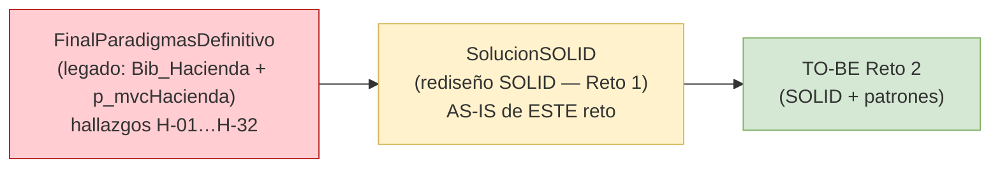
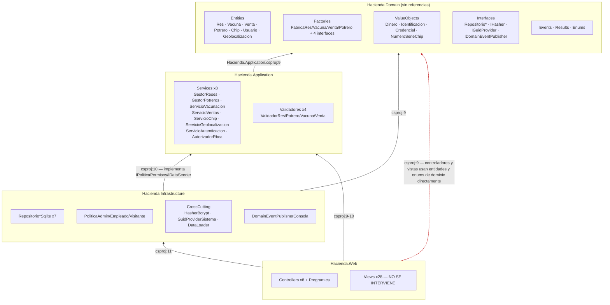

# 01 — AS-IS: Comprensión del Sistema Actual

> [!abstract] Propósito
> Fotografía completa y evidenciada del sistema entregado en el Reto 1 (`03-src/SolucionSOLID`), que para el Reto 2 constituye el **AS-IS**. Este documento es la base de [[Reto2-Hacienda/Opcion1/02-PuntosDolor]] y del diagrama AS-IS de [[Reto2-Hacienda/Opcion1/05-TOBE]]. Cada afirmación cita `archivo:línea`.

> [!info] Convención de rutas
`SOLID/` = `03-src/SolucionSOLID/`. Números de línea verificados contra el código actual (commit único `421d86a`).

> [!warning] Trampa de nomenclatura
La documentación del Reto 1 llama "TO-BE" a este código (`02-diseno/TOBE_Arquitectura_Completa.md`, `Hacienda.TOBE.sln`). **Ese nombre quedó obsoleto: aquí este código es el AS-IS.** El TO-BE del Reto 2 es el diseño con patrones que se documenta en [[Reto2-Hacienda/Opcion1/05-TOBE]].

---

## 0. Linaje del código (de dónde viene este AS-IS)

> [!info] Las tres generaciones — y por qué esta sección existe
> En la sustentación conviene tener clarísimo qué crítica corresponde a qué generación. Las observaciones del profesor nacieron sobre la entrega de Evaluación 1 y **siguen vigentes en SolucionSOLID** — con evidencia distinta en cada caso.



| Crítica del profesor (linaje) | Cómo estaba en el legado (hallazgos Reto 1) | Cómo quedó en SolucionSOLID (evidencia de este doc) | Veredicto de evolución |
|-------------------------------|---------------------------------------------|------------------------------------------------------|------------------------|
| "Demasiadas capas" | Sin capas reales: God Class `Hacienda` de 559 líneas (H-01) + `PersistenciaService` de 643 líneas acoplada a `HttpContext` (H-10) | 4 proyectos bien separados **pero** con redundancia interna: capa `Validaciones` que duplica reglas (§9, P-07) y DTOs muertos (§12) | El estilo de capas **se queda** (decisión del equipo); el TO-BE solo elimina la **redundancia** (E-04), no reestructura |
| "Responsabilidades fuera del dominio" | Toda la lógica en `Hacienda`/`Potrero`/`Autenticacion` (H-01, H-09) | 13 reglas de negocio aún viven en Application/Web (§5) — **parcialmente corregido, el núcleo sigue pendiente** | P-04: el TO-BE baja las reglas al Core (DEC-07 + esqueleto Template Method) |
| "Entidades que no encapsulan" | Setters que rompían LSP (H-07/H-08) | LSP se corrigió, pero `Res` expone setters públicos y listas mutables (`Res.cs:13-16`) — reglas bypassables | P-04: cierre de encapsulamiento sin tocar la superficie pública |
| "Factory mal implementados" | Sin fábrica de vacunas (H-03); defaults silenciosos en deserialización (H-04, `_ => new Ternero`) | 4 Simple Factories disfrazados de Factory Method (§6) — y el default silencioso **se heredó** (`DescribirRango`, `FabricaRes.cs:47`) | P-01/P-02: TO-BE introduce Factory Method real + registro abierto |
| "Lógica donde no corresponde" | `Potrero.anadir_res` de 124 líneas (H-09); controladores brincándose servicios (H-14/15/17) | Dispatch por tipo duplicado en `VacunaController:49-68,101-120` + éxito decidido por parsing de mensajes (`:153`) — **reintroducido en el rediseño** | P-05/P-06: la selección baja a la creación; contrato de resultados unificado |

> [!important] Lectura para la sustentación
> La carta de la Líder Técnica — *"SOLID les dio un sistema correcto, no me dio un sistema robusto"* — se refiere a **SolucionSOLID**, no al legado. El trabajo del Reto 2 **no** es volver a corregir el legado (eso ya se hizo): es robustecer lo que quedó bien separado. Por eso el TO-BE no cambia el estilo de capas: lo fortalece por dentro (Core).

---

## 1. Vista general

Solución .NET 8 (`net8.0`, LangVersion 12, nullable enabled — `SOLID/Directory.Build.props`) en cuatro proyectos, ~**3.750 LOC** en 99 archivos C# + 28 vistas Razor (~2.300 LOC). Persistencia SQLite vía Dapper (SQL inline). Autenticación por cookie. Sin pruebas automatizadas (ver §12).

| Proyecto | Archivos .cs | LOC | Rol declarado |
|----------|--------------|-----|----------------|
| `Hacienda.Domain` | 46 | 901 | Entidades, Value Objects, Enums, interfaces de repositorio, factories, eventos, results |
| `Hacienda.Application` | 27 | 959 | Servicios de caso de uso, validadores, interfaces de aplicación |
| `Hacienda.Infrastructure` | 15 | 1.115 | Repositorios SQLite/Dapper, políticas de permisos, cross-cutting, publicador de eventos |
| `Hacienda.Web` | 11 | 775 | Controllers MVC, `Program.cs` (composition root), vistas |

> [!note] Observación de fondo
La documentación del proyecto pesa más que el código: `02-diseno/TOBE_Arquitectura_Completa.md` tiene 3.621 líneas, casi el tamaño de todo el código. Es la primera señal del riesgo "deriva documento↔código" que se materializa en varios puntos (§5, §6, §13).

---

## 2. Regla de dependencias: la declarada vs. la real

Declarada (Clean Architecture): *el dominio no depende de nadie; las dependencias apuntan hacia adentro*.

Real (leída de los `.csproj`):



**Desviaciones respecto de la regla declarada:**

1. **`Web → Domain` directa** (`Hacienda.Web.csproj:9`): controladores importan `Hacienda.Domain.Enums` (`ResController.cs:4`) y las vistas bindean entidades de dominio (`Views/Res/Index.cshtml:71` hace switch sobre `TipoRes`). La capa de DTOs que existed para evitar esto (`Application/DTOs/Dto.cs`) **no se usa en ningún punto** (grep: cero referencias).
2. **Reglas de autorización en Infrastructure** (`PoliticaAdmin/Empleado/Visitante.cs`): políticas que evalúan reglas puras de negocio viven en la capa de infraestructura.

> [!tip] Lectura para el Reto 2
Estas desviaciones **no se corrigen cambiando el estilo** (prohibido). Se documentan porque condicionan dónde pueden vivir los patrones: cualquier mecanismo de creación/comportamiento que se diseñe debe operar con el mapa real de dependencias, no con el ideal.

---

## 3. Inventario por capa (responsabilidad real)

### 3.1 Hacienda.Domain

| Componente | Contenido | Veredicto de encapsulación |
|------------|-----------|---------------------------|
| `Entities/Res.cs` (abstracta, 43 líneas) | `Id`, `Nombre`, `Peso { get; set; }`, `Edad { get; set; }`, `VacunasAplicadas` (`List<Vacuna>` pública), `Chip { get; set; }` (`Res.cs:8-16`); propiedades abstractas de configuración (`Tipo`, `MaxVacunasBacterianas/Vivas`, `PesoMinimo`, `PesoRecomendadoVenta`, `EsEdadValida` — `:27-33`); único comportamiento: `EsquemaVacunacionCompleto()` (`:35-40`) y `Serializar()` (`:42`, **muerto**) | ⚠️ Setters públicos sin validación y lista mutable expuesta: cualquier código puede `res.Edad = 999`, `res.VacunasAplicadas.Add(...)` o `res.Chip = x` sin pasar por regla alguna |
| `Entities/Ternero/Cebon/Novillo.cs` (20 líneas c/u) | Constructores **públicos** (`Cebon.cs:7`); devuelven constantes y el predicado `EsEdadValida` (ej. `Cebon.cs:10-16`: 1/4 vacunas, 290/420 kg, edad 13–48) | ⚠️ "Bolsas de constantes + discriminador". La regla de edad que declaran no se exige en ningún punto salvo que se pase por `FabricaRes` (§6) |
| `Entities/Viva/Bacteriana.cs` | `Bacteriana` valida `periodoAplicacion ∈ [2,4]` en el constructor (`Bacteriana.cs:13-15`) — único invariante a nivel subtipo del modelo; `Viva` expone el enum anidado `GradoAtenuacion` (`Viva.cs:7-12`) que se filtra a los contratos de Application (`IVacunaFactory.cs:12`) | ✅/⚠️ |
| `Entities/Venta.cs` (22 líneas) | Registro puro: todo get-only, constructor público, **cero comportamiento** (`Venta.cs:8-14`) | ⚠️ Anémica total |
| `Entities/Potrero.cs` (42 líneas) | El agregado mejor encapsulado: `MAX_RESES = 150` privado (`:14`), `AgregarRes` exige capacidad (`:24-30`), propiedades computadas (`:39-41`) — pero `Reses` es una `List<Res>` pública (`:12`) que permite bypasear la capacidad | ✅/⚠️ |
| `Entities/Chip.cs` (75 líneas) | **La única entidad "de libro"**: constructor privado + `Crear` estático con validación de ventana de fechas (`:14-31`), `CambiarEstado` con máquina de estados explícita (`:33-71`) | ✅ (defectos menores: usa `DateTime.UtcNow` en `:24`, violando el ADR-08 propio del Reto 1; `IChip` vive en `Entities/` no en `Interfaces/`) |
| `Entities/Usuario.cs`, `Geolocalizacion.cs` | Estructuras de datos anémicas, constructores públicos, sin validación. Rango −90..90/−180..180 vive en `ServicioGeolocalizacion.cs:38-42` | ⚠️ Regla de dominio fuera del dominio |
| `Factories/` (4 clases + 4 interfaces) | Ver §6 | ⚠️ |
| `ValueObjects/` | `Dinero` (rechaza negativos, `Dinero.cs:10-11`), `Identificacion`, `Credencial`, `NumeroSerieChip` — todos validan en constructor lanzando excepción | ✅ |
| `Results/` | `ResultadoAutenticacion`, `ResultadoAutorizacion`, `ValidationResult` — records sellados, constructor privado + fábricas estáticas | ✅ |
| `Events/` | 6 records de eventos (`DomainEvents.cs`) — `VacunaVencidaEvent` (`:69-83`) **no se publica nunca**; no existe infraestructura de handlers | ⚠️ |
| `Interfaces/` | `IRepositorio*` (7), `IHasher`, `IGuidProvider`, `IDomainEventPublisher` | ⚠️ Contratos que filtran forma de persistencia: `IRepositorioRes.GuardarTodas(List<Potrero>)` (`IRepositorioRes.cs:8`) hace que el repo de reses escriba potreros |

### 3.2 Hacienda.Application

| Servicio | Dependencias (constructor) | Reglas de negocio dentro (no orquestación) |
|---------|---------------------------|---------------------------------------------|
| `GestorReses` | 6: `IRepositorioPotrero`, `IRepositorioVacuna`, `IResFactory`, `IValidarRes`, `IDomainEventPublisher`, `TimeProvider` (`GestorReses.cs:20-34`) | Regla de res duplicada (`:42-43`); mapeo `TipoPotrero→TipoRes` (`:45,137-143`); reglas de umbral de peso→evento (`:56-65, 96-105`); eventos de potrero medio/lleno (`:66-75`); alimentación como `res.Peso += cantidad` (`:93`); construye strings de presentación "[Evento] …" (`:59,64,69,74`) |
| `GestorPotreros` | 4 (`:17-27`), incluye `IDomainEventPublisher` **inyectado y jamás usado** | Regla de unicidad de identificación (`:31-32`) |
| `ServicioVacunacion` | 5 (`:19-31`) | Unicidad de lote (`:37-38, 51-52`); tamaño de lote 1..100 (`:64-65, 93-94`); formato de numeración `{loteBase}-{i:D3}` (`:72`); regla "ya aplicada" (`:131-132`); **límites de vacunación re-implementados imperativamente** (`:134-143`) en vez de delegar en la entidad; persistencia en 3 stores sin transacción (`:145-150`) |
| `ServicioVentas` | 5 (`:18-30`) | Mayormente orquestación; retira la res del potrero (`:46`); contrato de error mixto (excepción vs string, `:42-44`) |
| `ServicioAutenticacion` | 3 (`:16-21`) | Validación de creación de usuario + rol por defecto `Visitante` hardcodeado (`:45-57`) |
| `AutorizadorRbca` | 1: `IEnumerable<IPoliticaPermisos>` (`:13-16`) | Despachador puro por diccionario `RolUsuario→IPoliticaPermisos`; rol desconocido → denegar (`:26`). **Sin ningún call site** (§8) |
| `ServicioChip` | 6 (`:18-32`), incluye `IRepositorioRes` **jamás usado** | Regla "un chip por res" vive aquí (`:43-44`); unicidad de número de serie (`:46-48`); captura excepciones de dominio y las convierte en strings (`:67-80`) |
| `ServicioGeolocalizacion` | 4 (`:17-27`) | Regla chip-activo (`:35-36`); validación de rangos lat/long (`:38-42`); **fórmula de Haversine** (`:88-99`) — lógica de dominio geográfico en Application |

`Validaciones/Validador*.cs` — análisis de duplicación en §9. `Interfaces/` — contratos que devuelven **strings de mensaje en español** como contrato de resultado (`IGestorReses`, `IServicioVacunacion`, etc.): la capa de aplicación queda acoplada a la presentación.

### 3.3 Hacienda.Infrastructure

- **Repositorios SQLite (7)**: SQL inline con Dapper; cada método abre su propia `SqliteConnection`. Estrategias de escritura inconsistentes: diff+`INSERT OR REPLACE` (`RepositorioPotreroSqlite.cs:89-137`) vs **`DELETE FROM` total + reinserción** (`RepositorioVentaSqlite.cs:59`, `RepositorioUsuarioSqlite.cs:48`, `RepositorioChipSqlite.cs:75`). Mapeadores con switch de tipo duplicados entre repos (§6.2). Bug de identidad: la rehidratación de ventas **fabrica GUIDs nuevos en cada lectura** (`RepositorioVentaSqlite.cs:41-43`).
- **Políticas (3)**: ver §8.
- **CrossCutting**: `HasherBcrypt` (BCrypt.Net), `GuidProviderSistema`, `DataLoader` (siembra 3 usuarios + `seed_data.sql` embebido).
- **Events**: `DomainEventPublisherConsola` (`:5-11`) — los eventos de dominio terminan en `Console.WriteLine` del servidor.

### 3.4 Hacienda.Web

- **Composition root** en `Program.cs` (134 líneas): 31 registros explícitos (`TimeProvider.System`, `IGuidProvider`, `IHasher` singleton; 4 factories + 4 validadores + 3 políticas transient; 7 repositorios scoped con lambda; 8 servicios scoped). `DatabaseInitializer.Initialize` se ejecuta **durante el registro de servicios** (`Program.cs:61-65`) — efecto secundario en la fase de composición. La cadena de conexión de `appsettings.json` no se lee nunca (`:61-63` la construye a mano).
- **Controladores**: ver §7.

---

## 4. Diagrama de clases AS-IS (núcleo de dominio + factories)

```mermaid
classDiagram
    direction TB
    class Res {
        <<abstract>>
        +Id : Guid
        +Nombre : String
        +Peso : uint {set público}
        +Edad : ushort {set público}
        +VacunasAplicadas : List~Vacuna~ {expuesta}
        +Chip : IChip {set público}
        +EsquemaVacunacionCompleto() bool
        +Serializar()* String «muerto»
        +EsEdadValida(edad)* bool «query, no exigida»
    }
    class Ternero { +ctor público }
    class Cebon { +ctor público }
    class Novillo { +ctor público }
    Res <|-- Ternero
    Res <|-- Cebon
    Res <|-- Novillo
    Res "1" o-- "0..*" Vacuna : VacunasAplicadas
    Res "1" o-- "0..1" IChip : Chip

    class IResFactory {
        <<interface>>
        +Crear(tipo, nombre, peso, edad) Res
    }
    class FabricaRes {
        -Dictionary~TipoRes,Func~ _creators
        +Crear(...) Res «valida edad DESPUÉS de construir»
    }
    IResFactory <|.. FabricaRes
    GestorReses ..> IResFactory : usa

    class Vacuna {
        <<abstract>>
        +CalcularEstado(reloj) EstadoVacuna
    }
    class Bacteriana { -valida periodo [2,4] }
    class Viva { +GradoAtenuacion «filtrado a Application» }
    Vacuna <|-- Bacteriana
    Vacuna <|-- Viva
    class IVacunaFactory {
        <<interface>>
        +CrearBacteriana(...) «un método por tipo concreto»
        +CrearViva(...)
    }
    IVacunaFactory <|.. FabricaVacuna

    class Potrero {
        -MAX_RESES = 150
        +Reses : List~Res~ «expuesta»
        +AgregarRes(res) «exige capacidad»
    }
    Potrero "1" o-- "0..150" Res

    class Chip {
        -ctor privado
        +Crear(...) Chip$
        +CambiarEstado() «máquina de estados»
    }
    class IChip
    Chip ..|> IChip
    Res ..> Chip : set público sin regla
```

---

## 5. Dónde vive la lógica de negocio (mapa de responsabilidades desplazadas)

> [!important] Este es el corazón de la crítica "responsabilidades fuera del dominio"
> Regla por regla, dónde vive hoy y qué debería ser. Fuente de [[Reto2-Hacienda/Opcion1/02-PuntosDolor]].

| # | Regla de negocio | Vive hoy (evidencia) | Debería vivir en |
|---|------------------|----------------------|------------------|
| 1 | Límite de vacunas por tipo de res | Re-implementada imperativamente en `ServicioVacunacion.cs:134-143` | La entidad `Res` (ya expone `MaxVacunas*` que nadie usa para exigir) |
| 2 | Alimentación y umbral de peso → evento | `res.Peso += cantidad` en `GestorReses.cs:93`; umbrales comparados en el servicio (`:56-65, 96-105`) | `Res` (método `Alimentar(cantidad)` que devuelva el evento) |
| 3 | Un chip por res | `ServicioChip.cs:43-44` | La relación `Res–Chip` |
| 4 | Edad válida por tipo | Predicado público `EsEdadValida` (`Res.cs:33`) exigido solo en `FabricaRes.cs:33-37` **después** de construir | El constructor/creación del subtipo |
| 5 | Unicidad de res en potrero/hacienda | `GestorReses.cs:42-43` | Regla del agregado `Potrero`/dominio |
| 6 | Capacidad de potrero (150) | ✅ en `Potrero.AgregarRes` (`:24-30`)… bypaseable por `potrero.Reses.Add(...)` (`:12`) | Ya está; falta cerrar el bypass |
| 7 | Rangos geográficos válidos | `ServicioGeolocalizacion.cs:38-42` | Value Object `Coordenada` |
| 8 | Distancia entre registros (Haversine) | `ServicioGeolocalizacion.cs:88-99` | Dominio (VO o servicio de dominio) |
| 9 | Estado de vacuna según reloj | ✅ `Vacuna.CalcularEstado` (`Vacuna.cs:27-35`) | Ya está |
| 10 | Transiciones de chip | ✅ `Chip.CambiarEstado` (`Chip.cs:33-71`) | Ya está |
| 11 | Validación de contraseña/usuario | `UsuarioController.cs:37-49` + re-validación en `ServicioAutenticacion.cs:45-54` (duplicada en dos capas) | Una sola capa |
| 12 | Selección de tipo de vacuna | `VacunaController.cs:49-68 y 101-120` (dispatch por string duplicado dos veces) | Ni controlador ni servicio: polimorfismo |
| 13 | Éxito/fracaso de una operación | Parsing del mensaje en español: `VacunaController.cs:153`, `ChipController.cs:45,70` | Un contrato de resultado (ya existe `ValidationResult` y no se usa en estos flujos) |

---

## 6. Factories AS-IS (diagnóstico priorizado)

### 6.1 Clasificación

> [!critical] Conclusión
> **Los cuatro "Factories" son Simple Factories** (constructores parametrizados detrás de una interfaz). **Ninguno es Factory Method** (no hay subclasificación de creadores: `Creator → ConcreteCreator` no existe; hay exactamente una clase concreta por interfaz). **Ninguno es Abstract Factory** (no hay familias de productos: `FabricaVacuna` produce dos productos no-relacionados mediante métodos separados por nombre).

| Factory | Interface | Registro DI | Consumidor | Veredicto |
|---------|-----------|-------------|------------|-----------|
| `FabricaRes` | `IResFactory` | `Program.cs:39` (transient) | `GestorReses.cs:15,23,47` | El mejor de los cuatro (registro por diccionario, `FabricaRes.cs:11,17-23`) pero sigue siendo Simple Factory; valida la edad **después** de construir (`:33-37`) y su `DescribirRango` (`:42-48`) tiene default silencioso `_ => "desconocido"` |
| `FabricaVacuna` | `IVacunaFactory` | `Program.cs:40` | `ServicioVacunacion.cs:15,22` | El peor: la **interfaz expone un método por tipo concreto** (`IVacunaFactory.cs:8-12`) — agregar un tipo de vacuna obliga a modificar la interfaz (el antipatrón H-21/H-22 que el equipo documentó en el legado) |
| `FabricaVenta` | `IVentaFactory` | `Program.cs:41` | `ServicioVentas.cs:14,21` | Validación del monto duplicada (`:20`) contra `Dinero.cs:10` y `ValidadorVenta.cs:15` con umbrales distintos; recibe `TimeProvider` como **parámetro de método** (`:17`) — idioma inconsistente con el resto |
| `FabricaPotrero` | `IPotreroFactory` | `Program.cs:42` | `GestorPotreros.cs:15,21` | Ceremonial: envuelve un constructor que **sigue siendo público y se usa en paralelo** desde los repositorios (`RepositorioPotreroSqlite.cs:34,67` hace `new Potrero(...)` directamente) |

### 6.2 El costo real de "agregar un tipo" (evidencia contra la promesa OCP)

La documentación del Reto 1 afirma: *"agregar subtipo = 1 clase nueva + 1 entrada en el diccionario, 0 modificaciones"* (`02-diseno/TOBE_Arquitectura_Completa.md:938`). Medición real sobre el código para agregar `VacaLechera : Res`:

| # | Punto de modificación | Archivo:línea | Capa |
|---|----------------------|---------------|------|
| 1 | Valor nuevo en `enum TipoRes` | `Enums/TipoRes.cs` | Domain |
| 2 | Entrada en el diccionario de creators | `FabricaRes.cs:17-23` | Domain |
| 3 | Case en `DescribirRango` (hoy default silencioso) | `FabricaRes.cs:42-48` | Domain |
| 4 | Switch `MapearTipoRes` | `GestorReses.cs:137-143` | Application |
| 5 | Switch `MapearRes` | `RepositorioPotreroSqlite.cs:150-157` | Infrastructure |
| 6 | Switch en `ObtenerTodas` (rehidratación de venta) | `RepositorioVentaSqlite.cs:39-45` | Infrastructure |
| 7 | Switch de badge en vista | `Views/Res/Index.cshtml:71-77` | Web (excluida del alcance) |
| 8 | Switch de badge en vista | `Views/Venta/Index.cshtml:106` | Web (excluida del alcance) |
| 9 | Contadores hardcodeados por tipo | `GestorReses.cs:130-132` | Application |

**9 puntos de modificación en 4 capas (7 en el back + 2 en vistas), sobre 8 archivos (7 modificados + 1 nuevo)**. El mismo ejercicio para un tipo nuevo de vacuna obliga a tocar: la interfaz `IVacunaFactory.cs:8-12`, `FabricaVacuna`, `ServicioVacunacion` (nuevo método), `VacunaController.cs:49,101` (nuevo `if`), `RepositorioVacunaSqlite.cs:103-115 y 126-163` (`is Bacteriana`/`is Viva`).

---

## 7. Lógica de negocio en la capa Web (evidencia)

1. **Dispatch por tipo de vacuna duplicado** — `VacunaController.cs:49-68` (Crear) y `:101-120` (CrearLote): `if (tipoVacuna == "Bacteriana") { … } else { … }` con validaciones de campos opcionales en el controlador.
2. **Éxito decidido por parsing del mensaje** — `VacunaController.cs:153`: `mensaje.Contains("exito") ? "success" : "danger"`; `ChipController.cs:45` (`Contains("correctamente")`) y `:70` (`Contains("registrada")`).
3. **Validación de contraseña en controlador** — `UsuarioController.cs:37-49`, duplicada por `ServicioAutenticacion.cs:45-54`.
4. **Dependencia muerta** — `UsuarioController.cs:15,18` inyecta `IAutorizador` y nunca lo llama.
5. **Contrato de error inconsistente** — `ResController.cs:50-54, 70-74, 87-91` captura `Exception` y pone `ex.Message` en `TempData`; el servicio lanza para un caso y devuelve string para otro (`GestorReses.AgregarRes`: excepción en `:40`, string en `:51`).
6. **Superficie MVC desincronizada** — existe `Views/Venta/Create.cshtml` pero `VentaController` no tiene acción `Create`; vender se hace desde `ResController.Vender` (`ResController.cs:79-93`).

---

## 8. Autorización: RBAC decorativo

El mecanismo está bien construido y es la pieza mejor patrónica del código: `IPoliticaPermisos` con 3 implementaciones registradas como plugins (`Program.cs:83-85`), y `AutorizadorRbca` que arma un `Dictionary<RolUsuario, IPoliticaPermisos>` por inyección múltiple (`AutorizadorRbca.cs:13-16`) con deny-by-default (`:26`).

> [!failure] Pero es código muerto
> `grep` de `.Autorizar(` en Web: **cero llamadas**. La única inyección de `IAutorizador` (`UsuarioController.cs:15`) nunca se usa. La protección real es `[Authorize]` plano en todos los controladores (`ResController.cs:8`, etc.) — sin `[Authorize(Roles=…)]` en ningún punto, aunque el claim de rol sí se emite (`AccountController.cs:40`). **Efecto: Admin, Empleado y Visitante tienen permisos efectivos idénticos.** Las reglas "Empleado no puede Eliminar" (`PoliticaEmpleado.cs:11-14`, mediante `operacion.Contains("Eliminar")` — matching de strings) y "Visitante solo lectura" (`PoliticaVisitante.cs:11-14`) son inalcanzables. Curiosamente, Mateo anotó este mismo síntoma en la lectura en frío del código legado (`00-lectura-en-frio/MateoRojasHernandez.pdf`) — y sigue siendo cierto.

---

## 9. Validación: triplicada y contradictoria

| Regla | Definición 1 | Definición 2 | Definición 3 | Efecto |
|-------|--------------|--------------|--------------|--------|
| Monto de venta | `FabricaVenta.cs:20` — rechaza `< 0` (excepción) | `Dinero.cs:10-11` — rechaza `< 0` (excepción) | `ValidadorVenta.cs:15` — rechaza `<= 0` (string) | Una venta de $0 se **construye y persiste en memoria**, luego el validador la rechaza devolviendo string. Dos umbrales distintos, dos contratos de error distintos |
| Nombre de res | `FabricaRes.cs:27-28` (excepción) | `ValidadorRes.cs:14` (string) | — | Duplicada, contratos distintos |
| Identificación de potrero | `Identificacion.cs:9-11` (VO lanza) + `FabricaPotrero.cs:20-21` | `ValidadorPotrero.cs:14` | — | **Inalcanzable**: el VO ya lanzó antes de que el validador corra |
| Nombre/lote de vacuna | `FabricaVacuna.cs:36-39` | `ValidadorVacuna.cs:14-15` | — | Además `IValidarVacuna` está registrado (`Program.cs:57`) pero **no se inyecta en ninguna clase** — validador muerto de extremo a extremo |

**Veredicto estructural:** los validadores corren *post-construcción* sobre objetos cuyas invariantes debieron garantizarse al crear. La existencia de la capa `Validaciones` es evidencia de que las invariantes están mal ubicadas, no de que falte validación.

---

## 10. Persistencia (contexto — fuera del alcance de intervención)

Documentada como deuda, sin propuesta de cambio directo (el enunciado excluye base de datos):

- SQL inline en los 7 repositorios; sin unidad de trabajo compartida (la vacunación en lote persiste en 3 stores sin transacción — `ServicioVacunacion.cs:145-150`).
- Mapeo de subtipos TPH con discriminador TEXT (`DatabaseInitializer.cs:21-31`, `:45-56`) y **switches de rehidratación duplicados** entre repos (§6.2).
- `DELETE FROM` total + reinserción como estrategia de guardado en ventas, usuarios, chips y geolocalizaciones.
- **Identidad destruida en lectura:** cada carga de ventas re-fabrica la res con GUID nuevo (`RepositorioVentaSqlite.cs:41-43`).
- FK declarada a tabla inexistente en ese momento (`reses→chips` en `DatabaseInitializer.cs:30` vs `:90`); `PRAGMA foreign_keys` nunca activado.
- La tabla `ventas` desnormaliza campos de la res sin FK (`:68-79`).

> [!note] Por qué se documenta si no se interviene
Los switches de mapeo de los repositorios **sí son parte del problema de creación de objetos** (rehidratar es crear). El TO-BE puede tocar *cómo* se reconstruyen los objetos sin tocar *dónde* se guardan. La distinción fino-grano se decide en [[Reto2-Hacienda/Opcion1/02-PuntosDolor]] y [[Reto2-Hacienda/Opcion1/05-TOBE]].

---

## 11. Composition root (resumen)

`Program.cs` (134 líneas): 31 registros. Singletones: `TimeProvider.System`, `IGuidProvider`, `IHasher` (`:34-36`). Transients: 4 factories (`:39-42`), 4 validadores (`:55-58`), 3 políticas (`:83-85`). Scoped: 7 repos con lambda de connection string (`:67-80`), `IDataSeeder` (`:88-94`), `IDomainEventPublisher` (`:31`), 8 servicios (`:45-52`). `DatabaseInitializer.Initialize` corre **en fase de registro** (`:61-65`). Siembra pre-middleware (`:99-103`). Ruta raíz mapeada dos veces con un baile 303 (`:119-132`).

> [!tip] Lectura para el Reto 2
El punto de ensamblaje está bien identificado y centralizado — es exactamente el lugar donde el enunciado permite trabajar ("el punto donde se ensambla el sistema" es ámbito de intervención). La calidad del composition root facilita cualquier patrón que se adopte.

---

## 12. Código muerto y configuración fantasma (inventario)

| Elemento | Evidencia | Tipo |
|----------|-----------|------|
| `VacunaVencidaEvent` | `DomainEvents.cs:69-83`, cero publicaciones | Evento muerto |
| `Res.Serializar()` / `Vacuna.Serializar()` | 6 definiciones, 0 llamadas (resto de era CSV) | Método muerto |
| `IValidarVacuna` + `ValidadorVacuna` | registrado `Program.cs:57`, nunca inyectado | Validador muerto |
| `IAutorizador` en `UsuarioController` | `:15,18`, nunca invocado | Dependencia muerta |
| `ServicioChip._repoRes` | `:12,27`, nunca leído | Dependencia muerta |
| `GestorPotreros._eventPublisher` | `:19`, nunca usado | Dependencia muerta |
| DTOs de Application | `Application/DTOs/Dto.cs:3-6`, cero referencias | Capa muerta |
| `Views/Venta/Create.cshtml` | sin acción `Create` en `VentaController` | Vista huérfana |
| `ConnectionStrings:Sqlite` en `appsettings.json` | `Program.cs:61-63` construye la cadena a mano | Config muerta |
| Pruebas automatizadas | `Directory.Packages.props` fija xunit/Moq/FluentAssertions (`:10-14`) y `Directory.Build.props:30-34` condiciona proyectos de test… **ninguno existe** | Capacidad prometida, no entregada |

---

## 13. Contratos que el TO-BE debe respetar (restricciones de compatibilidad)

1. **Contrato con las vistas (decisión del equipo — frontend intacto):** las vistas bindean entidades de dominio (`Res`, `Vacuna`, `Venta`, `Potrero`), consumen `ViewBag.TiposRes` (`ResController.cs:36,57`) y mensajes de `TempData`/`ViewBag`. Cualquier diseño TO-BE debe mantener disponible esa superficie de datos.
2. **Comportamiento observable congelado:** mismos mensajes, mismos cálculos, mismas salidas — incluyendo las salidas de consola de `DomainEventPublisherConsola`.
3. **Regla de dependencias real** (§2): el TO-BE opera sobre el mapa existente; no se agregan capas ni proyectos.
4. **Anexo B:** el TO-BE debe dejar más barata la solicitud de cambio que el equipo elija (D-01 en [[00-Plan]] §8: SC-1 derivados o SC-3 historia clínica — SC-2 chips ya fue implementada en el Reto 1 y queda excluida).

---

## 14. Síntesis: mapa de deuda técnica heredada

| Deuda | Evidencia clave | Se ataca en |
|-------|-----------------|-------------|
| Factories que no eliminan el punto de modificación (OCP de papel) | §6.2 — **9 puntos para un subtipo nuevo** | [[Reto2-Hacienda/Opcion1/02-PuntosDolor]] → [[Reto2-Hacienda/Opcion1/05-TOBE]] |
| Dominio anémico / reglas fuera del dominio | §5 — 13 reglas mapeadas | [[Reto2-Hacienda/Opcion1/02-PuntosDolor]] |
| Lógica de negocio en controladores | §7 — 6 hallazgos | [[Reto2-Hacienda/Opcion1/02-PuntosDolor]] |
| Contratos de resultado basados en strings en español + parsing de mensajes | §5 (fila 13), §7.2 | [[Reto2-Hacienda/Opcion1/02-PuntosDolor]] |
| RBAC decorativo | §8 | [[Reto2-Hacienda/Opcion1/02-PuntosDolor]] |
| Validación triplicada/contradictoria | §9 | [[Reto2-Hacienda/Opcion1/02-PuntosDolor]] |
| Rehidratación de objetos dispersa y duplicada | §10 | [[Reto2-Hacienda/Opcion1/02-PuntosDolor]] |
| Código muerto + cero pruebas | §12 | [[Reto2-Hacienda/Opcion1/07-Riesgos]], [[Reto2-Hacienda/Opcion1/06-VerificacionSOLID]] |

---

## 15. Navegación

- [[00-Plan]] — encuadre, alcance y metodología.
- [[Reto2-Hacienda/Opcion1/02-PuntosDolor]] — Actividad 1: la tabla P-XX que nace de este documento.
- [[Reto2-Hacienda/Opcion1/05-TOBE]] — el diseño destino (Actividad 3).
- [[Reto2-Hacienda/Opcion1/10-BitacoraIA]] — registro de decisiones frente a la IA.
