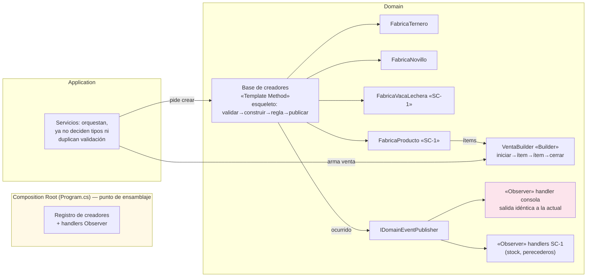

# 04 — Decisiones Arquitectónicas (Cierre de la Actividad 2)

> [!abstract] Propósito
> Consolida las decisiones de la Actividad 2 ya ratificadas por el equipo: qué se adopta, qué se descarta, qué se decide **sin patrón**, y cómo colaboran los patrones entre sí. Es el contrato de entrada de [[Reto2-Hacienda/Opcion1/05-TOBE]]. La evaluación completa vive en [[Reto2-Hacienda/Opcion1/03-PatronesEvaluados]]; aquí queda la decisión ejecutiva con su justificación de una página.

---

## 1. Registro ejecutivo de decisiones

| # | Decisión | Origen | Ancla | Estado |
|---|----------|--------|-------|--------|
| DEC-01 | Adoptar **Factory Method** (creacional) | IA → equipo ratifica | P-01, P-02, P-09 | ✅ Ratificada |
| DEC-02 | Adoptar **Builder** (creacional) para la venta de SC-1 | IA → equipo ratifica | P-03 (+SC-1) | ✅ Ratificada — D-05 resuelta (Variante A) confirma el diseño multi-ítem |
| DEC-03 | Adoptar **Template Method** (comportamiento) como esqueleto de creación | IA → equipo ratifica | P-01, P-02, P-07 | ✅ Ratificada |
| DEC-04 | Adoptar **Observer** (comportamiento) para el consumo de eventos | IA → equipo ratifica | P-10 | ✅ Ratificada |
| DEC-05 | Descartar los 18 patrones restantes con justificación técnica | IA → equipo ratifica | — | ✅ Ratificada |
| DEC-06 | **No intervenir** P-08 (RBAC), P-11 (código muerto), P-12 (composición) | IA → equipo ratifica | Congelamiento / higiene / riesgo | ✅ Ratificada |
| DEC-07 | Cerrar encapsulamiento de entidades (setters y colecciones) — **decisión de diseño, no patrón** | IA → equipo ratifica | P-04 | ✅ Ratificada |
| DEC-08 | Unificar el contrato de resultados con los result-objects existentes, **mensajes de usuario idénticos** — **diseño, no patrón** | IA → equipo ratifica | P-06 | ✅ Ratificada |
| DEC-09 | El contrato `TipoRes`/`Res` hacia las vistas **sobrevive** (frontend intacto) | Equipo (restricción) | [[00-Plan]] §2.2 | ✅ Vigente |
| DEC-10 | Si la implementación de SC-1 (Variante A) incluye reglas de precio variables por producto → **re-evaluar Strategy** | IA (puerta abierta) | P-05, SC-1 | 🟡 Pendiente de la decisión de precio en SC-1 |

---

## 2. Las cuatro adopciones (una página cada una, síntesis ejecutiva)

### DEC-01 · Factory Method — el punto de modificación desaparece

**Qué resuelve:** la decisión de "qué implementación concreta instanciar" está regada en ≥9 puntos del código (P-01), la interfaz de vacunas crece con cada tipo (P-02) y la rehidratación está duplicada por repositorio (P-09).

**Qué se decide:** un **creador concreto por subtipo** (`FabricaTernero`, `FabricaNovillo`, …, y su equivalente por tipo de vacuna y de producto SC-1) detrás de una interfaz de creador común, ensamblados en un **registro abierto** que el composition root alimenta. Creación nueva y rehidratación usan el mismo registro.

**Qué NO se hace (alternativas rechazadas):** mantener el Simple Factory "más ordenado" (no elimina switches externos); Abstract Factory (sin familias — advertencia literal del Anexo A); no hacer nada (9 clases/9 archivos por subtipo, medido).

**Qué cuesta:** 1 clase creadora por subtipo (~4–6 nuevas); un registro que leer; una indirección más entre "quiero un Ternero" y "quién lo construye".

**Ganancia medible:** agregar `VacaLechera` baja de **9 clases/9 archivos en 4 capas** a **1 clase nueva + 1 registro**. Es la cifra estrella para la vista de negocio y la sustentación.

### DEC-02 · Builder — la venta de SC-1 sin constructor telescópico

**Qué resuelve:** `Venta` sostiene una `Res` concreta (`Venta.cs:10`) con 5 campos fijos; SC-1 la convierte en un agregado multi-ítem (res + derivados con unidades y cantidades) — P-03.

**Qué se decide:** `VentaBuilder` con pasos (iniciar → agregar ítem → cerrar con validación de invariantes y total). Los ítems son creados por los creadores de DEC-01.

**Qué NO se hace:** constructores sobrecargados (telescópicos al primer cambio); Composite (lista plana, no árbol — descarte argumentado en [[Reto2-Hacienda/Opcion1/03-PatronesEvaluados]] §3.3).

**Qué cuesta:** un estado intermedio "en construcción" (mitigado con `Build()` validador); una clase más en la traza.

**Condición cumplida:** D-05 → Variante A (producción propia): la venta multi-ítem queda confirmada (B-10); la rebaja a "evaluado" no aplica.

### DEC-03 · Template Method — el pipeline de creación escrito una vez

**Qué resuelve:** la secuencia invariante de creación (validar reglas comunes → construir → exigir regla del subtipo → publicar ocurrido) hoy está triplicada y desincronizada: regla de monto con 2 umbrales y 2 contratos de error (P-07), edad validada *después* de construir (`FabricaRes.cs:33-37`).

**Qué se decide:** el esqueleto vive en la base de los creadores de DEC-01; los subtipos aportan **sus reglas como datos** (rangos de edad, límites de vacunas), no como pasos opcionales.

**Qué NO se hace:** Chain of Responsibility (orden fijo fail-fast, reordenabilidad sin consumidor); validadores de Application (status quo = P-07).

**Qué cuesta:** herencia para variar (acoplamiento base↔subclases, declarado); +1 nivel de pila al depurar; **tensión LSP declarada y compensada**: ningún hook puede quedar vacío porque los hooks son propiedades, no métodos a implementar.

**Ganancia medible:** una regla común cambia en 1 sitio; fin de la venta de $0 que se construía y luego se rechazaba; la capa `Validaciones/` (4 validadores, 2 de ellos muertos) queda jubilada.

### DEC-04 · Observer — la mitad que faltaba del diseño del Reto 1

**Qué resuelve:** existe publicación de eventos (`IDomainEventPublisher`) pero no consumo: único destino `Console.WriteLine` (P-10); `VacunaVencidaEvent` nunca publicado; `IDomainEventHandler<T>` quedó en el papel (`TOBE_Arquitectura_Completa.md:1106-1109`).

**Qué se decide:** contrato de handler + registro determinista en el composition root. **La consola actual se convierte en el primer handler**: la salida existente queda byte a byte idéntica (comportamiento congelado) y los handlers nuevos se añaden detrás.

**Qué NO se hace:** llamadas directas desde servicios (status quo: cada reacción toca al publicador); Mediator (god object).

**Qué cuesta:** infraestructura de despacho; orden de notificación que debe quedar especificado; N handlers invisibles en la firma del método publicador (costo de depuración declarado).

**Ganancia medible:** SC-1 (stock mínimo, perecederos por vencer) reacciona con 1 handler nuevo + 1 registro, sin tocar a quien publica.

---

## 3. Decisiones de diseño sin patrón (declaradas para blindar el criterio)

> [!important] Por qué se declaran
> El enunciado penaliza el patrón sin ancla; también penaliza fingir que todo dolor se cura con patrón. Dos dolores se curan con diseño puro y aquí se declara.

| Decisión | Ancla | Contenido |
|----------|-------|-----------|
| **DEC-07 · Encapsulamiento del Core** | P-04 | Cierre de setters públicos (`Res.Peso/Edad/Chip` — `Res.cs:13-16`) y de colecciones expuestas (`Res.VacunasAplicadas`, `Potrero.Reses`): mutación solo por métodos con regla (`Alimentar(cantidad)`, `AplicarVacuna(...)`, `InstalarChip(...)`). El comportamiento observable no cambia: los servicios actuales ya hacen estas operaciones — ahora las hacen **a través** de la entidad. Los constructores públicos de subtipos se cierran: la única puerta es el creador |
| **DEC-08 · Contrato de resultados único** | P-06 | Los servicios devuelven result-objects (`Results/` ya existentes) en vez de strings parseables; el controlador mapea resultado → mensaje **exactamente igual al actual**. Fin del `Contains("exito")` como semántica (`VacunaController.cs:153`). La redacción de mensajes no se toca: el congelamiento manda |
| **DEC-09 · Contrato hacia vistas** | Restricción del equipo | `TipoRes` y `Res.Tipo` sobreviven como superficie de lectura para las vistas; los creadores lo exponen sin que el enum siga siendo el punto de decisión de creación |

---

## 4. Cómo colaboran los patrones entre sí (vista previa del TO-BE)

1. **Template Method vive dentro de Factory Method**: el esqueleto de creación es el método plantilla de la base de creadores; cada creador concreto es el hook de construcción.
2. **Builder consume Factory Method**: los ítems de la venta son productos de los creadores; el builder ensambla, no decide tipos.
3. **Observer es disparado por el esqueleto**: el último paso del pipeline publica el ocurrido; los handlers (consola primero) se registran en el mismo punto de ensamblaje.
4. **El composition root es el único punto que conoce la foto completa** — y ya existe bien hecho ([[Reto2-Hacienda/Opcion1/01-AS-IS]] §11): no se agrega capa, se fortalece el Core, como pidió el profesor.

---

## 5. Impacto agregado declarado (antes del detalle de la Act. 3)

| Concepto | Cuenta |
|----------|--------|
| Clases nuevas (solo diseño) | ~10–14 (creadores por subtipo actual, base de creadores, builder, contrato y handlers de Observer, registro) |
| Clases modificadas | ~10 (servicios que dejan de decidir/validar, repositorios que delegan rehidratación, publicador→despachador) |
| Clases eliminadas/candidatas | 4 (validadores de Application: 2 muertos hoy, 2 absorbidos por el esqueleto) |
| Capas afectadas | Domain (Core, eje), Application (adelgaza), Infrastructure (delega rehidratación), Web (solo DI + mapeo resultado→mensaje) |
| Comportamiento observable | **Idéntico** — mensajes, cálculos, salidas de consola |

---

## 6. Dudas abiertas y próximos pasos

| ID | Duda | Estado |
|----|------|--------|
| ~~D-05~~ | ¿SC-1 con producción propia (vaca lechera → P-01 se dispara) o stock directo (Builder en riesgo)? | ✅ Resuelta: Variante A (B-10) |
| D-03 | (ver [[00-Plan]]) — casos de comportamiento; la captura de salidas del flujo de ventas queda pendiente de ejecutar antes de refactorizar | 🟡 Ejecutar capturas |

## 7. Riesgos declarados en el cierre de la Act. 2

1. **Riesgo de ejecución:** 4 patrones + SC-1 + documento + video con fecha 6-sep y equipo de 3 — el plan de la Act. 3 debe priorizar el núcleo (FM+TM+Observer) y dejar Builder/detalles como segunda ola.
2. **Riesgo de verificación:** cada tensión LSP/determinismo declarada aquí es un compromiso público que la Act. 4 debe demostrar con evidencia, no afirmar.

---

## 8. Navegación

- [[Reto2-Hacienda/Opcion1/03-PatronesEvaluados]] — la evaluación completa que sustenta estas decisiones.
- [[Reto2-Hacienda/Opcion1/05-TOBE]] — el diseño que implementa este contrato (Actividad 3).
- [[Reto2-Hacienda/Opcion1/10-BitacoraIA]] — el registro de cada una de estas decisiones.
