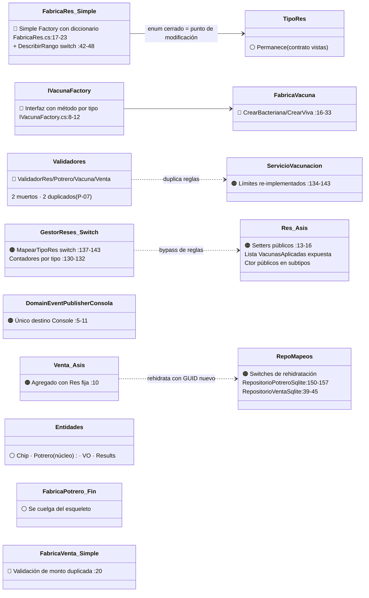

# 05 — TO-BE: Diseño con SOLID + Patrones (Actividad 3)

> [!abstract] Propósito
> El diseño destino: **qué sale, qué entra, cómo se conecta y qué impacto tiene**. Contiene los tres entregables de la Actividad 3: (3.1) los dos diagramas con elementos marcados por patrón, (3.2) la tabla de cambio estructural E-XX, (3.3) las fichas por patrón adoptado. Se implementa sobre el AS-IS ([[Reto2-Hacienda/Opcion1/01-AS-IS]]) según las decisiones ratificadas ([[Reto2-Hacienda/Opcion1/04-DecisionesArquitectonicas]]).

> [!warning] Reglas de preservación (verificables en [[Reto2-Hacienda/Opcion1/06-VerificacionSOLID]])
> 1. **Mensajes de usuario idénticos** — mismo texto, mismo orden.
> 2. **Salida de consola idéntica byte a byte** — el handler de consola reproduce las líneas actuales de `DomainEventPublisherConsola`.
> 3. **Cálculos idénticos** — totales, distancias, estados, umbrales.
> 4. **Contrato hacia vistas intacto** — `TipoRes`, `Res.Tipo`, bindings y `TempData` sobreviven (DEC-09).
> 5. **Sin capas ni proyectos nuevos** — Domain se fortalece; Application adelgaza; Infrastructure delega.

> [!success] D-05 RESUELTA (2026-08-30, por delegación explícita del equipo)
> **Variante A — producción propia (con `FabricaVacaLechera`, E-14).** Justificación del deber ser: el enunciado define SC-1 como "productos derivados **del ganado**" — la leche proviene de vacas lecheras, la carne y el cuero de las reses; sin producción propia el modelo queda incoherente con el dominio. Además es la variante que mide la promesa OCP (9 clases/4 capas → 1 clase + 1 registro). El resto del diseño es común a ambas variantes. Ver [[Reto2-Hacienda/Opcion1/10-BitacoraIA]] B-10.

---

## 3.1 · Entregable 1 — Los dos diagramas

### Diagrama A — LO QUE SALE (recorte del AS-IS con elementos marcados)

Elementos en 🔴 rojo **salen**; en 🟠 naranja **se transforman** (cambian de responsabilidad); en gris claro permanecen.

**Lectura:** el AS-IS no se destruye — se le extraen los **puntos de decisión regados** (switches, métodos-por-tipo, validadores duplicados) y los objetos anémicos se transforman cerrando su encapsulamiento. El enum `TipoRes`, los Value Objects, los Results, `Chip` y el núcleo de `Potrero` permanecen.

### Diagrama B — LO QUE ENTRA (TO-BE; en negro lo que se conserva sin cambios)

```mermaid
classDiagram
    direction TB
    class FabricaDeRes {
        «abstract · Creator + Template Method»
        +Crear(nombre, peso, edad) Res «esqueleto sellado»
        +Rehidratar(datos) Res «P-09»
        +TipoAtendido* TipoRes
        #Construir(...)* Res «Factory Method hook»
    }
    class FabricaTernero { «ConcreteCreator» }
    class FabricaCebon { «ConcreteCreator» }
    class FabricaNovillo { «ConcreteCreator» }
    class FabricaVacaLechera { «ConcreteCreator · solo SC-1-A» }
    FabricaDeRes <|-- FabricaTernero
    FabricaDeRes <|-- FabricaCebon
    FabricaDeRes <|-- FabricaNovillo
    FabricaDeRes <|-- FabricaVacaLechera

    class RegistroDeReses {
        «punto único de decisión»
        +Crear(tipo, ...) Res
        +Rehidratar(tipo, datos) Res
    }
    RegistroDeReses o-- FabricaDeRes : creators inyectados (DI)

    class FabricaDeVacuna {
        «abstract · Creator + Template Method»
        +Crear(DatosVacuna) Vacuna
        #Construir(datos)* Vacuna
        #ValidarPropios(datos)* void
    }
    class FabricaBacteriana { «ConcreteCreator» }
    class FabricaViva { «ConcreteCreator» }
    class DatosVacuna {
        «request object · mata la interfaz por-método»
        nombre lote fechas + periodoAplicacion? + atenuacion?
    }
    FabricaDeVacuna <|-- FabricaBacteriana
    FabricaDeVacuna <|-- FabricaViva
    class RegistroDeVacunas {
        «keyed by VacunaCategoria»
    }
    RegistroDeVacunas o-- FabricaDeVacuna

    class FabricaDeProducto {
        «abstract · SC-1 A/B»
    }
    class FabricaLacteo { «SC-1» }
    class FabricaCarne { «SC-1» }
    class FabricaPiel { «SC-1» }
    FabricaDeProducto <|-- FabricaLacteo
    FabricaDeProducto <|-- FabricaCarne
    FabricaDeProducto <|-- FabricaPiel

    class IVendible {
        «interface · polimorfismo de ítems (diseño, no patrón)»
    }
    class Res { ⚪ superficie intacta · mutación por métodos }
    class ProductoDerivado { «SC-1 · nuevo» }
    IVendible <|.. Res
    IVendible <|.. ProductoDerivado

    class VentaBuilder {
        «Builder · SC-1»
        +Iniciar()
        +ConItem(vendible, cantidad) VentaBuilder
        +Build() Venta «valida invariantes»
    }
    class Venta { ⚪ misma cara · agregado multi-ítem }
    VentaBuilder ..> Venta : construye
    VentaBuilder ..> IVendible : ítems de los creadores

    class IDomainEventHandlerT {
        «interface · Observer»
        +Manejar(evento)
    }
    class HandlerConsola {
        «Observer #1 · salida IDÉNTICA a la actual»
    }
    class HandlerStockDerivados { «Observer #2 · SC-1» }
    class DespachadorDeEventos {
        «Observer · IDomainEventPublisher existente»
        orden determinista por registro
    }
    IDomainEventHandlerT <|.. HandlerConsola
    IDomainEventHandlerT <|.. HandlerStockDerivados
    DespachadorDeEventos o-- IDomainEventHandlerT : handlers inyectados

    class GestorReses { ⚪ orquesta · ya no mapea tipos }
    class ServicioVacunacion { ⚪ orquesta · ya no re-implementa límites }
    class Repos { ⚪ SQL intacto · rehidratan vía RegistroDeReses }
    class Program { ⚪ punto de ensamblaje · +registros }
    GestorReses --> RegistroDeReses
    ServicioVacunacion --> RegistroDeVacunas
    Repos --> RegistroDeReses
    Program ..> RegistroDeReses : registra creators
    Program ..> DespachadorDeEventos : registra handlers (consola 1º)
```

**Lectura por color conceptual:** ⚪ = se conserva (algunos con interior cerrado); sin marca = nuevo y siempre con su patrón/papel rotulado. El enum `TipoRes` **no** desaparece: deja de ser el punto de *decisión* de creación y queda como superficie de lectura (para vistas y BD).

> [!tip] Diagramador por capas (muy bien valorado por el enunciado)
> Este par de diagramas está listo para montarse como **dos capas superpuestas** (AS-IS debajo, TO-BE encima) en draw.io: capa 1 = Diagrama A (grises), capa 2 = Diagrama B (nuevos en color). Si el equipo lo quiere, genero el archivo `.drawio` con las dos capas — pedirlo en la revisión de esta actividad.

---

## 3.2 · Entregable 2 — Tabla de cambio estructural (E-XX)

| ID | Elemento | Estado | Qué hacía antes | Qué hace ahora | Quién dependía de él y cómo se reconecta |
|----|----------|--------|-----------------|----------------|------------------------------------------|
| E-01 | `FabricaRes` + `IResFactory` | **Se transforma** | Simple Factory con diccionario interno; switch `DescribirRango`; validaba edad después de construir | Se divide en base `FabricaDeRes` (esqueleto Template Method) + creadores concretos por subtipo con hook de construcción; el rango de edad pasa a ser **dato del subtipo** | `GestorReses` (único consumidor — `GestorReses.cs:15,23,47`) pasa a depender de `RegistroDeReses`; DI reenvasa el registro |
| E-02 | `IVacunaFactory` / `FabricaVacuna` | **Sale** | Interfaz con un método por tipo concreto + clase que los implementa | Reemplazadas por jerarquía `FabricaDeVacuna` + `DatosVacuna` (objeto-solicitud) + `RegistroDeVacunas` | `ServicioVacunacion.cs:15,22` pasa al registro; `VacunaController` arma `DatosVacuna` sin if/else por tipo |
| E-03 | `FabricaVenta` + `IVentaFactory` | **Sale** | Constructor fijo (res, potrero, monto, reloj) con validación de monto duplicada (`:20`) | `VentaBuilder` (SC-1): iniciar → ítems (via `IVendible`) → `Build()` valida invariantes y calcula total | `ServicioVentas.cs:14,21` pasa al builder; el reloj se inyecta por constructor como en el resto del sistema (idioma unificado) |
| E-04 | `ValidadorRes/Potrero/Vacuna/Venta` + `IValidar*` | **Sale** | Validación post-construcción: 2 muertos, 2 duplicando reglas de factories/VOs (P-07) | Las reglas vivas migran al esqueleto de la base de creadores (paso "validar comunes"); las muertas se eliminan | `GestorReses`/`ServicioVentas` sueltan la dependencia; los mensajes de error exactos se conservan en el esqueleto |
| E-05 | `GestorReses.MapearTipoRes` + contadores `:130-143` | **Se transforma** | Traducía enum→instancia con switch; contaba por tipo con cases hardcodeados | La traducción vive en `RegistroDeReses`; las estadísticas se calculan polimórficamente agrupando por `res.Tipo` (LINQ) | Nadie más usaba el método privado; el controlador consume las mismas estadísticas |
| E-06 | Switches de rehidratación (`RepositorioPotreroSqlite.cs:150-157`, `RepositorioVentaSqlite.cs:39-45`) | **Se transforma** | Cada repo re-fabricaba Res con switch propio (y GUID nuevo en ventas) | Los repos llaman a `RegistroDeReses.Rehidratar(...)` que preserva el `Id` persistido | `RepositorioResSqlite` (que ya consumía el mapeo estático cruzado — `:29,96`) usa el mismo registro: fin del acoplamiento estático entre repos |
| E-07 | `DomainEventPublisherConsola` | **Se transforma** | Publicaba todo a `Console.WriteLine` | Se divide: `DespachadorDeEventos` (implementa `IDomainEventPublisher` — la interfaz NO cambia) + `HandlerConsola` que reproduce **las mismas líneas** | Todos los servicios que publican (`GestorReses`, `ServicioVacunacion`, …) ni se enteran: dependen de la interfaz existente |
| E-08 | `Res` y subtipos (setters, ctor públicos) | **Se transforma** | Estructura editable: `Peso/Edad/Chip` settables, lista expuesta | Setters cerrados; mutación por métodos con regla (`Alimentar`, `AplicarVacuna`, `InstalarChip`); constructores privados — la única puerta es el creador | Los servicios hacen hoy esas mutaciones; pasan a hacerlo **a través** de los métodos (mismos efectos, mismos mensajes) |
| E-09 | `ServicioVacunacion` (límites `:134-143`) | **Se transforma** | Re-implementaba imperativamente los límites de vacunas | Delega en `Res.AplicarVacuna(vacuna)` que exige `MaxVacunasBacterianas/Vivas` (las propiedades ya existían) | Mismo mensaje de error al usuario; la regla vive donde el dominio la declaró |
| E-10 | `Venta` | **Se transforma** | Agregado con una `Res` fija | Agregado multi-ítem (`IVendible`) construido solo por `VentaBuilder`; superficie actual (fecha, res, potrero, monto) preservada para las vistas | `RepositorioVentaSqlite` persiste ítems nuevos; la lectura de ventas legacy reconstruye un ítem único (compatibilidad) |
| E-11 | `IDomainEventHandler<T>` + `HandlerConsola` + `HandlerStockDerivados` | **Entra** | No existían (diseño del Reto 1 que quedó en papel) | Contrato Observer + handlers registrables en orden determinista (consola primero) | `Program.cs` los registra; los publicadores existentes no cambian |
| E-12 | `RegistroDeReses` / `RegistroDeVacunas` / `RegistroDeProductos` | **Entra** | No existían | Punto único de decisión de creación y rehidratación, alimentado por DI con `IEnumerable<FabricaDeX>` (mismo idioma que `AutorizadorRbca.cs:13-16`) | Servicios y repos los consumen; agregar tipo = 1 creador + 1 registro en `Program.cs` |
| E-13 | `FabricaDeProducto` + `Lacteo/Carne/Piel` + `ProductoDerivado` + `IVendible` | **Entra** (SC-1 A/B) | No existían | Jerarquía de productos derivados con creadores propios; implementan `IVendible` | `VentaBuilder` los consume; repositorios nuevos de producto (SC-1) |
| E-14 | `FabricaVacaLechera` | **Entra** (solo SC-1-A) | No existía | Creador del subtipo lechero: **1 clase + 1 registro, cero ediciones** (demostración OCP) | `RegistroDeReses`; las estadísticas y vistas la muestran vía `Tipo` sin switch |
| E-15 | `Program.cs` | **Se transforma** | 31 registros correctos, efectos secundarios de arranque | Mismos registros + creators, registros de productos y handlers; **orden de arranque intacto** (P-12 no se toca) | Es el punto de ensamblaje del enunciado — único lugar que conoce la foto completa |

**Cuenta agregada:** Entran ~14–18 clases (segunda ola SC-1 incluida) · Se transforman 9 · Salen 6 (E-02, E-03, E-04 ×4). Capas: Domain +8–10, Application −4 netas, Infrastructure ±2, Web solo DI.

---

## 3.3 · Entregable 3 — Fichas por patrón adoptado (una página c/u)

### Ficha 1 · Factory Method

| Campo | Contenido |
|-------|-----------|
| **Patrón y punto de dolor** | Factory Method (creacional) → **P-01** (`FabricaRes.cs:17-23`, enum `TipoRes`, switches en `GestorReses.cs:137-143` y 2 repos), **P-02** (`IVacunaFactory.cs:8-12`), **P-09** (switches de rehidratación duplicados) |
| **Alternativas evaluadas** | (1) Simple Factory ordenado — no elimina switches externos; (2) Abstract Factory — sin familias (advertencia Anexo A); (3) **no hacer nada** — 9 clases/9 archivos por subtipo, 8 por vacuna (medido en [[Reto2-Hacienda/Opcion1/02-PuntosDolor]]) |
| **Qué sale / qué entra** | **Sale:** diccionario central, `DescribirRango`, métodos-por-tipo en interfaz, switches de servicio y repos. **Entra:** `FabricaDeRes`/`FabricaDeVacuna` (bases), creadores concretos (`FabricaTernero`…), `RegistroDe*` (punto único), `DatosVacuna` |
| **Cómo se relaciona** | La base de creadores **es** el Template Method (Ficha 2). El `VentaBuilder` (Ficha 3) consume productos de los creadores. `Program.cs` arma los registros (punto de ensamblaje). **Quién construye:** el composition root. **Quién usa:** servicios (crear) y repositorios (rehidratar) |
| **Impacto** | Creadas: ~8 (bases 2, creadores 4, registros 2, +SC-1). Modificadas: `GestorReses`, `ServicioVacunacion`, `VacunaController`, 2 repos, `Program.cs`. Eliminadas: `IVacunaFactory`+`FabricaVacuna` as-is. **Anexo B:** SC-1 agrega producto/vaca lechera = **1 clase + 1 registro por tipo** (era 9 clases/4 capas) |
| **Qué cuesta** | 1 clase por subtipo (más carpetas); una indirección más entre consumo y construcción; el registro es un lugar que leer para entender "quién crea qué" |
| **Origen** | Propuesta IA aceptada por el equipo — bitácora [[Reto2-Hacienda/Opcion1/10-BitacoraIA]] B-08; raíz del análisis B-01 |

### Ficha 2 · Template Method

| Campo | Contenido |
|-------|-----------|
| **Patrón y punto de dolor** | Template Method (comportamiento) → **P-07** (regla de monto ×3 con 2 umbrales — `FabricaVenta.cs:20`, `Dinero.cs:10-11`, `ValidadorVenta.cs:15`; validación común duplicada `FabricaVacuna.cs:36-39` vs `ValidadorVacuna.cs:14-15`), **P-01/P-02** (pipeline disperso) |
| **Alternativas evaluadas** | (1) Chain of Responsibility — orden fijo fail-fast, reordenabilidad sin consumidor; (2) validadores de Application (status quo = P-07); (3) **no hacer nada** — cada factory nueva reimplementa y desincroniza el pipeline (evidencia: venta de $0 que se construye y luego se rechaza) |
| **Qué sale / qué entra** | **Sale:** capa `Validaciones/` (4 clases), validación post-construcción de edad. **Entra:** esqueleto sellado en la base de creadores: `ValidarComunes → Construir (hook FM) → ExigirReglaDelSubtipo → PublicarOcurrido`. Las reglas del subtipo son **datos** (`EsEdadValida`, rangos), no pasos opcionales |
| **Cómo se relaciona** | Es la mitad creacional-comportamental del mismo mecanismo: los creadores de la Ficha 1 heredan este esqueleto. El último paso dispara Observer (Ficha 4) |
| **Impacto** | Creadas: 1 (la base — compartida con Ficha 1). Eliminadas: 4 validadores + 2 interfaces `IValidar*`. Modificadas: factories (se cuelgan del esqueleto). **Anexo B:** una regla común nueva (p.ej. caducidad mínima de lácteos SC-1) se escribe una vez para todos los productos |
| **Qué cuesta** | Herencia para variar (acoplamiento base↔subclases declarado); +1 frame de pila al depurar; **tensión LSP compensada**: hooks como propiedades-dato ⇒ ningún subtipo puede "no poder" cumplir un paso; el esqueleto no tiene pasos skipping-ables |
| **Origen** | Propuesta IA aceptada — bitácora B-08; el dolor P-07 fue hallazgo B-01/B-06 |

### Ficha 3 · Builder

| Campo | Contenido |
|-------|-----------|
| **Patrón y punto de dolor** | Builder (creacional) → **P-03**: `Venta` sostiene `Res` concreta (`Venta.cs:10`) y SC-1 la vuelve multi-ítem; `FabricaVenta` con validación duplicada (`:20`) |
| **Alternativas evaluadas** | (1) Constructores sobrecargados — telescópicos al primer cambio de ítems; (2) Composite — lista plana, no árbol ([[Reto2-Hacienda/Opcion1/03-PatronesEvaluados]] §3.3); (3) **no hacer nada** — cada evolución de ítems reescribe constructor + factory + repositorio (8 clases/8 archivos, P-03) |
| **Qué sale / qué entra** | **Sale:** `FabricaVenta`/`IVentaFactory` tal cual. **Entra:** `VentaBuilder` (iniciar → conItem(vendible, cantidad) → `Build()` que valida invariantes y fija el total), `IVendible` (polimorfismo Res \| Producto — diseño, no patrón), `ProductoDerivado` + creadores (SC-1) |
| **Cómo se relaciona** | Los ítems provienen de los registros de la Ficha 1 (builder ensambla, no decide tipos). `Build()` publica el evento de venta vía el despachador (Ficha 4). **Quién construye:** el builder (creado por DI). **Quién usa:** `ServicioVentas` |
| **Impacto** | Creadas: 1 builder + contrato `IVendible` + productos SC-1 (3–4). Modificadas: `Venta` (agrega ítems; superficie intacta), `ServicioVentas`, repositorio de ventas (persistencia multi-ítem con compatibilidad de lectura legacy). **Anexo B:** SC-1 = el caso de uso directo; SC-3 futura (venta con servicios/historia) también ensambla por aquí |
| **Qué cuesta** | Objeto "en construcción" con estado intermedio (mitigado: `Build()` único punto de entrega válida); una clase más en la traza de creación; la persistencia multi-ítem exige decisión de esquema (columna/discord — zona BD: solo agregar, no migrar) |
| **Origen** | Propuesta IA aceptada — bitácora B-08; comparativa de costos en B-05. **D-05 resuelta → Variante A confirmada (B-10): la ficha incluye E-14** |

### Ficha 4 · Observer

| Campo | Contenido |
|-------|-----------|
| **Patrón y punto de dolor** | Observer (comportamiento) → **P-10**: publicación sin consumo (`DomainEventPublisherConsola.cs:5-11` único destino; `VacunaVencidaEvent` nunca publicado `DomainEvents.cs:69-83`; `IDomainEventHandler` documentado y jamás implementado) |
| **Alternativas evaluadas** | (1) Llamadas directas en servicios (status quo — cada reacción toca al publicador); (2) Mediator — god object, centraliza lo que hoy está bien distribuido; (3) **no hacer nada** — SC-1 no puede reaccionar a stock/perecederos sin cirugía en quien publica |
| **Qué sale / qué entra** | **Sale:** el publicador-consola monolítico. **Entra:** `IDomainEventHandler<T>` (contrato Domain), `DespachadorDeEventos` (implementa la interfaz **existente** `IDomainEventPublisher`), `HandlerConsola` (reproduce la salida actual **línea por línea**), handlers SC-1 (`HandlerStockDerivados`…) |
| **Cómo se relaciona** | Disparado por el paso final del esqueleto (Ficha 2). Se registra en el mismo composition root que los creadores (Ficha 1). Los servicios publicadores **no cambian** — dependían de la abstracción y sigue igual |
| **Impacto** | Creadas: contrato + despachador + handler consola + handlers SC-1 (~4 + los que SC-1 necesite). Modificadas: 0 en publicadores (DIP del Reto 1 rinde aquí). **Anexo B:** reaccionar a stock mínimo de derivados o a lácteos por vencer = 1 handler + 1 registro; SC-3 futura (alertas clínicas) idéntico mecanismo |
| **Qué cuesta** | Infraestructura de despacho; orden determinista que debe especificarse y testearse (consola primero); un evento dispara N handlers no visibles en la firma del publicador (costo de depuración declarado); handlers sincrónicos en v1 (sin cascadas) |
| **Origen** | Propuesta IA aceptada — bitácora B-08; el "medio diseño" ya existente fue hallazgo B-01 |

---

## 4. Efecto sobre las solicitudes del Anexo B (medido)

| Solicitud | Costo AS-IS (medido) | Costo TO-BE (diseño) |
|-----------|----------------------|----------------------|
| **SC-1 · Derivados** (elegida) | ~15–20 clases en ~15 archivos, varias en flujo congelado (P-01+P-03) | **Núcleo:** 1 creador por producto (3) + `ProductoDerivado` + `IVendible` + registros + handler = ~6–8 clases **nuevas, 0 ediciones de switches**. Variante A suma `FabricaVacaLechera` (1+1). Venta: builder ya diseñado |
| **SC-2 · Chips** (ya implementada) | — | Queda más robusta por colateral: rehidratación de chips vía registro cuando haya más subtipos; eventos de chip consumibles |
| **SC-3 · Historia clínica** (futura) | ~9–12 clases aditivas (B-05) | ~4–5: entidad + creador + repositorio + 1 handler (los eventos ya tendrán a quién escuchar) |

---

## 5. Dudas abiertas

| ID | Duda | Estado |
|----|------|--------|
| ~~D-05~~ | Producción propia (A) vs stock directo (B) | ✅ **Resuelta: Variante A** (delegación explícita del equipo a la recomendación IA — B-10). E-14 confirmado |
| D-11 | Persistencia multi-ítem de `Venta`: columna JSON vs tabla `venta_items` — decisión de esquema **aditiva** (zona BD: solo agregar) | 🟡 Se decide al implementar |

## 6. Riesgos propios del diseño

1. **Superficie de mensaje:** los mensajes exactos de errores/éxitos deben trasladarse al esqueleto y al builder — un texto cambiado = −0.5. Mitigación: tabla de mensajes congelados en [[Reto2-Hacienda/Opcion1/06-VerificacionSOLID]].
2. **Rehidratación con `Id` preservado** (E-06): cambia un comportamiento *interno* (identidad estable vs GUID nuevo por lectura). No es observable en UI/consola; se declara y se evidencia en la Act. 4.
3. **Determinismo del despachador:** el orden de handlers queda especificado (consola primero, luego resto en orden de registro) y con caso de prueba propio.

---

## 7. Navegación

- [[Reto2-Hacienda/Opcion1/01-AS-IS]] · [[Reto2-Hacienda/Opcion1/02-PuntosDolor]] · [[Reto2-Hacienda/Opcion1/03-PatronesEvaluados]] · [[Reto2-Hacienda/Opcion1/04-DecisionesArquitectonicas]] — la cadena de evidencia.
- [[Reto2-Hacienda/Opcion1/06-VerificacionSOLID]] — Actividad 4: aquí se audita todo lo que este diseño promete preservar.
- [[Reto2-Hacienda/Opcion1/10-BitacoraIA]] — B-05/B-08 sustentan las decisiones de esta actividad.
