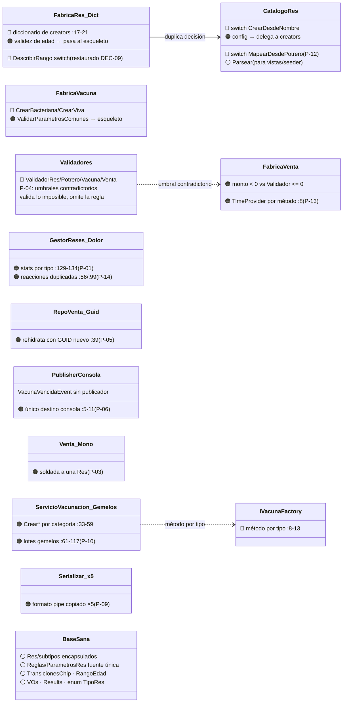

# 05 — TO-BE: Diseño con SOLID + Patrones (Actividad 3)

> [!abstract] Propósito
> El diseño destino: **qué sale, qué entra, cómo se conecta y qué impacto tiene**. Tres entregables: (3.1) los dos diagramas marcados, (3.2) la tabla de cambio estructural E-XX, (3.3) las fichas por patrón adoptado. Se implementa sobre el AS-IS saneado ([[Reto2-Hacienda/Opcion1/01-AS-IS|01-AS-IS]]) según el catálogo ([[Reto2-Hacienda/Opcion1/02-PuntosDolor|02-PuntosDolor]]) y las decisiones vivas ([[Reto2-Hacienda/Opcion1/04-DecisionesArquitectonicas|04-Decisiones]]).

> [!warning] Reglas de preservación (congeladas — Líder Técnica)
> 1. **Mensajes de usuario idénticos** — mismo texto, mismo orden (incluida la validación de edad restaurada, DEC-09).
> 2. **Salida de consola idéntica byte a byte** — `HandlerConsola` reproduce las líneas actuales.
> 3. **Cálculos idénticos** — totales, distancias, estados, umbrales, rangos.
> 4. **Contrato hacia vistas intacto** — `TipoRes`, `Res.Tipo`, bindings y `TempData` sobreviven.
> 5. **Sin capas ni proyectos nuevos** — Domain se fortalece; Application adelgaza; Infrastructure delega.
> 6. **SOLID no se toca** — si un patrón tensa un principio, se declara y compensa (Act. 4).

> [!success] Set de patrones (DEC-06)
> **Factory Method + Template Method + Builder + Observer** · Composite pendiente de D-12 (solo si SC-1 incluye canastas). Anclaje completo en [[Reto2-Hacienda/Opcion1/03-PatronesEvaluados|03-Patrones]] §2.

---

## 3.1 · Entregable 1 — Los dos diagramas

### Diagrama A — LO QUE SALE (recorte del AS-IS marcado)

🔴 sale · 🟠 se transforma · ⚪ permanece. Todos los elementos existen HOY en el código.

**Lectura:** no se destruye la base sana (⚪) — se extraen los **puntos de decisión regados** (fábricas con 4 idiomas, switches de catálogo, validación post-construcción, reacciones copiadas) y se reconectan a un único mecanismo.

### Diagrama B — LO QUE ENTRA (TO-BE; ⚪ lo conservado)

```mermaid
classDiagram
    direction TB
    class FabricaDeRes {
        «abstract · Factory Method + Template Method»
        +Crear(nombre, peso, edad) Res
        +Rehidratar(datos, id) Res «Id estable — P-05»
        +TipoAtendido* TipoRes
        +RangoDescribible* string «mismo texto»
        #Construir(...)* Res «hook»
        esqueleto: validar comunes → construir
        → exigir EsEdadValida (sellado)
        → publicar Ocurrido
    }
    class FabricaTernero { «ConcreteCreator» }
    class FabricaCebon { «ConcreteCreator» }
    class FabricaNovillo { «ConcreteCreator» }
    class FabricaVacaLechera { «SC-1 · 1 clase + 1 registro» }
    FabricaDeRes <|-- FabricaTernero
    FabricaDeRes <|-- FabricaCebon
    FabricaDeRes <|-- FabricaNovillo
    FabricaDeRes <|-- FabricaVacaLechera

    class RegistroDeReses {
        «punto único de decisión»
        +Crear(tipo, ...) / +Rehidratar(tipo, id, ...)
        «IEnumerable~FabricaDeRes~ por DI»
    }
    RegistroDeReses o-- FabricaDeRes

    class FabricaDeVacuna {
        «abstract · FM + TM»
        +Crear(DatosVacuna) Vacuna
        +CrearLote(DatosVacuna, n) «esqueleto común — P-10»
        #Construir(datos)* / #ValidarPropios(datos)*
    }
    class DatosVacuna { «request object — mata método-por-tipo» }
    class FabricaBacteriana { «ConcreteCreator» }
    class FabricaViva { «ConcreteCreator» }
    FabricaDeVacuna <|-- FabricaBacteriana
    FabricaDeVacuna <|-- FabricaViva
    class RegistroDeVacunas { «keyed por categoría» }
    RegistroDeVacunas o-- FabricaDeVacuna

    class FabricaDeProducto {
        «abstract · SC-1»
    }
    class FabricaLacteo { «SC-1» }
    class FabricaCarne { «SC-1» }
    class FabricaPiel { «SC-1» }
    FabricaDeProducto <|-- FabricaLacteo
    FabricaDeProducto <|-- FabricaCarne
    FabricaDeProducto <|-- FabricaPiel

    class IVendible { «interface — polimorfismo de ítems» }
    class Res { ⚪ intacta · Serializar consolidado en base (P-09) }
    class ProductoDerivado { «SC-1 · nuevo» }
    IVendible <|.. Res
    IVendible <|.. ProductoDerivado

    class VentaBuilder {
        «Builder — P-03»
        +Iniciar() → ConItem(vendible, cant) → Build()
        Build(): invariantes + total «una sola vez»
        reloj por ctor (mata IVentaFactory:8)
    }
    class Venta { ⚪ misma cara pública · agregado multi-ítem }
    VentaBuilder ..> Venta : construye

    class IDomainEventHandlerT {
        «interface · Observer»
        +Manejar(evento)
    }
    class HandlerConsola { «#1 — salida IDÉNTICA byte a byte» }
    class HandlerStockDerivados { «#2 · SC-1» }
    class DespachadorDeEventos {
        «implementa IDomainEventPublisher existente»
        orden determinista: consola primero
    }
    IDomainEventHandlerT <|.. HandlerConsola
    IDomainEventHandlerT <|.. HandlerStockDerivados
    DespachadorDeEventos o-- IDomainEventHandlerT

    class GestorReses { ⚪ orquesta · sin reacciones inline (P-14) }
    class ServicioVacunacion { ⚪ orquesta · sin gemelos (P-10) }
    class Repos { ⚪ SQL intacto · rehidratan vía RegistroDeReses }
    class Program { ⚪ solo AÑADE registros al final (P-08 intacto) }
    GestorReses --> RegistroDeReses
    ServicioVacunacion --> RegistroDeVacunas
    Repos --> RegistroDeReses
    Program ..> RegistroDeReses : registra creators
    Program ..> DespachadorDeEventos : registra handlers
```

**Lectura:** el enum `TipoRes` NO desaparece: deja de ser punto de decisión y queda como superficie de lectura (vistas + BD). `CatalogoRes` retiene `Parsear` y pierde los switches.

> [!tip] Diagramador por capas (muy bien valorado)
> Este par está listo para montarse como **dos capas superpuestas** en draw.io (A gris debajo, B en color encima) — el archivo `diagramas/Reto2_ASIS_TOBE_Capas.drawio` se re-sincroniza al congelar este diseño.

---

## 3.2 · Entregable 2 — Tabla de cambio estructural (E-XX)

| ID | Elemento | Estado | Qué hacía antes (hoy) | Qué hace ahora | Quién dependía y cómo se reconecta |
|----|----------|--------|----------------------|----------------|-----------------------------------|
| E-01 | `FabricaRes` + `IResFactory` | **Se transforma** | Diccionario de creators + `DescribirRango` switch + validez de edad inline | Base `FabricaDeRes` (Creator+TM sellado: comunes→hook→`EsEdadValida`→publicar) + creators concretos; rango describible = dato del creator | `GestorReses.cs:15,23` pasa a `RegistroDeReses`; mensajes idénticos |
| E-02 | `CatalogoRes` | **Se transforma** | Config por tipo + 2 switches (`CrearDesdeNombre`, `MapearDesdePotrero`) | Retiene `Parsear` (vistas/seeder); creación y mapeo migran al registro/creators; config sigue delegando a `ParametrosRes` ⚪ | Repos y `GestorReses.MapearTipoRes` → `RegistroDeReses.Rehidratar` |
| E-03 | `IVacunaFactory`/`FabricaVacuna` | **Sale** | Interfaz método-por-tipo + factory con validación común privada | Jerarquía `FabricaDeVacuna` + `DatosVacuna` (request) + `RegistroDeVacunas` | `ServicioVacunacion.cs:15,22`; `VacunaController` arma `DatosVacuna` sin ternario (`VacunaController.cs:49-54`) |
| E-04 | Validadores ×4 | **Sale** | Validación post-construcción con umbrales contradictorios (`FabricaVenta.cs:20` `<0` vs `ValidadorVenta.cs:15` `<=0`) | Reglas vivas al esqueleto de creación/`Build()`; mensajes exactos conservados | `GestorReses`/`GestorPotreros`/`ServicioVentas` sueltan `_validador`; `Program.cs:57-60` pierde registros |
| E-05 | `GestorReses` stats/reacciones | **Se transforma** | Contadores por tipo `:129-134`; reacciones duplicadas `:56/:99` | Stats polimórficas agrupando por `res.Tipo` (LINQ); el flujo solo publica — los handlers reaccionan | `ResController` consume las mismas keys del diccionario |
| E-06 | `RepositorioVentaSqlite:39` | **Se transforma** | Rehidrata `Res` con GUID nuevo por lectura | `Rehidratar(tipo, id, …)` preserva el `Id` persistido | Lecturas correlacionables con potrero/chip (comportamiento interno mejorado, declarado) |
| E-07 | `DomainEventPublisherConsola` | **Se transforma** | Todo a `Console.WriteLine` | `DespachadorDeEventos` (implementa `IDomainEventPublisher` — interfaz intacta) + `HandlerConsola` con las mismas líneas | Los publicadores actuales **no cambian** (DIP del Reto 1 rinde) |
| E-08 | `Venta` + `FabricaVenta` | **Se transforma** | Agregado soldado a una `Res`; reloj por parámetro de método | `Venta` multi-ítem (`IVendible`) con superficie intacta; `VentaBuilder` con reloj por ctor | `ServicioVentas.cs:14,21`; repo de ventas persiste ítems (D-11 define esquema) |
| E-09 | Lotes gemelos `ServicioVacunacion:61-117` | **Se transforma** | 27 líneas ×2 que difieren en 3 | `FabricaDeVacuna.CrearLote(DatosVacuna, n)` esqueleto común; el servicio orquesta | Mismos mensajes de lote (numerado `-001…`, conteo, tope 1-100) |
| E-10 | `Serializar()` ×5 | **Se transforma** | Formato pipe copiado en 5 subtipos | Implementación única en la base (`Res`/`Vacuna`), hook de sufijo por subtipo | Contrato de persistencia intacto (mismo formato exacto) |
| E-11 | `RegistroDeReses/Vacunas/Productos` | **Entra** | — | Punto único de decisión (crear + rehidratar), `IEnumerable<FabricaDeX>` por DI (idioma de `AutorizadorRbca.cs:13-16`) | Servicios y repos consumen; agregar tipo = 1 creator + 1 registro |
| E-12 | SC-1: `ProductoDerivado` + `IVendible` + `FabricaDeProducto/Lacteo/Carne/Piel` | **Entra** | — | Jerarquía de derivados con creators propios; implementan `IVendible` | `VentaBuilder` consume; repositorios de producto nuevos |
| E-13 | `FabricaVacaLechera` (DEC-05, Variante A) | **Entra** | — | Creador del subtipo lechero: **1 clase + 1 registro, cero ediciones** (demostración OCP medida) | `RegistroDeReses`; stats/vistas la muestran vía `Tipo` |
| E-14 | `Program.cs` | **Se transforma** | 31 registros + arranque sensible (P-08) | Mismos registros + creators/registros/handlers **añadidos al final** — orden intacto | Composition root: único lugar con la foto completa |

**Cuenta:** Entran ~16-20 clases · Se transforman 10 · Salen 6 (E-03 ×2, E-04 ×4). Capas: Domain +8-10, Application −4 netas, Infrastructure ±2, Web solo DI.

---

## 3.3 · Entregable 3 — Fichas por patrón adoptado

### Ficha 1 · Factory Method (+ RegistroDeReses como idioma de ensamblaje)

| Campo | Contenido |
|-------|-----------|
| **Patrón y punto de dolor** | Creacional → **P-01** (`FabricaRes.cs:17-21` diccionario, `CatalogoRes` 2 switches, `GestorReses.cs:129-134`, enum), **P-13** (4 fábricas/4 idiomas), P-02, colateral P-05/P-12 |
| **Alternativas evaluadas** | (1) Simple Factory ordenado — reubica el switch; (2) Abstract Factory — sin familias (Anexo A); (3) **no hacer nada** — 6 archivos/2 capas por subtipo (medido) |
| **Qué sale / qué entra** | Sale: diccionario central, switches de catálogo, método-por-tipo. Entra: bases `FabricaDeRes/Vacuna/Producto`, creators concretos, `RegistroDe*`, `DatosVacuna` |
| **Cómo se relaciona** | Las bases **son** el Template Method (Ficha 2). El `VentaBuilder` (Ficha 3) consume productos de los registros. `Program.cs` ensambla (E-14) |
| **Impacto** | Creadas ~8-10 · Modificadas: `GestorReses`, `ServicioVacunacion`, `VacunaController`, 3 repos, `Program.cs` · Eliminadas: `IVacunaFactory`+`FabricaVacuna` as-is · **SC-1: VacaLechera = 1+1** (antes 6 ediciones) |
| **Qué cuesta** | 1 clase por subtipo; una indirección más; el registro es un lugar que leer |
| **Origen** | IA aceptada — B-08; re-anclado al catálogo nuevo en B-15 |

### Ficha 2 · Template Method

| Campo | Contenido |
|-------|-----------|
| **Patrón y punto de dolor** | Comportamiento → **P-04** (umbrales `<0` vs `<=0`; validar lo imposible), **P-09** (`Serializar` ×5), **P-10** (lotes gemelos `:61-117`), colaterales P-13/P-14. Consolidará como paso sellado la validación de edad restaurada (DEC-09) |
| **Alternativas evaluadas** | (1) Chain of Responsibility — orden fijo, un consumidor; (2) validadores como hoy — ya desincronizados (evidencia: contradicción de monto); (3) **no hacer nada** — cada fábrica nueva reimplementa el pipeline |
| **Qué sale / qué entra** | Sale: capa `Validaciones/` (E-04). Entra: esqueleto sellado en las bases `validar comunes → construir (hook) → exigir regla del subtipo → publicar`; serialización y lote como esqueletos en la base |
| **Cómo se relaciona** | Es la mitad comportamiento del mismo mecanismo de la Ficha 1; el paso final dispara Observer (Ficha 4) |
| **Impacto** | Creadas: 0 extra (comparte bases con Ficha 1) · Eliminadas: 4 validadores + 2 interfaces · **Regla común nueva = se escribe una vez** (SC-1: caducidad de lácteos) |
| **Qué cuesta** | Herencia para variar (acoplamiento declarado); +1 frame; **tensión LSP compensada**: hooks como propiedades-dato ⇒ ningún subtipo puede "no poder" (matriz en 06) |
| **Origen** | IA aceptada — B-08; anclas P-09/P-10 ampliadas en B-15 |

### Ficha 3 · Builder

| Campo | Contenido |
|-------|-----------|
| **Patrón y punto de dolor** | Creacional → **P-03** (`Venta.cs:10` soldada; SC-1 multi-ítem), P-04 ○ (invariantes una vez), P-13 (reloj por ctor — mata `IVentaFactory.cs:8`) |
| **Alternativas evaluadas** | (1) Constructores sobrecargados — telescópicos al primer cambio de ítems; (2) Composite — D-12 pendiente (solo si canastas); (3) **no hacer nada** — SC-1 rompe constructor+factory+repo el día uno |
| **Qué sale / qué entra** | Sale: `FabricaVenta`/`IVentaFactory` tal cual. Entra: `VentaBuilder` (Iniciar→ConItem→Build), `IVendible`, `ProductoDerivado`+creators (E-12) |
| **Cómo se relaciona** | Ítems desde los registros (Ficha 1); `Build()` publica el evento de venta vía despachador (Ficha 4) |
| **Impacto** | Creadas: 1 builder + `IVendible` + productos SC-1 (3-4) · Modificadas: `Venta` (superficie intacta), `ServicioVentas`, repo (D-11) |
| **Qué cuesta** | Estado intermedio (mitigado: `Build()` único punto de entrega válida); decisión de esquema (D-11) |
| **Origen** | IA aceptada — B-08/B-10 (Variante A confirmada) |

### Ficha 4 · Observer

| Campo | Contenido |
|-------|-----------|
| **Patrón y punto de dolor** | Comportamiento → **P-06** (consola único destino; `VacunaVencidaEvent` 0 publicaciones — verificado), **P-14** (reacciones duplicadas `GestorReses.cs:56/:99`) |
| **Alternativas evaluadas** | (1) Llamadas directas (status quo — cada reacción toca al publicador); (2) Mediator — god object; (3) **no hacer nada** — SC-1 no puede reaccionar a stock sin cirugía |
| **Qué sale / qué entra** | Sale: publicador monolítico. Entra: `IDomainEventHandler<T>`, `DespachadorDeEventos` (interfaz existente intacta), `HandlerConsola` (líneas idénticas), `HandlerStockDerivados` (SC-1) |
| **Cómo se relaciona** | Disparado por el paso final del esqueleto (Ficha 2); registrado en el mismo composition root (Ficha 1) |
| **Impacto** | Creadas ~4 · Modificadas **0 en publicadores** · SC-1: reaccionar a stock/vencimiento = 1 handler + 1 registro |
| **Qué cuesta** | Orden determinista a especificar y probar (consola 1º); handlers invisibles en la firma (costo de depuración declarado); sincrónicos v1 |
| **Origen** | IA aceptada — B-08; ancla P-14 añadida en la auditoría B-15 |

---

## 4. Efecto sobre las solicitudes del Anexo B (medido hoy)

| Solicitud | Costo AS-IS (medido 2026-09-02) | Costo TO-BE (diseño) |
|-----------|--------------------------------|----------------------|
| **SC-1 · Derivados** (elegida) | ~20 clases / ~15 archivos: subtipo (6 ediciones P-01) + venta multi-ítem (P-03) + 5ª fábrica con idioma nuevo (P-13) + sin forma de reaccionar (P-06) | **Núcleo: ~8-10 clases nuevas, 0 ediciones de switches.** `FabricaVacaLechera` = 1+1 (E-13) |
| SC-2 · Chips (ya implementada) | — | Colateral: rehidratación con Id estable (E-06); eventos de chip consumibles |
| SC-3 · Historia clínica (futura) | ~9-12 clases aditivas | ~4-5: entidad + creator + repositorio + 1 handler |

---

## 5. Dudas abiertas

| ID | Duda | Estado |
|----|------|--------|
| D-04 | Distribución de los 4 frentes entre integrantes | 🟡 Del equipo |
| D-06 | ≥3 hallazgos propios sin IA | 🟡 1 confirmado (B-16 ◆) — faltan 2 |
| D-11 | Persistencia multi-ítem: columna JSON vs tabla `venta_items` | 🟡 Se decide al implementar (zona BD: solo añadir) |
| **D-12** | **¿Composite como 5º patrón?** (solo si SC-1 incluye canastas) | 🟡 Del equipo — recomendación: descartar salvo canastas |

## 6. Riesgos propios del diseño

1. **Superficie de mensaje:** los textos exactos (incluida la validación restaurada DEC-09 y los 4 mensajes de lote) se trasladan al esqueleto/builder — tabla congelada en [[Reto2-Hacienda/Opcion1/06-VerificacionSOLID|06-Verificación]].
2. **Rehidratación con `Id` preservado** (E-06): cambia comportamiento *interno* (identidad estable vs GUID nuevo) — no observable en UI; declarado y probado en Act. 4.
3. **Determinismo del despachador:** orden especificado (consola primero, resto en orden de registro) con caso de prueba propio.
4. **Des-sincronización de diagramas:** los `.drawio` de `diagramas/` se re-sincronizan al congelar este diseño (los mermaid de §3.1 son hoy la fuente de verdad).

## 7. Navegación

- [[Reto2-Hacienda/Opcion1/01-AS-IS|01-AS-IS]] · [[Reto2-Hacienda/Opcion1/02-PuntosDolor|02-PuntosDolor]] — la cadena de evidencia.
- [[Reto2-Hacienda/Opcion1/06-VerificacionSOLID|06-Verificación]] — Actividad 4: aquí se audita todo lo que este diseño promete preservar.
- [[Reto2-Hacienda/Opcion1/10-BitacoraIA|10-Bitácora]] — B-08/B-10/B-15/B-16 sustentan estas decisiones.
