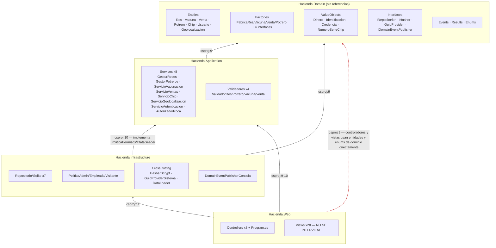
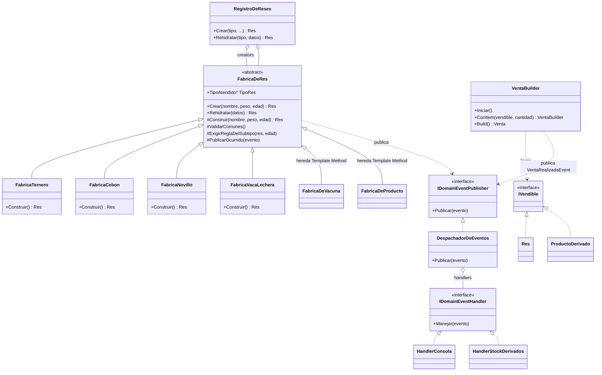

Los cuatro diagramas de arquitectura renderizados en vivo (haz clic en el botón de expandir para pan/zoom). Los archivos `.drawio` editables están al final como descarga.

## 1 · Arquitectura AS-IS (SolucionSOLID)



## 2 · Arquitectura TO-BE

```mermaid
flowchart TB
    subgraph Domain["Hacienda.Domain"]
        direction TB
        BASE[FabricaDeRes «Creator + Template Method»<br/>esqueleto sellado: validar → construir → regla del subtipo → publicar]
        CR1[FabricaTernero «ConcreteCreator»]
        CR2[FabricaCebon «ConcreteCreator»]
        CR3[FabricaNovillo «ConcreteCreator»]
        CR4[FabricaVacaLechera «ConcreteCreator · SC-1-A»]
        BASE <|-- CR1
        BASE <|-- CR2
        BASE <|-- CR3
        BASE <|-- CR4
        REG[RegistroDeReses<br/>punto único de decisión<br/>crear + rehidratar (Id estable)]
        REG o-- BASE : creators inyectados (DI)
        VACBASE[FabricaDeVacuna «TM» +<br/>FabricaBacteriana/Viva «FM»]
        DV[DatosVacuna<br/>(objeto-solicitud)]
        REGV[RegistroDeVacunas<br/>(por categoria)]
        REGV o-- VACBASE
        PRODBASE[FabricaDeProducto «TM» +<br/>creadores «FM» x3 «SC-1»]
        BLD[VentaBuilder «Builder»<br/>iniciar → ítems → Build()<br/>valida invariantes + total]
        IV[IVendible + ProductoDerivado<br/>Lacteo · Carne · Piel «SC-1»]
        PRODBASE <|-- FabricaLacteo
        PRODBASE <|-- FabricaCarne
        PRODBASE <|-- FabricaPiel
        BLD ..> IV : ensambla
        IV <|.. Res
        PRODBASE ..> IV : crea ítems
    end
    subgraph Infra["Hacienda.Infrastructure"]
        OBS[IDomainEventHandler<T> «Observer»]
        HC[HandlerConsola «Observer #1»<br/>salida IDÉNTICA byte a byte]
        HS[HandlerStockDerivados «Observer #2 · SC-1»]
        DESP[DespachadorDeEventos «Observer»<br/>implementa IDomainEventPublisher<br/>(interfaz AS-IS intacta)]
        OBS <|.. HC
        OBS <|.. HS
        DESP o-- OBS : handlers inyectados
    end
    subgraph App["Hacienda.Application"]
        SRV[Servicios<br/>orquestan, no deciden<br/>(se conservan, adelgazan)]
    end
    subgraph Web["Hacienda.Web"]
        PGM[Program.cs (conservado) ensambla:<br/>creators + registros + builder + handlers]
    end
    SRV -->|pide crear| REG
    SRV -->|arma venta| BLD
    BASE -.-> VACBASE : hereda esqueleto TM
    BLD -->|ítems| IV
    PRODBASE -->|ítems| IV
    DESP -->|despacha| OBS
    SRV -->|pide crear| REGV
    PGM -.->|registra| REG
    PGM -.->|registra| REGV
    PGM -.->|registra| DESP
    style SRV fill:#f5f5f5,stroke:#333
```

## 3 · Factory Method + Template Method + Observer



## 4 · Casos de comportamiento (C-01 a C-12)

```mermaid
flowchart TD
    subgraph Reto1["Casos Reto 1 (8) — congelados"]
        C01[C-01: Login 3 roles]
        C02[C-02: Crear potrero vacío]
        C03[C-03: Res edad inválida]
        C04[C-04: Alimentar → eventos peso]
        C05[C-05: Vacunar → exceder límite]
        C06[C-06: Lote vacunas mixto]
        C07[C-07: Chip + ubicación + Haversine]
        C08[C-08: Vender res]
    end
    subgraph Nuevos["Casos Nuevos (4) — tocan patrones"]
        C09[C-09: Vacuna vía DatosVacuna (sin if/else)]
        C10[C-10: Venta con derivado SC-1]
        C11[C-11: Rehidratación Id estable]
        C12[C-12: Agregar VacaLechera (demo OCP)]
    end
    CAP[Captura ANTES → Refactor → Captura DESPUÉS → diff lado a lado]
    Reto1 --> CAP
    Nuevos --> CAP
    CAP --> VIDEO[Video 20 min: min 11-14 SOLID en vivo]
```

## Archivos editables (.drawio)

| Archivo | Contenido |
| --- | --- |
| [Reto2_Evolucion_UML.drawio](./diagramas/Reto2_Evolucion_UML.drawio) | 2 páginas: AS-IS marcado + TO-BE por patrón (mismo layout para ver la evolución) |
| [Reto2_ASIS_TOBE_Capas.drawio](./diagramas/Reto2_ASIS_TOBE_Capas.drawio) | Capas superpuestas AS-IS/TO-BE (el formato que el enunciado valora «muy bien») |

Abrilos en [app.diagrams.net](https://app.diagrams.net). Las versiones embebidas equivalentes viven en [[Reto2-Hacienda/Opcion1/05-TOBE|05-TOBE §3.1]].
