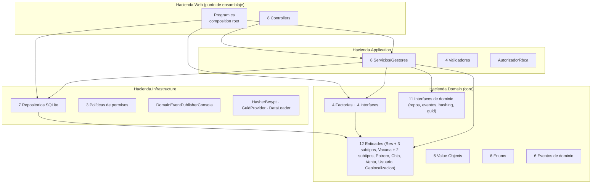

# 01 — AS-IS · Arquitectura actual (SolucionSOLID)

> [!abstract] Propósito
> Fotografía completa y verificada de la arquitectura heredada del Reto 1: capas, clases, dependencias, flujos de negocio, punto de ensamblaje y sitios de creación/decisión. Es la línea base contra la que se miden los puntos de dolor ([[Universidad/ArquitecturaDeSoftware/Reto2-Hacienda/Opcion2/02-PuntosDolor]]) y el TO-BE ([[Universidad/ArquitecturaDeSoftware/Reto2-Hacienda/Opcion2/05-TOBE]]).
>
> **Alcance**: backend (colaboración de objetos). El frontend (Views/Razor) queda fuera por decisión D-05 — se conserva igual en la entrega. Toda la evidencia cita `archivo:línea` relativo a `03-src/SolucionSOLID/`.

---

## 1. Vista general

Sistema de gestión de hacienda ganadera en **.NET 8 / C#**, MVC con Razor, persistencia SQLite vía Dapper (SQL a mano, sin ORM). **98 archivos fuente** en 4 proyectos.



**Dirección de dependencias**: Web → Application → Domain ← Infrastructure. Los repositorios implementan interfaces declaradas en Domain (`IRepositorio*`), y los servicios reciben esas abstracciones por constructor (DIP aplicado en el nivel de interfaces). El registro completo vive en `Program.cs`.

**Observación estructural**: el estilo se mantiene (así lo exige el encargo). El problema no es la dirección de las dependencias sino **dónde vive el conocimiento** — ver [[#6. Deuda técnica heredada (Reto 1)]].

---

## 2. Inventario por capa

### 2.1 Hacienda.Domain (el Core)

| Carpeta | Miembros | Observación clave |
|---------|----------|-------------------|
| `Entities/` | `Res` (abstracta) → `Ternero`, `Cebon`, `Novillo`; `Vacuna` (abstracta) → `Viva`, `Bacteriana`; `Potrero`, `Chip`, `Venta`, `Usuario`, `Geolocalizacion`, `IChip` | Subtipos de Res portan comportamiento real (rangos de edad, `EsEdadValida`, `Serializar`). `Potrero` y `Chip` encapsulan bien (invariantes dentro); `Res`, `Venta`, `Usuario`, `Geolocalizacion` son anémicas o semi-anémicas (setters públicos) |
| `Factories/` | `FabricaRes`/`IResFactory`, `FabricaVacuna`/`IVacunaFactory`, `FabricaVenta`/`IVentaFactory`, `FabricaPotrero`/`IPotreroFactory` | **Ninguna es Factory Method GoF** — auditoría completa en [[Universidad/ArquitecturaDeSoftware/Reto2-Hacienda/Opcion2/02-PuntosDolor]] §3 |
| `Interfaces/` | 7 `IRepositorio*`, `IDomainEvent(Publisher)`, `IHasher`, `IGuidProvider` | Los repos devuelven agregados sueltos (`List<Res>`) con parches de rehidratación (`CargarResesEnPotreros`) |
| `ValueObjects/` | `Dinero`, `Identificacion`, `Credencial`, `NumeroSerieChip` | Correctos y pequeños; `Credencial.Verificar` bien diseñado |
| `Enums/` | `TipoRes`, `TipoPotrero`, `VacunaCategoria`, `EstadoVacuna`, `EstadoChip`, `RolUsuario` | `TipoPotrero` duplica valor a valor a `TipoRes` — dos fuentes de verdad de un mismo concepto |
| `Events/` | 6 records (`VacunacionCompletada`, `PesoMinimo`, `PesoVenta`, `PotreroMitad`, `PotreroLleno`, `VacunaVencida`) | `VacunaVencida` definido y **nunca publicado** |
| `Results/` | `ValidationResult`, `ResultadoAutenticacion`, `ResultadoAutorizacion` | Patrón Result existe, pero los servicios de negocio no lo usan (devuelven `string`) |

### 2.2 Hacienda.Application

| Clase | Responsabilidad hoy | Señal |
|-------|---------------------|-------|
| `GestorReses` (144 LOC) | Alta/alimentación/lista/estadísticas de reses + eventos de peso | **Reglas de negocio dentro**: umbrales de desnutrición/aptitud (l.56-65), unicidad de nombre (l.42), mutación directa `res.Peso += cantidad` (l.93), mapeo de enums (l.137-143), strings de UI (l.79) |
| `ServicioVacunacion` (185 LOC) | 4 métodos de creación paralelos (unitario/lote × Bacteriana/Viva), aplicar, estadísticas | **Reimplementa el dominio**: límites por categoría (l.137-143) que `Res.EsquemaVacunacionCompleto` ya conoce; cuerpos de lote clonados (l.61-88 vs 90-117) |
| `ServicioVentas` (72 LOC) | Vender res: buscar, fabricar, validar, remover del potrero, guardar | La transacción "vender = salir del potrero + registrar venta" vive en el servicio (l.40-51) |
| `ServicioChip` (95 LOC) | Instalar chip mutando 3 repositorios distintos | Reglas "una res un chip" y "número único" como strings/if (l.43-48); persistencia cruzada sin transacción (l.54-56); `IRepositorioRes` inyectado y sin uso |
| `ServicioGeolocalizacion` (100 LOC) | Registrar ubicación + **fórmula de Haversine** + validación de rangos | Rangos lat/long y distancia: conocimiento de dominio en el servicio (l.38-42, 88-99) |
| `ServicioAutenticacion` (64 LOC) | Autenticar/crear usuario | Rol inicial `Visitante` hardcodeado (l.57) |
| `GestorPotreros` (64 LOC) | Orquesta potrero: repo + factory + validador | `IDomainEventPublisher` inyectado y sin uso |
| `AutorizadorRbca` (28 LOC) | Diccionario Rol→Política | **Código muerto: 0 llamadas en toda la solución** |
| `Validador*` (4 clases, ~18 LOC c/u) | Checks triviales tras la creación | Redundantes con VO's/fábricas; `ValidadorVacuna` registrado y nunca inyectado; sin mecanismo de composición de reglas |
| `DTOs/Dto.cs` | 4 records | **Código muerto (0 usos)** — las vistas consumen entidades directamente |

### 2.3 Hacienda.Infrastructure

| Miembro | Señal |
|---------|-------|
| `RepositorioPotreroSqlite.MapearRes` (l.150-156) | Switch propio para reconstruir subtipos de Res — **duplica el conocimiento de tipos de la factoría** |
| `RepositorioVentaSqlite` (l.39-45) | Segundo switch de reconstrucción + **GUID nuevo en cada lectura** (l.41-43): identidad destruida |
| `RepositorioVacunaSqlite` (l.103-159) | Tercer sitio: if por categoría en `MapearVacuna` + `is Bacteriana/is Viva` en `InsertVacuna` |
| `PoliticaAdmin/Empleado/Visitante` | Comparan operaciones por `Contains("Eliminar")`/`Contains("Consultar")` — strings mágicos sin catálogo; hoy inertes porque nadie llama al autorizador |
| `DataLoader` (115 LOC) | Seed: 254 `INSERT` crudos — bypasea factorías, validaciones y entidades |
| `DatabaseInitializer` | Esquema a mano + `ALTER` retrocompatibles; tabla `ventas` con columnas `res_*` grabadas a fuego |

### 2.4 Hacienda.Web

| Miembro | Señal |
|---------|-------|
| `Program.cs` (134 LOC) | Composition root completo — ver [[#5. El punto de ensamblaje]] |
| `VacunaController` (l.49-68, 101-120) | `if (tipoVacuna == "Bacteriana") ... else ...` duplicado en 2 acciones — decisión de tipos en string en la capa web |
| `ChipController` (l.45, 70) | Detecta éxito con `mensaje.Contains("correctamente")` — contrato por heurística de texto |
| `UsuarioController` (l.11, 15-19) | Inyecta `IAutorizador` y nunca lo usa |

---

## 3. Flujos de negocio (trazados con evidencia)

### 3.1 Vender una res (el flujo que la SC-1 quiere romper)

```mermaid
sequenceDiagram
    participant V as Views/Res/Index.cshtml<br/>(modal ventaModal)
    participant C as ResController.Vender<br/>(ResController.cs:79)
    participant S as ServicioVentas.VenderRes<br/>(ServicioVentas.cs:32)
    participant F as FabricaVenta.Crear<br/>(FabricaVenta.cs:17)
    participant Val as ValidadorVenta
    participant P as Potrero
    participant R as RepositorioVentaSqlite
    V->>C: POST Res/Vender (potreroId, nombreRes, monto)
    C->>S: VenderRes(...)
    S->>S: busca potrero y res (l.35-38)
    S->>F: Crear(res, potrero, monto, reloj)
    F-->>S: new Venta(...) — wrapper de constructor
    S->>Val: Validar(venta)
    Val-->>S: "Res nula / monto > 0"
    S->>P: RemoverRes(res) (l.46)
    S->>R: GuardarTodas(ventas)
    Note over R: DELETE masivo + re-INSERT;<br/>al leer: switch de subtipo + GUID nuevo (l.39-45)
    S-->>C: string en español
    C-->>V: TempData + Contains("correctamente")
```

**Lectura arquitectónica**: la venta es un caso de uso ("vender ganado") modelado como entidad (`Venta` tiene `Res Res` grabada a fuego, `Venta.cs:10`). No existe la abstracción "cosa vendible"; la tabla `ventas` persiste columnas `res_*` (`DatabaseInitializer.cs:69-79`). Vender un derivado (SC-1) obliga a tocar **14 archivos / ~14 clases** — conteo completo en [[Universidad/ArquitecturaDeSoftware/Reto2-Hacienda/Opcion2/02-PuntosDolor]] §5.

### 3.2 Alta de res (el flujo de los switches paralelos)

`ResController.Create` (`ResController.cs:45`) → `GestorReses.AgregarRes` (`GestorReses.cs:36`) → unicidad de nombre (l.42) → `MapearTipoRes` Traduce `TipoPotrero→TipoRes` (l.137-143) → `FabricaRes.Crear` decide el subtipo por diccionario (l.17-22) y valida edad por switch (l.42-48) → `Potrero.AgregarRes` → `RepositorioPotreroSqlite.GuardarTodos`.

**Lectura arquitectónica**: para dar de alta un tipo nuevo de res hay que editar **10 archivos / 7 clases** con 7 puntos de decisión distintos que crecen en paralelo (factoría ×2, servicio ×2, repos ×2, vistas ×2, enums ×2) — evidencia en [[Universidad/ArquitecturaDeSoftware/Reto2-Hacienda/Opcion2/02-PuntosDolor]] P-02.

### 3.3 Aplicar vacuna (el flujo con la regla duplicada)

`VacunaController` → `ServicioVacunacion.AplicarVacuna` (`ServicioVacunacion.cs:123`): comprueba límites por categoría (l.137-143) **duplicando** lo que `Res.EsquemaVacunacionCompleto` (`Res.cs:35-40`) ya sabe, muta `res.VacunasAplicadas` (lista pública, l.145), consume inventario (`vacunas.Remove`, l.146) y publica `VacunacionCompletada` a una consola invisible, compensando con strings manuales (l.55-75 en GestorReses).

### 3.4 Instalar chip (SC-2, el cambio del Reto 1 — ya integrado)

`ChipController.Instalar` → `ServicioChip.InstalarChip` (`ServicioChip.cs:33`): reglas "una res un chip" y "número único" como strings/if (l.43-48), luego persiste cruzando 3 repositorios sin transacción (l.54-56). La extensión completa del Reto 1 tocó **≈17-18 archivos en los 4 proyectos** — esa es la métrica empírica de lo que costó el último cambio tipo-SC en esta arquitectura.

---

## 4. Sitios de creación de objetos

| Mecanismo | Dónde | Cubre |
|-----------|-------|-------|
| Factorías (`I*Factory`) | `Program.cs:39-42` → llamadas únicas desde `GestorReses.AgregarRes`, `GestorPotreros.CrearPotrero`, `ServicioVacunacion` (×4), `ServicioVentas.VenderRes` | **Solo el alta por UI** |
| `new` directo en repositorios | 11 sitios: `MapearRes`, `RepositorioVentaSqlite.ObtenerTodas`, `MapearVacuna`, `MapearChip`, usuarios, geolocalizaciones… | **Rehidratación desde SQLite — camino paralelo con switches propios** |
| `new` directo en servicios | `ServicioAutenticacion.CrearUsuario` (rol hardcodeado), `ServicioGeolocalizacion.RegistrarUbicacion` (valida rangos ahí) | Creación + reglas fuera del dominio |
| `new` directo en seed | `DataLoader` (254 INSERTs crudos + usuarios a mano) | Fuera de toda abstracción |

> [!warning] Conclusión de creación
> La decisión de "qué implementación concreta instanciar" NO está centralizada: la factoría decide en el alta, cada repositorio decide de nuevo al leer, y los servicios deciden en los casos restantes. **Hay dos sistemas de creación paralelos que pueden discrepar entre sí.**

---

## 5. El punto de ensamblaje (`Program.cs`, 134 LOC)

| Bloque | Líneas | Contenido |
|--------|--------|-----------|
| UI/Auth | 16-28 | MVC + cookie auth (30 min) |
| Cross-cutting | 31-36 | `IDomainEventPublisher`→Consola, `TimeProvider.System`, `IGuidProvider`, `IHasher` |
| Factorías | 39-42 | Las 4 `I*Factory` → `Fabrica*` (Transient) |
| Servicios | 45-52 | 8 servicios/gestores (Scoped) |
| Validadores | 55-58 | 4 `IValidar*` → `Validador*` (uno registrado y nunca inyectado) |
| Persistencia | 61-80 | ConnectionString inline + `Directory.CreateDirectory` + `DatabaseInitializer.Initialize` (efecto lateral en el arranque) + 7 repos con factory lambda |
| Políticas | 83-85 | Registro múltiple `IPoliticaPermisos` → 3 políticas (el único mecanismo de extensión real del código — alimenta un subsistema muerto) |
| Seed | 88-103 | `IDataSeeder` → `DataLoader` con 5 dependencias resueltas a mano + **ejecución del seed al construir el host** |

**Lectura**: el root no solo configura — **ejecuta** (crear directorio, inicializar BD, sembrar datos). El ensamblaje funciona, pero leer cómo colaboran los objetos exige leer los 134 líneas + las 8 firmas de servicios: exactamente el "hay que leerlo todo" del correo de la Líder Técnica.

---

## 6. Deuda técnica heredada (Reto 1)

Mapeo directo entre las observaciones del profesor y la evidencia encontrada:

| Observación del profesor | Evidencia en el código |
|---------------------------|------------------------|
| "Factory mal implementados" | 0 de 4 factorías son Factory Method; 2 son wrappers; los repos vuelven a decidir subtipos por su cuenta ([[Universidad/ArquitecturaDeSoftware/Reto2-Hacienda/Opcion2/02-PuntosDolor]] §3) |
| "Responsabilidades movidas fuera del dominio" | Umbrales de peso en `GestorReses` (l.56-65), límites de vacunación en `ServicioVacunacion` (l.137-143), Haversine y rangos en `ServicioGeolocalizacion` (l.38-99), reglas de chip en `ServicioChip` (l.43-48) |
| "Entidades que no encapsulan correctamente" | `Res.Peso/Edad/Chip` con setters públicos (Res.cs:13-16), `VacunasAplicadas` lista pública, `Venta` con 0 métodos — mientras `Potrero` y `Chip` (las del Reto 1) sí encapsulan: **el estándar correcto ya existe dentro del propio código** |
| "Lógica de negocio donde no corresponde" | Contrato string de servicios + éxito por `Contains` (ChipController.cs:45,70; VacunaController.cs:153); decisión de tipos de vacuna en la web por string (VacunaController.cs:49,101) |
| "Demasiadas capas" | No se agregan capas nuevas; el trabajo es devolver conocimiento al Core existente (D-05) |

**Métrica del costo del último cambio real**: la SC-2 (chips) del Reto 1 tocó ≈17-18 archivos en los 4 proyectos. Ese número es el argumento de negocio completo del Reto 2.

---

## 7. Números del sistema

| Métrica | Valor |
|---------|-------|
| Archivos fuente | 98 (.cs, sin generados) |
| Proyectos | 4 (Domain, Application, Infrastructure, Web) |
| Entidades | 12 (2 jerarquías: Res→3 subtipos, Vacuna→2 subtipos) |
| Factorías | 4 (+4 interfaces) — 0 Factory Method reales |
| Sitios de creación fuera de factorías | 11 |
| Switches/if sobre enums o strings de tipo | 20+ (7 en el camino de "nuevo subtipo de Res") |
| Registros muertos en DI | 5 (`IAutorizador`+3 políticas, `IValidarVacuna`, `IRepositorioRes` y `IDomainEventPublisher` inyectados sin uso) |
| Código muerto | `Dto.cs` (4 DTOs), `Venta/Create.cshtml` (stub), `VacunaVencidaEvent` (nunca publicado) |
| Costo del último cambio tipo-SC (Reto 1) | ≈17-18 archivos |
| Costo proyectado SC-1 (derivados) | **14 archivos / ~14 clases** |
| Costo proyectado SC-3 (historia clínica) | **7-8 archivos / 5-7 clases** |

> [!tip] Navegación
> Plan: [[Universidad/ArquitecturaDeSoftware/Reto2-Hacienda/Opcion1/00-Plan]] · Inventario de dolor con estos números por punto: [[Universidad/ArquitecturaDeSoftware/Reto2-Hacienda/Opcion2/02-PuntosDolor]] · Evaluación de patrones: [[Universidad/ArquitecturaDeSoftware/Reto2-Hacienda/Opcion2/03-PatronesEvaluados]]
