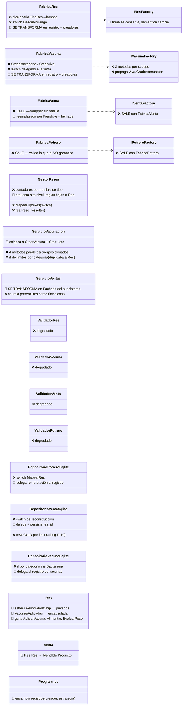

# 05 — TO-BE · Diseño del sistema con SOLID + Patrones

> [!abstract] Propósito
> Centro del entregable (Actividad 3): qué se va, qué llega, cómo se conecta y qué efecto tiene. Contiene los dos diagramas (Entregable 3.1), la tabla de cambio estructural E-XX (3.2) y la ficha de cada patrón adoptado (3.3). El estilo arquitectónico **no cambia** — el trabajo vive en la colaboración de objetos, principalmente el Core.

**Leyenda de marcado** (aplica a los dos diagramas):

| Marca | Significado |
|-------|-------------|
| ❌ | **Sale** — se retira del diseño |
| 🔄 | **Se transforma** — cambia de responsabilidad o de forma |
| ⬅️ | **Entra** — participante nuevo |
| ⚫ | **Se conserva sin cambios** (en negro en el diagramador de capas del PDF) |

---

## 1. Entregable 3.1a — Diagrama de lo que sale (recorte del AS-IS marcado)

Clúster de creación y venta del AS-IS. Todo lo marcado ❌/🔄 es lo que el TO-BE retira o cambia de responsabilidad; lo ⚫ permanece.



> [!note] Qué NO está en este recorte
| Las entidades `Potrero`, `Chip`, VOs, eventos, repositorios de usuarios/geolocalización, autenticación y el resto de controladores ⚫ **se conservan tal cual** (ver [[Universidad/ArquitecturaDeSoftware/Reto2-Hacienda/Opcion2/01-AS-IS]]). El frontend completo se conserva por D-05, salvo las vistas nuevas que la SC-1 autoriza.

---

## 2. Entregable 3.1b — Diagrama de lo que entra (TO-BE)

```mermaid
classDiagram
    direction TB
    class IVendible {
        ⬅️ «contrato de producto»
        +Descripcion() string
        +TipoProducto() string
        +Serializar() string
        +ValidarParaVenta(ctx) ValidationResult
        +AlConfirmarVenta(ctx)
    }
    class Res {
        ⚫ jerarquía existente
        🔄 ahora implementa IVendible
        🔄 AplicarVacuna / Alimentar / EvaluarPeso
        🔄 setters privados
    }
    class Ternero { ⚫ }
    class Novillo { ⚫ }
    class Cebon { ⚫ }
    class ProductoDerivado {
        ⬅️ «SC-1»
        TipoDerivado, Nombre
        PrecioUnitario Dinero
    }
    class ICreadorRes {
        ⬅️ «Factory Method»
        +Crear(datos) Res
        +Rehidratar(estadoPersistido) Res
        +TipoAtendido TipoRes
        +DescripcionTipo() string
    }
    class CreadorTernero { ⬅️ «Factory Method» }
    class CreadorNovillo { ⬅️ «Factory Method» }
    class CreadorCebon { ⬅️ «Factory Method» }
    class ICreadorVacuna {
        ⬅️ «Factory Method»
        +Crear(datos) Vacuna
        +Rehidratar(estado) Vacuna
    }
    class CreadorViva { ⬅️ «Factory Method» }
    class CreadorBacteriana { ⬅️ «Factory Method» }
    class IRegistroProductos {
        ⬅️ «Factory Method + Strategy»
        +Para(tipo) Par(Proveedor, Estrategia)
    }
    class ProveedorResDePotrero {
        ⬅️ resuelve la res vendible
        (potreroId, nombreRes)
    }
    class ProveedorDerivado {
        ⬅️ «SC-1» construye ProductoDerivado
    }
    class IEstrategiaPrecio {
        ⬅️ «Strategy»
        +Calcular(producto, datos) Dinero
    }
    class MontoManual {
        ⬅️ «Strategy»
        reses: monto provisto por el usuario
        (comportamiento congelado)
    }
    class PrecioUnitario {
        ⬅️ «Strategy» «SC-1»
        precio unitario × cantidad
    }
    class IServicioVentas {
        🔄 «Facade» contrato unificado
        +Vender(especVenta) string
    }
    class ServicioVentas {
        🔄 «Facade»
        ORQUESTA: proveer → validar →
        calcular → confirmar → persistir
        PROHIBIDO: reglas de negocio (límite)
    }
    class Venta {
        🔄 Producto IVendible
        +Monto via estrategia
    }
    class IContextoVenta {
        ⬅️ «double dispatch»
        acceso de dominio a potreros
    }
    class ServicioVacunacion {
        🔄 CrearVacuna(categoria, datos)
        🔄 CrearLote(categoria, cantidad, datos)
        reglas → Res.AplicarVacuna
    }
    class Program_cs {
        ⚫ 🔄 ensambla: registros de creadores
        + pares (proveedor, estrategia)
    }

    IVendible <|.. Res
    Res <|-- Ternero
    Res <|-- Novillo
    Res <|-- Cebon
    IVendible <|.. ProductoDerivado
    ICreadorRes <|.. CreadorTernero
    ICreadorRes <|.. CreadorNovillo
    ICreadorRes <|.. CreadorCebon
    CreadorTernero ..> Ternero : crea y describe
    ICreadorVacuna <|.. CreadorViva
    ICreadorVacuna <|.. CreadorBacteriana
    IRegistroProductos --> ICreadorRes : resuelve por tipo
    IRegistroProductos --> ProveedorDerivado
    IRegistroProductos --> IEstrategiaPrecio : par registrado
    IEstrategiaPrecio <|.. MontoManual
    IEstrategiaPrecio <|.. PrecioUnitario
    ProveedorResDePotrero ..> Res : localiza
    ProveedorDerivado ..> ProductoDerivado : construye
    IServicioVentas <|.. ServicioVentas
    ServicioVentas --> IRegistroProductos : consulta
    ServicioVentas --> Venta : registra
    Venta --> IVendible
    Venta --> IEstrategiaPrecio : delega monto
    Res --> IContextoVenta : AlConfirmarVenta
    ServicioVacunacion --> ICreadorVacuna : sin if por categoría
```

**Lectura del ensamblaje** (la respuesta a "hay que leerlo todo"): `Program.cs` registra, por familia, los creadores; y por tipo de producto vendible, el **par (proveedor, estrategia)**. La fachada pregunta al registro; no conoce ningún tipo concreto. **Añadir un producto nuevo = registrar su par.** Ese es todo el punto de extensión.

---

## 3. Entregable 3.2 — Tabla de cambio estructural

| ID | Elemento | Estado | Qué hacía antes | Qué hace ahora | Quién dependía de él y cómo se reconecta |
|----|----------|--------|-----------------|----------------|------------------------------------------|
| E-01 | `FabricaRes` | Se transforma | Diccionario TipoRes→lambda + switch de rangos; validaba edad | Desaparece como clase única: su conocimiento se reparte en `CreadorTernero/Novillo/Cebon` (crear, rehidratar, describir, validar edad del subtipo) + registro | `GestorReses.AgregarRes` → pide al registro; `RepositorioPotreroSqlite`/`RepositorioVentaSqlite` → `Rehidratar` con estado persistido |
| E-02 | `IResFactory` | Se transforma | `Crear(TipoRes, nombre, peso, edad)` | `IRegistroReses.Para(tipo) → ICreadorRes`; mismo uso desde `GestorReses` | Firma nueva en el mismo punto de inyección (`Program.cs`) |
| E-03 | `FabricaVacuna` + `IVacunaFactory` | Se transforma | 2 métodos por subtipo; propagaba `GradoAtenuacion` | `ICreadorVacuna` + `CreadorViva/Bacteriana` + registro; los datos propios del subtipo quedan dentro del subtipo | `ServicioVacunacion` colapsa 4 métodos → 2; `VacunaController` mapea el string del radio a la categoría **una sola vez** (las vistas no cambian) |
| E-04 | `FabricaVenta` + `IVentaFactory` | Sale | Wrapper de `new Venta` | La venta se construye en la fachada con el `IVendible` ya provisto | `ServicioVentas` (único consumidor) reconstruido como fachada |
| E-05 | `FabricaPotrero` + `IPotreroFactory` | Sale | Validaba no-vacío (garantizado por `Identificacion`) y `new Potrero` | Construcción directa; el VO sigue siendo el guardián | `GestorPotreros.CrearPotrero` construye directamente |
| E-06 | `ValidadorRes/Vacuna/Venta/Potrero` | Sale (degrada) | 2 checks triviales tras la creación, con doble semántica de error | Validación real: VOs + creadores + `IVendible.ValidarParaVenta`; un solo mecanismo | `GestorReses`/`ServicioVacunacion`/fachada leen `ValidationResult` del dominio |
| E-07 | `GestorReses` | Se transforma | Mapeaba enums, contaba por tipo, mutaba peso, decidía umbrales | Orquesta: registro → creador → `Res` (reglas dentro) → eventos; `MapearTipoRes` y contadores desaparecen | `ResController` no cambia de contrato; `Res` gana `Alimentar/EvaluarPeso/AplicarVacuna` |
| E-08 | `ServicioVacunacion` | Se transforma | 4 métodos de creación clonados + reglas de límites duplicadas | 2 métodos (`CrearVacuna`, `CrearLote` parametrizado vía registro); `AplicarVacuna` delega la regla en `Res.AplicarVacuna` | `VacunaController` y vistas conservan sus inputs; los if/else por string se reducen al mapeo único de la categoría |
| E-09 | `ServicioVentas` | Se transforma | Asumía potrero+res; buscaba, fabricaba, validaba, removía | **Fachada**: orquesta proveer → validar (dominio) → calcular (estrategia) → confirmar (`AlConfirmarVenta`) → persistir | `ResController.Vender` redirige a `Vender(espec)`; `VentaController` gana la entrada de ventas de derivados |
| E-10 | `Venta` | Se transforma | `Res Res` grabado a fuego; 0 métodos | `IVendible Producto` + monto calculado por estrategia | `RepositorioVentaSqlite` persiste `res_id`/columnas de producto (ver E-14); vistas leen `Descripcion()/TipoProducto()/Serializar()` |
| E-11 | `Res` | Se transforma | Setters públicos; colección de vacunas pública; pasiva | Implementa `IVendible`; encapsula peso/edad/chip/vacunas; reglas `AplicarVacuna/Alimentar/EvaluarPeso/AlConfirmarVenta` | Servicios dejan de mutar; los 8 casos del Reto 1 producen las mismas salidas (verificación en [[Universidad/ArquitecturaDeSoftware/Reto2-Hacienda/Opcion2/06-VerificacionSOLID]]) |
| E-12 | `RepositorioPotreroSqlite` / `RepositorioVentaSqlite` / `RepositorioVacunaSqlite` | Se transforma | Switches propios de subtipos; GUID nuevo en lectura | Delegan rehidratación al registro correspondiente (GUID persistido → P-10 corregido) | Firma interna: `IRegistro*.Para(tipo).Rehidratar(fila)` — sin cambios de esquema salvo E-14 |
| E-13 | `Program.cs` | Se transforma | Registraba 4 factorías y 4 validadores | Ensambla registros de creadores + **pares (proveedor, estrategia)** por producto; punto de lectura del ensamblaje | Único lugar que crece al extender (1 línea por tipo nuevo) — autorizado por el encargo |
| E-14 | Tabla `ventas` (esquema) | Se transforma | Columnas `res_*` obligatorias | + `res_id` (nullable, corrige P-10), + `producto_tipo/producto_descripcion/cantidad/precio_unitario` (nullable para reses) | `DatabaseInitializer` (ALTER retrocompatible, patrón existente en l.34-43); ventas de reses escriben igual que hoy |
| E-15 | `IVendible`, `ProductoDerivado`, `ICreadorRes(+3)`, `ICreadorVacuna(+2)`, `IRegistroProductos`, `ProveedorResDePotrero`, `ProveedorDerivado`, `IEstrategiaPrecio(+2)`, `IContextoVenta` | **Entra** | — | El andamiaje del TO-BE (ver diagrama §2) | Nadie dependía: se conectan vía `Program.cs` y la fachada |
| E-16 | `Dto.cs` (muerto) | ⚫ Se conserva | Nada | Nada (deuda P-15 declarada) | — |

**Resumen de impacto**: ⬅️ ~16 clases nuevas (todas pequeñas, alta cohesión) · 🔄 12 transformaciones · ❌ 8 salidas (2 factorías, 4 validadores, switches/mapeos) · Capas: Domain (núcleo del cambio), Application (fachada + colapso de servicios), Infrastructure (repos delegan + 1 ALTER), Web (solo `Program.cs` + re-ruteo de la entrada de venta). **El Core es el protagonista — exactamente lo que el profesor pidió.**

---

## 4. Entregable 3.3 — Fichas de los patrones adoptados

### Ficha 1 · Factory Method — creación única para alta y rehidratación

| Campo | Contenido |
|-------|-----------|
| **Patrón y punto de dolor** | Factory Method (creacional). Anclas: P-02, P-05, P-06, P-09, P-10. Evidencia: `FabricaRes.cs:17-22` (diccionario), `:42-48` (switch espejo), `GestorReses.cs:137-143`, `RepositorioVentaSqlite.cs:39-45` (switch + GUID nuevo l.41-43), `IVacunaFactory` (métodos por subtipo), `VacunaController.cs:49,101` (if por string) |
| **Alternativas evaluadas** | (1) Abstract Factory — descartada: el eje es el tipo, no la familia (advertencia literal del Anexo A). (2) Prototype — descartado: clonar exige exponer llenado y rompe la encapsulación que P-08 recupera. (3) **No hacer nada** — cada tipo nuevo seguiría costando 10-12 archivos con dos caminos de creación que discrepan (bug P-10 activo) |
| **Qué sale y qué entra** | Sale: diccionario+switch de `FabricaRes`, 2 métodos por subtipo de `IVacunaFactory`, `MapearTipoRes`, switches de los 3 repos, contadores por nombre. Entra: `ICreadorRes` + 3 creadores, `ICreadorVacuna` + 2 creadores, `IRegistroProductos` (resuelve tipo → creador/proveedor) — cada creador **crea, rehidrata, describe y valida su subtipo** |
| **Cómo se relaciona** | Los construye `Program.cs` (registra); los usan `GestorReses` (alta), `ServicioVacunacion` (vacunas) y los 3 repositorios (rehidratación con GUID persistido). **Interactúa con Strategy** (el registro resuelve el par proveedor+estrategia) y con **Facade** (la fachada consulta el registro, no conoce tipos). El `DescripcionTipo()` del creador alimenta los badges que hoy salen de switches de vista |
| **Impacto** | Creadas ≈9 (creadores + registro) · Modificadas: `GestorReses`, `ServicioVacunacion`, 3 repos, `Program.cs` · Eliminadas: 4 switches/mapeos y 4 métodos paralelos. **Efecto sobre el Anexo B**: SC-1 pasa de 14 archivos a registrar un par; SC-2-variantes (nuevo estado de chip) no se beneficia (declarado); SC-3 ganaría el mismo mecanismo para eventos clínicos |
| **Qué cuesta** | ≈9 clases pequeñas más; un nivel más de indirección entre solicitud y nacimiento del objeto; depurar exige leer el registro en `Program.cs`; riesgo residual: que alguien reintroduzca un switch de tipo — prohibido por regla en [[Universidad/ArquitecturaDeSoftware/Reto2-Hacienda/Opcion2/09-VistaTecnica]] |
| **Origen** | Propuesta de la IA, aprobada por el equipo (bitácora [[Universidad/ArquitecturaDeSoftware/Reto2-Hacienda/Opcion2/10-BitacoraIA]] B-08) tras evaluar y descartar Abstract Factory y Prototype con evidencia |

### Ficha 2 · Facade — el subsistema de venta en un punto legible

| Campo | Contenido |
|-------|-----------|
| **Patrón y punto de dolor** | Facade (estructural). Anclas: P-01 y la queja de la Líder Técnica ("interfaces limpias y ningún lugar donde se pueda leer cómo colaboran"). Evidencia: pipeline de venta en 9 piezas (`ResController.cs:79` → `ServicioVentas.cs:32-54` → fábrica+validador+potrero+2 repos); `Venta.cs:10` (`Res Res` grabado) |
| **Alternativas evaluadas** | (1) Mediator — descartado: matriz de referencias cruzadas entre colegas paritarios; duplicaría la fachada con acoplamiento mayor. (2) Exponer colaboradores al controlador (status quo) — con SC-1 el controlador coordinaría 5+ dependencias nuevas. (3) **No hacer nada** — el costo contado de P-01 (14 archivos) permanece |
| **Qué sale y qué entra** | Sale: la asunción potrero+res como único caso de venta; `FabricaVenta`. Entra: `IServicioVentas` con contrato unificado `Vender(IEspecVenta)`; `ServicioVentas` reestructurado como **fachada** (rol del servicio existente, no clase nueva) |
| **Cómo se relaciona** | La construye `Program.cs`; la usan `ResController` (venta de reses, mismo flujo visible) y `VentaController` (venta de derivados, SC-1). **Interactúa con Factory Method** (consulta `IRegistroProductos`) y con **Strategy** (recibe el monto ya calculado por la estrategia del par registrado). **Límite declarado (Anexo A)**: orquesta — obtener, validar, calcular, confirmar, persistir — y NO legisla: métrica de control "si un método de la fachada contiene un `if` de negocio, la regla baja al dominio" |
| **Impacto** | Creadas: 0 (rol sobre servicio existente) · Modificadas: `IServicioVentas`/`ServicioVentas`, `ResController.Vender` (redirige), `VentaController` (nueva entrada SC-1), `Program.cs` · Eliminadas: `FabricaVenta`+`IVentaFactory`. **Efecto Anexo B**: SC-1 se implementa detrás de la fachada sin que la UI conozca creadores ni estrategias; SC-3 reutilizaría el mismo patrón de orquestación |
| **Qué cuesta** | Una indirección más UI→dominio; el riesgo tipificado por el Anexo A (absorber lógica → SRP roto) queda **activo y controlado** por la métrica y por la revisión de [[Universidad/ArquitecturaDeSoftware/Reto2-Hacienda/Opcion2/06-VerificacionSOLID]]; exige disciplina en revisión de código del equipo |
| **Origen** | Propuesta de la IA (B-09), aprobada con el límite declarado como condición de la aprobación |

### Ficha 3 · Strategy — comportamiento de precio por producto, en runtime

| Campo | Contenido |
|-------|-----------|
| **Patrón y punto de dolor** | Strategy (comportamiento). Anclas: P-01 (SC-1: el comportamiento de venta varía por tipo de producto) y P-04 (la selección por categoría hoy es un if que duplica al dominio). Alcance literal del encargo: "cómo se selecciona y coordina el comportamiento en tiempo de ejecución". Evidencia: el bifurcador que SC-1 induciría (`if (producto es res) … else …`) ya existe como defecto equivalente en `VacunaController.cs:49,101` y `ServicioVacunacion.cs:137-143` |
| **Alternativas evaluadas** | (1) Template Method — descartado: varía el comportamiento completo, no un paso del algoritmo. (2) Condicional por tipo — es exactamente el anti-patrón medido del AS-IS (12 archivos por tipo de vacuna). (3) **No hacer nada** — SC-1 imposible sin bifurcar servicios y validadores |
| **Qué sale y qué entra** | Sale: el futuro (y los existentes) bifurcadores por tipo en el camino de venta/precio. Entra: `IEstrategiaPrecio` + `MontoManual` (reses: devuelve el monto provisto — **el comportamiento observable de hoy no cambia ni un carácter**) + `PrecioUnitario` (derivados: precio × cantidad — comportamiento nuevo autorizado por SC-1) |
| **Cómo se relaciona** | La construye `Program.cs` **en par con el proveedor del producto** (el registro de Factory Method resuelve el par); la usa `Venta`/fachada para calcular el monto. **Interactúa con Factory Method** (par registrado) y con **Facade** (consumidora). Nueva política de precio (2×1, precio por bulto) = nueva estrategia + registro |
| **Impacto** | Creadas: 3 (interfaz + 2 estrategias) · Modificadas: `Venta`, `ServicioVentas`, `Program.cs` · Eliminadas: ninguna. **Efecto Anexo B**: SC-1 viable sin tocar servicios por tipo; SC-3 no la usa (declarado); una futura SC de promociones entraría solo aquí |
| **Qué cuesta** | +1 interfaz +2-3 clases; depurar un precio exige identificar la estrategia participante (mitigado: el registro es legible); riesgo ISP si la interfaz crece — controlado: una sola operación `Calcular` |
| **Origen** | Propuesta de la IA (B-10) con la condición explícita de que `MontoManual` preserve el comportamiento congelado de reses — verificable en los 12 casos de [[Universidad/ArquitecturaDeSoftware/Reto2-Hacienda/Opcion2/06-VerificacionSOLID]] |

---

## 5. Qué se conserva intacto (la prueba de que el estilo no cambió)

| Elemento | Estado |
|----------|--------|
| Estilo arquitectónico, 4 proyectos, dirección de dependencias | ⚫ Sin cambios |
| `Potrero`, `Chip` (las entidades bien encapsuladas del Reto 1), VOs, eventos, `Usuario`, `Geolocalizacion` | ⚫ Sin cambios |
| Repositorios de usuarios/geolocalización/chips, `HasherBcrypt`, `GuidProviderSistema`, `DataLoader` | ⚫ Sin cambios |
| Autenticación, vistas y controladores existentes (salvo la re-conexión de la entrada de venta) | ⚫ Sin cambios (D-05) |
| Flujo observable completo de reses, potreros, vacunas, chips, usuarios | ⚫ Sin cambios — se demuestra en [[Universidad/ArquitecturaDeSoftware/Reto2-Hacienda/Opcion2/06-VerificacionSOLID]] |

> [!tip] Navegación
| AS-IS: [[Universidad/ArquitecturaDeSoftware/Reto2-Hacienda/Opcion2/01-AS-IS]] · Dolor: [[Universidad/ArquitecturaDeSoftware/Reto2-Hacienda/Opcion2/02-PuntosDolor]] · Evaluación: [[Universidad/ArquitecturaDeSoftware/Reto2-Hacienda/Opcion2/03-PatronesEvaluados]] · Decisiones: [[Universidad/ArquitecturaDeSoftware/Reto2-Hacienda/Opcion2/04-DecisionesArquitectonicas]] · Verificación SOLID de este diseño: [[Universidad/ArquitecturaDeSoftware/Reto2-Hacienda/Opcion2/06-VerificacionSOLID]]
