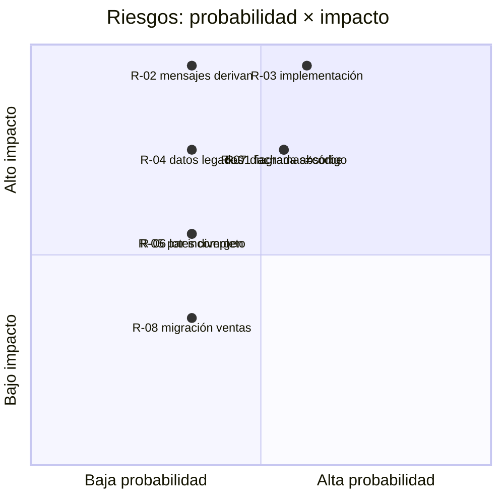

# 07 — Análisis de riesgos y plan de cambio

> [!abstract] Propósito
> Actividad 5: riesgos **reales de incorporar estos patrones** (no genéricos), escritos como condición → consecuencia, con probabilidad e impacto calificados (1-5), exposición P×I, acción preventiva y **señal observable** de materialización. Cierra con el plan concreto de cambio que ejecuta el equipo.

---

## 1. Registro de riesgos

| ID | Riesgo (si ocurre X, entonces Y) | Prob | Imp | Exp | Qué hacen para evitarlo | Cómo se enteran (señal observable) |
|----|----------------------------------|------|-----|-----|-------------------------|-------------------------------------|
| R-01 | Si la fachada acumula condiciones de negocio durante la implementación, entonces el límite declarado se rompe y SRP cae (el error que el Anexo A tipifica) | 3 | 4 | **12** | Métrica de control: "cero `if` de negocio en `ServicioVentas`" revisada en cada merge; las reglas bajan al dominio (`Res.EvaluarPeso`, `IVendible.ValidarParaVenta`) | Cualquier `if`/`switch` con una regla de negocio (no de secuencia) aparece en `ServicioVentas` durante revisión o code review |
| R-02 | Si un mensaje visible deriva aunque sea un carácter al refactorizar, entonces se viola el comportamiento congelado (−0.5 por caso) | 2 | 5 | **10** | Los 12 casos de [[Reto2-Hacienda/Opcion2/06-VerificacionSOLID]] §2 se ejecutan lado a lado en cada integración; los textos se copian de sus sitios de construcción AS-IS, no se reescriben | El diff de cualquier caso 1-8/10-12 muestra diferencia de texto entre AS-IS y TO-BE |
| R-03 | Si el volumen de implementación supera el tiempo disponible, entonces el código no compila/ejecuta y el criterio 4 se califica 0.0 | 3 | 5 | **15** | Plan de cambio por fases con puntos de compulación (§2); orden que entrega valor verificable cada fase; criterio de parada declarado (si el 4/9 al mediodía no compila la fase 2, se congela alcance y se prioriza evidencia) | Al final de cada fase del plan (§2) la solución no compila o los casos de esa fase no pasan |
| R-04 | Si `Rehidratar` re-valida reglas de alta, entonces los datos legados empiezan a lanzar en lectura y el listado histórico se rompe (cambio de comportamiento) | 2 | 4 | **8** | Contrato explícito crear≠rehidratar en `ICreador*`; `Rehidratar` restaura estado persistido sin reglas de alta | Caso 12 lanza excepción (`EsEdadValida` u otra) leyendo la BD pre-TO-BE |
| R-05 | Si el registro de pares (proveedor, estrategia) queda incompleto o cruzado para un tipo, entonces la venta de ese tipo falla en runtime ("tipo no registrado") o calcula con estrategia equivocada | 2 | 3 | **6** | El constructor del registro exige el par completo e inmutable; prueba de humo al arrancar: cada tipo registrado con su par (carga de `Program.cs`) | Venta de un tipo X lanza "tipo no registrado" o el monto del caso 9 sale con fórmula equivocada |
| R-06 | Si al colapsar los 4 métodos de vacunas cambia la numeración o los textos de lotes, entonces el caso 3 falla (−0.5) | 2 | 3 | **6** | La numeración `{base}-{i:D3}` y los mensajes se copian 1:1; el bucle de lote es el mismo, solo cambia quién crea la unidad | Diff del caso 3 muestra numeración o texto distinto |
| R-07 | Si los diagramas/tabla E-XX de [[Reto2-Hacienda/Opcion2/05-TOBE]] no corresponden al código entregado, entonces los criterios 3 y 4 no superan 3.0 | 3 | 4 | **12** | Revisión cruzada final: cada clase del diagrama existe en el diff y cada clase nueva del diff está en E-xx; se hace ANTES de armar el PDF | Al generar el diff final aparecen clases sin fila E-XX o filas E-XX sin clase |
| R-08 | Si la migración de la tabla `ventas` (`res_id`, columnas de producto) deja filas históricas sin `res_id`, entonces la identidad estable (caso 11) solo aplica a ventas nuevas y el listado mezcla comportamientos | 2 | 2 | **4** | Columnas nullables + ALTER retrocompatible (patrón ya usado en `DatabaseInitializer.cs:34-43`); se declara en la vista técnica que la identidad estable aplica a ventas post-migración | Caso 11: las ventas históricas reconstruyen con GUID nuevo (esperado y declarado), las nuevas lo mantienen |

### Ranking y lectura

**Los tres que mandan**: R-03 (tiempo) → se gestiona con el plan de §2; R-01 y R-07 (calidad del cambio) → se gestionan con dos revisiones cruzadas baratas y de alto valor (métrica de fachada y diff↔E-XX). Todos los riesgos son del **cambio**, no del diseño en sí — el diseño es deliberadamente conservador para que la exposición viva en la ejecución y no en la estructura.

---

## 2. Plan concreto de cambio

### 2.1 Fases con puntos de verificación (cada fase compila)

| Fase | Trabajo (según tabla E-XX de [[Reto2-Hacienda/Opcion2/05-TOBE]]) | Al terminar debe… | Casos que pasan |
|------|--------------------------------------------|-------------------|-----------------|
| **0. Base** | Rama `reto2-tobe` desde el estado actual; capturar las salidas AS-IS de los 12 casos (evidencia "antes") | Compilar igual que hoy y guardar las 12 capturas | — (evidencia base) |
| **1. Dominio encapsulado** (E-07, E-11) | `Res`: `AplicarVacuna`/`Alimentar`/`EvaluarPeso`, setters privados, colección encapsulada; reglas de vacunación mudan del servicio a la entidad; umbrales bajan de `GestorReses` | Compilar; los servicios ya no mutan la entidad | 1, 2, 4 |
| **2. Creadores y registro** (E-01, E-02, E-03, E-12) | `ICreadorRes`+3, `ICreadorVacuna`+2, registros; `GestorReses` y `ServicioVacunacion` consumen el registro; los 3 repos delegan rehidratación (GUID persistido); caen `MapearTipoRes`, contadores y switches | Compilar; alta y lectura de reses/vacunas por el mismo mecanismo | 1, 2, 3, 4, 8 + identidad de reses (pre-caso 11) |
| **3. Fachada y estrategias** (E-04, E-09, E-10, E-15 parcial) | `IVendible` (jerarquía Res lo implementa), `IEstrategiaPrecio` + `MontoManual`; `ServicioVentas` reestructurado como fachada con la especificación unificada; entrada de reses redirijada; sale `FabricaVenta` | Compilar; la venta de reses produce salidas idénticas | 5, 10 |
| **4. SC-1 derivados** (E-15, E-14) | `ProductoDerivado` + `ProveedorDerivado` + `PrecioUnitario`; par registrado; ALTER de `ventas` (`res_id`, columnas de producto); entrada de venta de derivados + vistas nuevas autorizadas | Compilar; venta de derivados funcional | 9, 11, 12 |
| **5. Limpieza y verificación** (E-05, E-06) | Salen `FabricaPotrero`, `IVentaFactory`, los 4 `Validador*` degradados y su registro en `Program.cs`; corrida completa de los 12 casos lado a lado | Los 12 casos verdes; revisión R-01 (métrica fachada) y R-07 (diff↔E-XX) | 1-12 |

### 2.2 Reglas operativas del cambio

1. **Una fase, un commit hito** con los casos de esa fase en verde — rollback barato si algo se tuerce (`git revert` al hito anterior, no al inicio).
2. **Nadie toca mensajes**: los textos se copian de sus sitios AS-IS con su formato exacto (R-02).
3. **Prohibido** `switch`/`if` sobre tipos de producto/res/vacuna fuera de: (a) `Program.cs` (registro), (b) el mapeo único string-de-vista→categoría en `VacunaController` (existente, D-05). Todo lo demás es bandera roja.
4. **Criterio de parada** (R-03): 4 de septiembre al mediodía — si la fase vigente no compila, se congela el alcance restante, se completa la verificación de lo andado y se declara la deuda en [[Reto2-Hacienda/Opcion2/09-VistaTecnica]]. Un TO-BE de 3 patrones verificado vale más que uno de 3 y medio roto.
5. Al cierre: sincronizar `05-TOBE` (diagramas/E-XX) con el diff real (R-07) **antes** de armar el PDF.

> [!tip] Navegación
> Qué se verifica: [[Reto2-Hacienda/Opcion2/06-VerificacionSOLID]] · Qué se diseña: [[Reto2-Hacienda/Opcion2/05-TOBE]] · Guía de dónde tocar para el dev nuevo: [[Reto2-Hacienda/Opcion2/09-VistaTecnica]] · Registro completo de decisiones: [[Reto2-Hacienda/Opcion2/10-BitacoraIA]]
